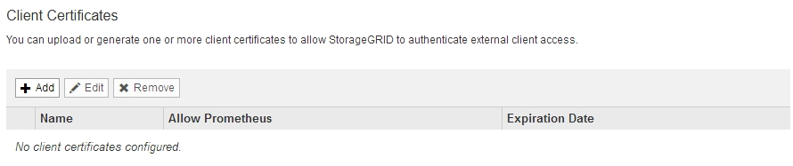

= 관리자 클라이언트 인증서를 구성하는 중입니다
:allow-uri-read: 
:icons: font
:imagesdir: ../media/

[role="lead"]
클라이언트 인증서를 사용하여 권한이 있는 외부 클라이언트가 StorageGRID Prometheus 데이터베이스에 액세스할 수 있도록 허용할 수 있습니다. 클라이언트 인증서는 외부 도구를 사용하여 StorageGRID를 모니터링하는 안전한 방법을 제공합니다.

외부 모니터링 도구를 사용하여 StorageGRID에 액세스해야 하는 경우 그리드 관리자를 사용하여 클라이언트 인증서를 업로드하거나 생성하고 인증서 정보를 외부 도구에 복사해야 합니다.

== 관리자 클라이언트 인증서를 추가하는 중입니다

클라이언트 인증서를 추가하려면 고유한 인증서를 제공하거나 Grid Manager를 사용하여 인증서를 생성할 수 있습니다.

.필요한 것
* 루트 액세스 권한이 있어야 합니다.
* 지원되는 브라우저를 사용하여 Grid Manager에 로그인해야 합니다.
* 관리 노드의 IP 주소 또는 도메인 이름을 알아야 합니다.
* StorageGRID 관리 인터페이스 서버 인증서를 구성하고 해당 CA 번들을 가지고 있어야 합니다
* 인증서를 업로드하려면 인증서의 공개 키와 개인 키를 로컬 컴퓨터에서 사용할 수 있어야 합니다.

.단계
. 그리드 관리자에서 * 구성 * > * 액세스 제어 * > * 클라이언트 인증서 * 를 선택합니다.
+
클라이언트 인증서 페이지가 나타납니다.

+

. 추가 * 를 선택합니다.
+
인증서 업로드 페이지가 나타납니다.

+
image::../media/certificate_admin_upload.png[Certificate-Admin-Upload 를 클릭합니다]

. 인증서의 이름을 1자에서 32자 사이로 입력합니다.
. 외부 모니터링 도구를 사용하여 Prometheus 메트릭에 액세스하려면 * Prometheus * 허용 확인란을 선택합니다.
. 인증서 업로드 또는 생성:
+
.. 인증서를 업로드하려면 으로 이동합니다 <<upload_cert,여기>>.
.. 인증서를 생성하려면 으로 이동합니다 <<generate_cert,여기>>.

. [[upload_cert]] 인증서를 업로드하려면
+
.. 클라이언트 인증서 업로드 * 를 선택합니다.
.. 인증서의 공개 키를 찾습니다.
+
인증서의 공개 키를 업로드하면 * 인증서 메타데이터 * 및 * 인증서 PEM * 필드가 채워집니다.

+
image::../media/certificate_admin_upload_cert_file.png[Certificate-Admin-Upload Cert File을 선택합니다]

.. 클립보드로 인증서 복사 * 를 선택하고 외부 모니터링 도구에 인증서를 붙여 넣습니다.
.. 편집 도구를 사용하여 개인 키를 복사하여 외부 모니터링 도구에 붙여 넣습니다.
.. 인증서를 Grid Manager에 저장하려면 * 저장 * 을 선택합니다.

. [[generate_cert]] 인증서를 생성하려면:
+
.. 클라이언트 인증서 생성 * 을 선택합니다.
.. 관리자 노드의 도메인 이름 또는 IP 주소를 입력합니다.
.. 선택적으로 DN(고유 이름)이라고도 하는 X.509 제목을 입력하여 인증서를 소유한 관리자를 식별합니다.
.. 원하는 경우 인증서가 유효한 일 수를 선택합니다. 기본값은 730일입니다.
.. Generate * 를 선택합니다.
+
인증서 메타데이터 *, * 인증서 PEM * 및 * 인증서 개인 키 * 필드가 채워집니다.

+
image::../media/certificate_admin_upload_generated.png[Certificate-Admin-Upload가 생성되었습니다]

.. 클립보드로 인증서 복사 * 를 선택하고 외부 모니터링 도구에 인증서를 붙여 넣습니다.
.. Copy private key to clipboard * 를 선택하고 키를 외부 모니터링 도구에 붙여 넣습니다.
+

IMPORTANT: 대화 상자를 닫은 후에는 개인 키를 볼 수 없습니다. 키를 안전한 위치에 복사합니다.

.. 인증서를 Grid Manager에 저장하려면 * 저장 * 을 선택합니다.

. Grafana와 같은 외부 모니터링 도구에서 다음 설정을 구성합니다.
+
Grafana 예제는 다음 스크린샷에 나와 있습니다.

+
image::../media/grafana_add_url_and_auth.png[Grafana - URL 및 인증을 추가합니다]

+
.. * 이름 *: 연결 이름을 입력합니다.
+
StorageGRID에는 이 정보가 필요하지 않지만 연결을 테스트하려면 이름을 입력해야 합니다.

.. * URL *: 관리자 노드의 도메인 이름 또는 IP 주소를 입력합니다. HTTPS 및 포트 9091을 지정합니다.
+
예를 들면 다음과 같습니다. `+https://admin-node.example.com:9091+`

.. TLS 클라이언트 인증 * 및 * CA 인증 * 을 활성화합니다.
.. 관리 인터페이스 서버 인증서 또는 CA 번들을 TLS/SSL 인증 세부 정보 아래의** CA Cert**에 복사하여 붙여 넣습니다.
.. * ServerName *: 관리 노드의 도메인 이름을 입력합니다.
+
servername은 관리 인터페이스 서버 인증서에 표시된 도메인 이름과 일치해야 합니다.

.. StorageGRID 또는 로컬 파일에서 복사한 인증서 및 개인 키를 저장하고 테스트합니다.
+
이제 외부 모니터링 툴을 사용하여 StorageGRID에서 Prometheus 메트릭에 액세스할 수 있습니다.

+
메트릭에 대한 자세한 내용은 StorageGRID 모니터링 및 문제 해결 지침을 참조하십시오.

.관련 정보
link:using-storagegrid-security-certificates.html["StorageGRID 보안 인증서 사용"]

link:configuring-custom-server-certificate-for-grid-manager-tenant-manager.html["Grid Manager 및 테넌트 관리자에 대한 사용자 지정 서버 인증서 구성"]

link:../monitor/index.html["모니터링 및 문제 해결"]

== 관리자 클라이언트 인증서를 편집하는 중입니다

인증서를 편집하여 이름을 변경하거나, Prometheus 액세스를 활성화 또는 비활성화하거나, 현재 인증서가 만료되면 새 인증서를 업로드할 수 있습니다.

.필요한 것
* 루트 액세스 권한이 있어야 합니다.
* 지원되는 브라우저를 사용하여 Grid Manager에 로그인해야 합니다.
* 관리 노드의 IP 주소 또는 도메인 이름을 알아야 합니다.
* 새 인증서 및 개인 키를 업로드하려면 로컬 컴퓨터에서 사용할 수 있어야 합니다.

.단계
. 구성 * > * 액세스 제어 * > * 클라이언트 인증서 * 를 선택합니다.
+
클라이언트 인증서 페이지가 나타납니다. 기존 인증서가 나열됩니다.

+
인증서 만료 날짜가 표에 나열되어 있습니다. 인증서가 곧 만료되거나 이미 만료된 경우 테이블에 메시지가 나타나고 경고가 트리거됩니다.

+
image::../media/certificate_admin_list.png[Certificate-Admin-List를 선택합니다]

. 편집할 인증서 왼쪽에 있는 라디오 단추를 선택합니다.
. 편집 * 을 선택합니다.
+
인증서 편집 대화 상자가 나타납니다.

+
image::../media/certificate_admin_edit.png[Certificate-Admin-Edit를 선택합니다]

. 원하는 대로 인증서를 변경합니다.
. 인증서를 Grid Manager에 저장하려면 * 저장 * 을 선택합니다.
. 새 인증서를 업로드한 경우:
+
.. 외부 모니터링 도구에 인증서를 붙여넣으려면 * 클립보드로 인증서 복사 * 를 선택합니다.
.. 편집 도구를 사용하여 새 개인 키를 복사하여 외부 모니터링 도구에 붙여 넣습니다.
.. 외부 모니터링 도구에서 인증서와 개인 키를 저장하고 테스트합니다.

. 새 인증서를 생성한 경우:
+
.. 외부 모니터링 도구에 인증서를 붙여넣으려면 * 클립보드로 인증서 복사 * 를 선택합니다.
.. 인증서를 외부 모니터링 도구에 붙여넣으려면 * 클립보드로 개인 키 복사 * 를 선택합니다.
+

IMPORTANT: 대화 상자를 닫은 후에는 개인 키를 보거나 복사할 수 없습니다. 키를 안전한 위치에 복사합니다.

.. 외부 모니터링 도구에서 인증서와 개인 키를 저장하고 테스트합니다.

== 관리자 클라이언트 인증서를 제거하는 중입니다

인증서가 더 이상 필요하지 않으면 제거할 수 있습니다.

.필요한 것
* 루트 액세스 권한이 있어야 합니다.
* 지원되는 브라우저를 사용하여 Grid Manager에 로그인해야 합니다.

.단계
. 구성 * > * 액세스 제어 * > * 클라이언트 인증서 * 를 선택합니다.
+
클라이언트 인증서 페이지가 나타납니다. 기존 인증서가 나열됩니다.

+
image::../media/certificate_admin_list.png[Certificate-Admin-List를 선택합니다]

. 제거할 인증서 왼쪽에 있는 라디오 단추를 선택합니다.
. 제거 * 를 선택합니다.
+
확인 대화 상자가 나타납니다.

+
image::../media/certificate_confirm_delete.png[인증서 - 삭제를 확인합니다]

. OK * 를 선택합니다.
+
인증서가 제거됩니다.

