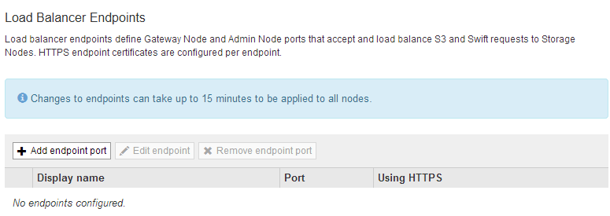
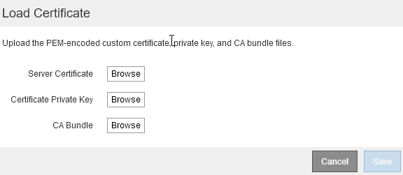
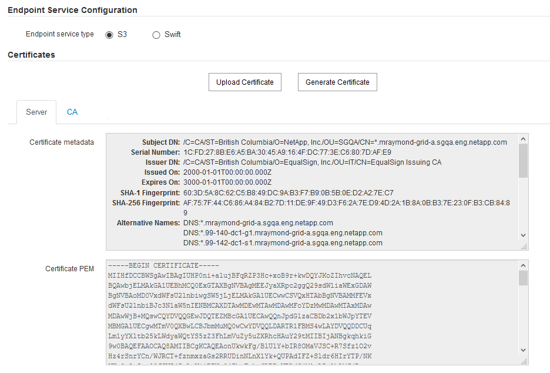

= 부하 분산 장치 엔드포인트 구성
:allow-uri-read: 
:icons: font
:imagesdir: ../media/

[role="lead"]
부하 분산 엔드포인트를 생성, 편집 및 제거할 수 있습니다.

== 로드 밸런서 끝점을 만듭니다

각 로드 밸런서 끝점은 포트, 네트워크 프로토콜(HTTP 또는 HTTPS) 및 서비스 유형(S3 또는 Swift)을 지정합니다. HTTPS 끝점을 만드는 경우 서버 인증서를 업로드하거나 생성해야 합니다.

.필요한 것
* 루트 액세스 권한이 있어야 합니다.
* 지원되는 브라우저를 사용하여 Grid Manager에 로그인해야 합니다.
* 로드 밸런서 서비스에 사용할 포트를 이전에 다시 매핑한 경우 리맵을 제거해야 합니다.
+

IMPORTANT: 포트를 다시 매핑한 경우 동일한 포트를 사용하여 로드 밸런서 끝점을 구성할 수 없습니다. 다시 매핑된 포트를 사용하여 끝점을 만들 수 있지만 이러한 끝점은 로드 밸런서 서비스가 아닌 원래 CLB 포트 및 서비스에 다시 매핑됩니다. 포트 재맵을 제거하기 위한 복구 및 유지 관리 지침의 단계를 따릅니다.

+

NOTE: CLB 서비스는 더 이상 사용되지 않습니다.

.단계
. 구성 * > * 네트워크 설정 * > * 로드 밸런서 엔드포인트 * 를 선택합니다.
+
부하 분산 엔드포인트 페이지가 나타납니다.

+

. 끝점 추가 * 를 선택합니다.
+
끝점 만들기 대화 상자가 나타납니다.

+
image::../media/load_balancer_endpoint_create_http.png[LB 끝점 작성]

. 로드 밸런서 끝점 페이지의 목록에 표시될 끝점의 표시 이름을 입력합니다.
. 포트 번호를 입력하거나 미리 채워진 포트 번호를 그대로 둡니다.
+
포트 번호 80 또는 443을 입력하면 엔드포인트는 게이트웨이 노드에서만 구성됩니다. 이러한 포트는 관리 노드에 예약되기 때문입니다.

+

NOTE: 다른 그리드 서비스에서 사용하는 포트는 허용되지 않습니다. 내부 및 외부 통신에 사용되는 포트 목록은 네트워킹 지침을 참조하십시오.

. 이 끝점의 네트워크 프로토콜을 지정하려면 * HTTP * 또는 * HTTPS * 를 선택합니다.
. 끝점 바인딩 모드를 선택합니다.
+
** * 글로벌 * (기본값): 엔드포인트는 지정된 포트 번호의 모든 게이트웨이 노드 및 관리 노드에서 액세스할 수 있습니다.
+
image::../media/load_balancer_endpoint_global_binding_mode.png[엔드포인트 전역 바인딩 모드]

** * HA 그룹 VIP *: 끝점은 선택한 HA 그룹에 대해 정의된 가상 IP 주소를 통해서만 액세스할 수 있습니다. 이 모드에서 정의된 엔드포인트는 해당 엔드포인트에서 정의된 HA 그룹이 서로 겹치지 않는 한 동일한 포트 번호를 재사용할 수 있습니다.
+
끝점을 표시할 가상 IP 주소가 있는 HA 그룹을 선택합니다.

+
image::../media/load_balancer_endpoint_ha_group_vips_binding_mode.png[Endpoint HA 그룹 VIP 바인딩 모드]

** * 노드 인터페이스 *: 끝점은 지정된 노드와 네트워크 인터페이스에서만 액세스할 수 있습니다. 이 모드에서 정의된 끝점은 인터페이스가 서로 겹치지 않는 한 동일한 포트 번호를 다시 사용할 수 있습니다.
+
끝점을 표시할 노드 인터페이스를 선택합니다.

+
image::../media/load_balancer_endpoint_node_interfaces_binding_mode.png[끝점 노드 인터페이스의 바인딩 모드입니다]

. 저장 * 을 선택합니다.
+
끝점 편집 대화 상자가 나타납니다.

. S3 * 또는 * Swift * 를 선택하여 이 끝점에서 지원하는 트래픽 유형을 지정합니다.
+
image::../media/load_balancer_endpoint_client_options.png[로드 밸런서 클라이언트]

. HTTP * 를 선택한 경우 * Save * 를 선택합니다.
+
보안되지 않은 끝점이 만들어집니다. 부하 분산 끝점 페이지의 표에는 끝점의 표시 이름, 포트 번호, 프로토콜 및 끝점 ID가 나열됩니다.

. HTTPS * 를 선택하고 인증서를 업로드하려면 * 인증서 업로드 * 를 선택합니다.
+

+
.. 서버 인증서와 인증서 개인 키를 찾습니다.
+
S3 클라이언트가 S3 API 엔드포인트 도메인 이름을 사용하여 연결할 수 있도록 하려면 클라이언트가 그리드에 연결하는 데 사용할 수 있는 모든 도메인 이름과 일치하는 다중 도메인 또는 와일드카드 인증서를 사용합니다. 예를 들어 서버 인증서에서 도메인 이름을 사용할 수 있습니다 `*._example_.com`.

+
link:configuring-s3-api-endpoint-domain-names.html["S3 API 엔드포인트 도메인 이름 구성"]

.. 선택적으로 CA 번들을 찾습니다.
.. 저장 * 을 선택합니다.
+
끝점에 대한 PEM 인코딩된 인증서 데이터가 나타납니다.

. HTTPS * 를 선택하고 인증서를 생성하려면 * 인증서 생성 * 을 선택합니다.
+
image::../media/load_balancer_endpoint_generate_cert.png[인증서 생성]

+
.. 도메인 이름 또는 IP 주소를 입력합니다.
+
와일드카드를 사용하여 로드 밸런서 서비스를 실행하는 모든 관리 노드 및 게이트웨이 노드의 정규화된 도메인 이름을 나타낼 수 있습니다. 예를 들면, 다음과 같습니다. `*.sgws.foo.com` 와일드카드를 사용하여 나타냅니다 `gn1.sgws.foo.com` 및 `gn2.sgws.foo.com`.

+
link:configuring-s3-api-endpoint-domain-names.html["S3 API 엔드포인트 도메인 이름 구성"]

.. 를 선택합니다 image:../media/icon_plus_sign_black_on_white.gif["더하기 기호"] 다른 도메인 이름 또는 IP 주소를 추가합니다.
+
HA(고가용성) 그룹을 사용하는 경우 HA 가상 IP의 도메인 이름 및 IP 주소를 추가합니다.

.. 필요한 경우 인증서를 소유하는 사용자를 식별하기 위해 DN(고유 이름)이라고도 하는 X.509 제목을 입력합니다.
.. 원하는 경우 인증서가 유효한 일 수를 선택합니다. 기본값은 730일입니다.
.. Generate * 를 선택합니다.
+
끝점에 대한 인증서 메타데이터 및 PEM 인코딩된 인증서 데이터가 나타납니다.

. 저장 * 을 클릭합니다.
+
끝점이 작성됩니다. 부하 분산 끝점 페이지의 표에는 끝점의 표시 이름, 포트 번호, 프로토콜 및 끝점 ID가 나열됩니다.

.관련 정보
link:../maintain/index.html["유지 및 복구"]

link:../network/index.html["네트워크 지침"]

link:managing-high-availability-groups.html["고가용성 그룹 관리"]

link:managing-untrusted-client-networks.html["신뢰할 수 없는 클라이언트 네트워크 관리"]

== 로드 밸런서 끝점 편집

비보안(HTTP) 끝점의 경우 S3 및 Swift 간에 끝점 서비스 유형을 변경할 수 있습니다. 보안(HTTPS) 엔드포인트의 경우 엔드포인트 서비스 유형을 편집하고 보안 인증서를 보거나 변경할 수 있습니다.

.필요한 것
* 루트 액세스 권한이 있어야 합니다.
* 지원되는 브라우저를 사용하여 Grid Manager에 로그인해야 합니다.

.단계
. 구성 * > * 네트워크 설정 * > * 로드 밸런서 엔드포인트 * 를 선택합니다.
+
부하 분산 엔드포인트 페이지가 나타납니다. 기존 끝점이 테이블에 나열됩니다.

+
인증서가 곧 만료되는 끝점이 표에 나와 있습니다.

+
image::../media/load_balancer_endpoint_edit_or_remove.png[끝점 편집]

. 편집할 끝점을 선택합니다.
. 끝점 편집 * 을 클릭합니다.
+
끝점 편집 대화 상자가 나타납니다.

+
비보안(HTTP) 끝점의 경우 대화 상자의 끝점 서비스 구성 섹션만 나타납니다. 보안(HTTPS) 끝점의 경우 다음 예제와 같이 대화 상자의 끝점 서비스 구성 및 인증서 섹션이 나타납니다.

+

. 끝점을 원하는 대로 변경합니다.
+
비보안(HTTP) 엔드포인트의 경우 다음을 수행할 수 있습니다.

+
** S3 및 Swift 간에 엔드포인트 서비스 유형을 변경합니다.
** 끝점 바인딩 모드를 변경합니다. 보안(HTTPS) 엔드포인트의 경우 다음을 수행할 수 있습니다.
** S3 및 Swift 간에 엔드포인트 서비스 유형을 변경합니다.
** 끝점 바인딩 모드를 변경합니다.
** 보안 인증서를 봅니다.
** 현재 인증서가 만료되거나 만료될 때 새 보안 인증서를 업로드하거나 생성합니다.
+
기본 StorageGRID 서버 인증서 또는 업로드된 CA 서명 인증서에 대한 자세한 정보를 표시하려면 탭을 선택합니다.

+

NOTE: 예를 들어, HTTP에서 HTTPS로 같은 기존 끝점의 프로토콜을 변경하려면 새 끝점을 만들어야 합니다. 로드 밸런서 끝점을 만들기 위한 지침에 따라 원하는 프로토콜을 선택합니다.

. 저장 * 을 클릭합니다.

.관련 정보
<<로드 밸런서 끝점을 만듭니다>>

== 로드 밸런서 끝점을 제거하는 중입니다

로드 밸런서 끝점이 더 이상 필요하지 않으면 제거할 수 있습니다.

.필요한 것
* 루트 액세스 권한이 있어야 합니다.
* 지원되는 브라우저를 사용하여 Grid Manager에 로그인해야 합니다.

.단계
. 구성 * > * 네트워크 설정 * > * 로드 밸런서 엔드포인트 * 를 선택합니다.
+
부하 분산 엔드포인트 페이지가 나타납니다. 기존 끝점이 테이블에 나열됩니다.

+
image::../media/load_balancer_endpoint_edit_or_remove.png[끝점 편집]

. 제거할 끝점 왼쪽에 있는 라디오 단추를 선택합니다.
. 끝점 제거 * 를 클릭합니다.
+
확인 대화 상자가 나타납니다.

+
image::../media/load_balancer_endpoint_confirm_removal.png[끝점 제거를 확인합니다]

. 확인 * 을 클릭합니다.
+
끝점이 제거됩니다.

