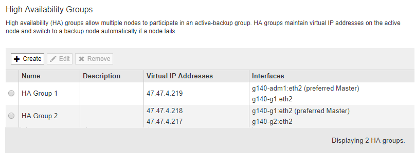

= 고가용성 그룹 편집
:allow-uri-read: 
:icons: font
:imagesdir: ../media/

[role="lead"]
HA(고가용성) 그룹을 편집하여 이름과 설명을 변경하거나, 인터페이스를 추가 또는 제거하거나, 가상 IP 주소를 추가 또는 업데이트할 수 있습니다.

.필요한 것
* 지원되는 브라우저를 사용하여 Grid Manager에 로그인해야 합니다.
* 루트 액세스 권한이 있어야 합니다.

.이 작업에 대해
HA 그룹을 편집하는 몇 가지 이유는 다음과 같습니다.

* 기존 그룹에 인터페이스 추가 인터페이스 IP 주소는 그룹에 이미 할당된 다른 인터페이스와 동일한 서브넷 내에 있어야 합니다.
* HA 그룹에서 인터페이스 제거 예를 들어 그리드 네트워크 또는 클라이언트 네트워크에 대한 노드의 인터페이스가 HA 그룹에서 사용되는 경우 사이트 또는 노드 서비스 해제 절차를 시작할 수 없습니다.

.단계
. 구성 * > * 네트워크 설정 * > * 고가용성 그룹 * 을 선택합니다.
+
High Availability Groups 페이지가 나타납니다.

+

. 편집할 HA 그룹을 선택하고 * 편집 * 을 클릭합니다.
+
High Availability Group 편집 대화 상자가 나타납니다.

. 필요에 따라 그룹의 이름 또는 설명을 업데이트합니다.
. 필요에 따라 * 인터페이스 선택 * 을 클릭하여 HA 그룹의 인터페이스를 변경합니다.
+
High Availability Group에 인터페이스 추가 대화 상자가 나타납니다.

+
image::../media/ha_group_add_interfaces.png[HA 그룹 인터페이스 추가]

+
DHCP에서 IP 주소를 할당한 경우 인터페이스가 목록에 나타나지 않습니다.

. 확인란을 선택하거나 선택 취소하여 인터페이스를 추가하거나 제거합니다.
+
인터페이스 선택에 대한 다음 지침을 참조하십시오.

+
** 인터페이스를 하나 이상 선택해야 합니다.
** 둘 이상의 인터페이스를 선택하는 경우 모든 인터페이스가 그리드 네트워크(eth0) 또는 클라이언트 네트워크(eth2)에 있어야 합니다.
** 모든 인터페이스는 동일한 서브넷 또는 공통 접두사가 있는 서브넷에 있어야 합니다.
+
IP 주소는 가장 작은 서브넷(접두사가 가장 큰 서브넷)으로 제한됩니다.

** 다른 노드 유형의 인터페이스를 선택하고 페일오버가 발생하는 경우 선택한 노드에 공통되는 서비스만 가상 IP에서 사용할 수 있습니다.
+
*** Grid Manager 또는 Tenant Manager의 HA 보호를 위해 두 개 이상의 관리 노드를 선택합니다.
*** 로드 밸런서 서비스의 HA 보호를 위해 두 개 이상의 관리 노드, 게이트웨이 노드 또는 둘 다를 선택합니다.
*** CLB 서비스의 HA 보호를 위해 둘 이상의 게이트웨이 노드를 선택합니다.
+

NOTE: CLB 서비스는 더 이상 사용되지 않습니다.

. 적용 * 을 클릭합니다.
+
선택한 인터페이스가 페이지의 인터페이스 섹션에 나열됩니다. 기본적으로 목록의 첫 번째 인터페이스가 기본 설정 마스터로 선택됩니다.

+
image::../media/ha_group_edit_group.png[HA 그룹 편집 그룹]

. 다른 인터페이스를 기본 마스터로 사용하려면 * Preferred Master * 열에서 해당 인터페이스를 선택합니다.
+
장애가 발생하여 VIP 주소가 백업 인터페이스에 재할당되지 않는 한 기본 마스터는 활성 인터페이스입니다.

+

NOTE: HA 그룹이 그리드 관리자에 대한 액세스를 제공하는 경우 기본 관리 노드에서 기본 마스터로 사용할 인터페이스를 선택해야 합니다. 일부 유지 보수 절차는 기본 관리 노드에서만 수행할 수 있습니다.

. 필요에 따라 HA 그룹의 가상 IP 주소를 업데이트합니다.
+
IPv4 주소를 하나 이상 입력해야 합니다. 선택적으로 추가 IPv4 및 IPv6 주소를 지정할 수 있습니다.

+
IPv4 주소는 모든 멤버 인터페이스에서 공유하는 IPv4 서브넷 내에 있어야 합니다.

. 저장 * 을 클릭합니다.
+
HA 그룹이 업데이트됩니다.

