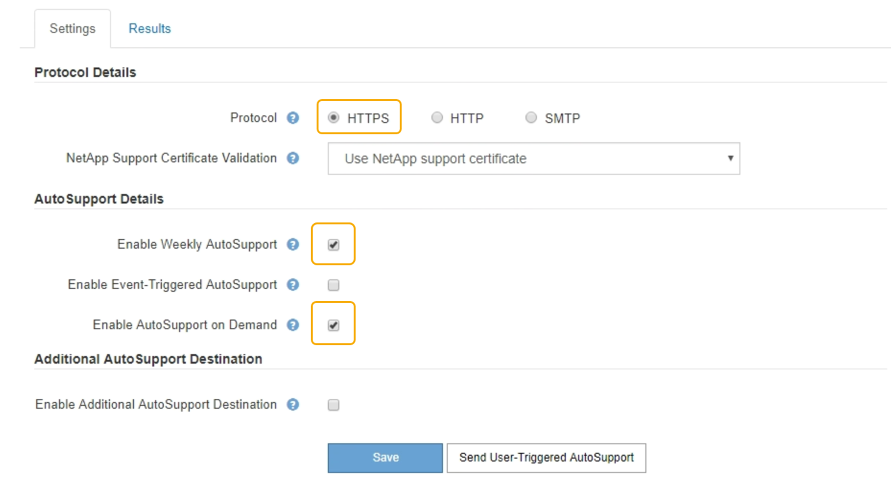

= AutoSupport 온디맨드 를 지원합니다
:allow-uri-read: 
:icons: font
:imagesdir: ../media/

[role="lead"]
AutoSupport On Demand는 기술 지원이 활발하게 진행 중인 문제를 해결하는 데 도움이 될 수 있습니다. AutoSupport On Demand를 활성화하면 기술 지원 부서에서 사용자의 개입 없이 AutoSupport 메시지를 보내도록 요청할 수 있습니다.

.필요한 것
* 지원되는 브라우저를 사용하여 Grid Manager에 로그인해야 합니다.
* 루트 액세스 또는 기타 그리드 구성 권한이 있어야 합니다.
* 주간 AutoSupport 메시지를 사용하도록 설정해야 합니다.
* 전송 프로토콜을 HTTPS로 설정해야 합니다.

.이 작업에 대해
이 기능을 활성화하면 기술 지원 부서에서 StorageGRID 시스템에 AutoSupport 메시지를 자동으로 보내도록 요청할 수 있습니다. 기술 지원 부서에서는 AutoSupport 주문형 쿼리에 대한 폴링 시간 간격을 설정할 수도 있습니다.

기술 지원 부서에서 AutoSupport On Demand를 활성화하거나 비활성화할 수 없습니다.

.단계
. 지원 * > * 도구 * > * AutoSupport * 를 선택합니다.
+
AutoSupport 페이지가 나타나고 * 설정 * 탭이 선택됩니다.

. 페이지의 * 프로토콜 세부 정보 * 섹션에서 HTTPS 라디오 버튼을 선택합니다.
+

. Weekly AutoSupport * 활성화 확인란을 선택합니다.
. AutoSupport On Demand * 활성화 확인란을 선택합니다.
. 저장 * 을 선택합니다.
+
AutoSupport On Demand가 활성화되어 있으면 기술 지원 부서에서 AutoSupport On Demand 요청을 StorageGRID로 보낼 수 있습니다.

