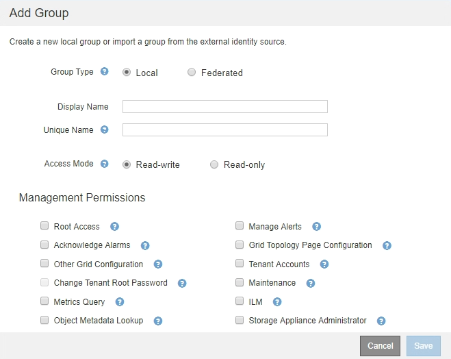

= 관리 그룹 관리
:allow-uri-read: 
:icons: font
:imagesdir: ../media/

[role="lead"]
관리자 그룹을 만들어 하나 이상의 관리자 사용자에 대한 보안 권한을 관리할 수 있습니다. StorageGRID 시스템에 대한 액세스 권한을 부여하려면 사용자가 그룹에 속해야 합니다.

== 관리 그룹 생성 중

관리자 그룹을 사용하면 그리드 관리자 및 그리드 관리 API에서 어떤 기능과 작업에 액세스할 수 있는지 확인할 수 있습니다.

.필요한 것
* 지원되는 브라우저를 사용하여 Grid Manager에 로그인해야 합니다.
* 특정 액세스 권한이 있어야 합니다.
* 통합 그룹을 가져오려면 ID 페더레이션을 구성해야 하며 통합 그룹은 구성된 ID 소스에 이미 있어야 합니다.

.단계
. Configuration * * * Access Control * * Admin Groups * 를 선택합니다.
+
관리 그룹 페이지가 나타나고 기존 관리 그룹이 나열됩니다.

+
image::../media/groups.png[그룹 페이지]

. 추가 * 를 선택합니다.
+
그룹 추가 대화 상자가 나타납니다.

+

. 그룹 유형 에서 StorageGRID 내에서만 사용할 그룹을 만들려면 * 로컬 * 을 선택하고, ID 소스에서 그룹을 가져오려면 * 통합 * 을 선택합니다.
. Local * 을 선택한 경우 그룹의 표시 이름을 입력합니다. 표시 이름은 그리드 관리자에 나타나는 이름입니다. 예를 들어, "유지 보수 사용자" 또는 ""ILM 관리자""가 있습니다.
. 그룹의 고유한 이름을 입력합니다.
+
** * 로컬 *: 원하는 고유한 이름을 입력합니다. 예: ""ILM 관리자"""
** * Federated *: 구성된 ID 소스에 표시된 대로 그룹의 이름을 정확하게 입력합니다.

. 액세스 모드 * 의 경우 그룹의 사용자가 그리드 관리자 및 그리드 관리 API에서 설정을 변경하고 작업을 수행할 수 있는지 또는 설정과 기능만 볼 수 있는지 여부를 선택합니다.
+
** * 읽기-쓰기 * (기본값): 사용자는 설정을 변경하고 관리 권한에서 허용하는 작업을 수행할 수 있습니다.
** * 읽기 전용 *: 사용자는 설정 및 기능만 볼 수 있습니다. 그리드 관리자 또는 그리드 관리 API에서 어떠한 변경이나 작업도 수행할 수 없습니다. 로컬 읽기 전용 사용자는 자신의 암호를 변경할 수 있습니다.
+

NOTE: 사용자가 여러 그룹에 속해 있고 모든 그룹이 * 읽기 전용 * 으로 설정된 경우 사용자는 선택된 모든 설정 및 기능에 대한 읽기 전용 액세스 권한을 갖게 됩니다.

. 하나 이상의 관리 권한을 선택합니다.
+
각 그룹에 적어도 하나의 권한을 할당해야 합니다. 그렇지 않으면 그룹에 속한 사용자가 StorageGRID에 로그인할 수 없습니다.

. 저장 * 을 선택합니다.
+
새 그룹이 생성됩니다. 로컬 그룹인 경우 하나 이상의 사용자를 추가할 수 있습니다. 통합 그룹인 경우 ID 소스는 그룹에 속한 사용자를 관리합니다.

.관련 정보
link:managing-local-users.html["로컬 사용자 관리"]

== 관리자 그룹 권한

관리자 사용자 그룹을 만들 때 그리드 관리자의 특정 기능에 대한 액세스를 제어하는 권한을 하나 이상 선택합니다. 그런 다음 각 사용자를 이러한 관리 그룹 중 하나 이상에 할당하여 사용자가 수행할 수 있는 작업을 결정할 수 있습니다.

각 그룹에 적어도 하나의 권한을 할당해야 합니다. 그렇지 않으면 해당 그룹에 속한 사용자가 Grid Manager에 로그인할 수 없습니다.

기본적으로 하나 이상의 사용 권한이 있는 그룹에 속한 사용자는 다음 작업을 수행할 수 있습니다.

* Grid Manager에 로그인합니다
* 대시보드 보기
* 노드 페이지를 봅니다
* 그리드 토폴로지를 모니터링합니다
* 현재 및 해결된 경고를 봅니다
* 현재 및 과거 알람 보기(레거시 시스템)
* 자신의 암호 변경(로컬 사용자만 해당)
* 구성 및 유지 관리 페이지에서 특정 정보를 봅니다

다음 섹션에서는 관리자 그룹을 만들거나 편집할 때 할당할 수 있는 권한에 대해 설명합니다. 명시적으로 언급되지 않은 기능을 사용하려면 루트 액세스 권한이 필요합니다.

=== 루트 액세스

이 권한은 모든 그리드 관리 기능에 대한 액세스를 제공합니다.

=== 알림 관리

이 권한은 알림 관리 옵션에 대한 액세스를 제공합니다. 사용자는 이 권한을 가지고 있어야 Silence, 경고 알림 및 경고 규칙을 관리할 수 있습니다.

=== 알람 확인(레거시 시스템)

이 권한을 통해 알람(레거시 시스템)을 확인하고 이에 대응할 수 있습니다. 로그인한 모든 사용자는 현재 및 과거 알람을 볼 수 있습니다.

사용자가 그리드 토폴로지를 모니터링하고 알람을 확인하려면 이 권한을 할당해야 합니다.

=== 그리드 토폴로지 페이지 구성

이 권한을 통해 다음 메뉴 옵션에 액세스할 수 있습니다.

* 지원 * * 도구 * 그리드 토폴로지 * 의 페이지에서 사용할 수 있는 구성 탭.
* * 노드 * * 이벤트 * 탭에서 이벤트 카운트 * 링크를 재설정합니다.

=== 기타 그리드 구성

이 권한은 추가 그리드 구성 옵션에 대한 액세스를 제공합니다.

IMPORTANT: 이러한 추가 옵션을 보려면 그리드 토폴로지 페이지 구성 권한도 있어야 합니다.

* 알람 * (레거시 시스템):
+
** 전체 알람
** 레거시 이메일 설정

* * ILM *:
+
** 스토리지 풀
** 보관 등급

* * 구성 * * 네트워크 설정 *
+
** 링크 비용

* * 구성 * * 시스템 설정 *:
+
** 표시 옵션
** 그리드 옵션
** 스토리지 옵션

* * 구성 * * 모니터링 *:
+
** 이벤트

* * 지원 *:
+
** AutoSupport

=== 테넌트 계정

이 권한은 * Tenants * * * Tenant Accounts * 페이지에 대한 액세스를 제공합니다.

NOTE: Grid Management API 버전 1(더 이상 사용되지 않음)에서는 이 권한을 사용하여 테넌트 그룹 정책을 관리하고, Swift 관리자 암호를 재설정하고, 루트 사용자 S3 액세스 키를 관리합니다.

=== 테넌트 루트 암호를 변경합니다

이 권한은 테넌트 계정 페이지의 * 루트 암호 변경 * 옵션에 대한 액세스를 제공하므로 테넌트의 로컬 루트 사용자에 대한 암호를 변경할 수 있는 사용자를 제어할 수 있습니다. 이 권한이 없는 사용자는 * 루트 암호 변경 * 옵션을 볼 수 없습니다.

NOTE: 이 권한을 할당하려면 먼저 그룹에 테넌트 계정 권한을 할당해야 합니다.

=== 유지 관리

이 권한을 통해 다음 메뉴 옵션에 액세스할 수 있습니다.

* * 구성 * * 시스템 설정 *:
+
** 도메인 이름 *
** 서버 인증서 *

* * 구성 * * 모니터링 *:
+
** 감사 *

* * 구성 * * 액세스 제어 *:
+
** 그리드 암호

* * 유지보수 * * 유지보수 태스크 *
+
** 서비스 해제
** 확장
** 복구

* * 유지보수 * * 네트워크 *:
+
** DNS 서버 *
** 그리드 네트워크 *
** NTP 서버 *

* * 유지보수 * * 시스템 *:
+
** 라이센스 *
** 복구 패키지
** 소프트웨어 업데이트

* * 지원 * * 툴 *:
+
** 로그

* 유지 관리 권한이 없는 사용자는 별표가 표시된 페이지를 볼 수는 있지만 편집할 수는 없습니다.

=== 메트릭 쿼리

이 권한은 * 지원 * * 도구 * 메트릭 * 페이지에 대한 액세스를 제공합니다. 이 권한은 또한 Grid Management API의 * Metrics * 섹션을 사용하여 맞춤형 Prometheus 메트릭 쿼리에 대한 액세스를 제공합니다.

=== ILM을 참조하십시오

이 권한은 다음 * ILM * 메뉴 옵션에 대한 액세스를 제공합니다.

* * 삭제 코딩 *
* * 규칙 *
* * 정책 *
* * 지역 *

NOTE: ILM * * * 스토리지 풀 * 및 * ILM * * 스토리지 등급 * 메뉴 옵션에 대한 액세스는 다른 그리드 구성 및 그리드 토폴로지 페이지 구성 권한에 의해 제어됩니다.

=== 개체 메타데이터 조회

이 권한은 * ILM * * 개체 메타데이터 조회 * 메뉴 옵션에 대한 액세스를 제공합니다.

=== 스토리지 어플라이언스 관리자

이 권한은 그리드 관리자를 통해 스토리지 어플라이언스에서 E-Series SANtricity System Manager에 대한 액세스를 제공합니다.

=== 사용 권한과 액세스 모드 간의 상호 작용

모든 권한에 대해 그룹의 액세스 모드 설정은 사용자가 설정을 변경하고 작업을 수행할 수 있는지 또는 관련 설정과 기능만 볼 수 있는지 여부를 결정합니다. 사용자가 여러 그룹에 속해 있고 모든 그룹이 * 읽기 전용 * 으로 설정된 경우 사용자는 선택된 모든 설정 및 기능에 대한 읽기 전용 액세스 권한을 갖게 됩니다.

=== Grid Management API에서 기능 비활성화

그리드 관리 API를 사용하여 StorageGRID 시스템의 특정 기능을 완전히 비활성화할 수 있습니다. 기능이 비활성화되면 해당 기능과 관련된 작업을 수행할 수 있는 권한을 아무도 할당할 수 없습니다.

.이 작업에 대해
비활성화된 기능 시스템을 사용하면 StorageGRID 시스템의 특정 기능에 액세스하지 못하게 할 수 있습니다. 루트 액세스 권한이 있는 관리자 그룹에 속한 루트 사용자나 사용자가 해당 기능을 사용할 수 없도록 하는 유일한 방법은 기능을 비활성화하는 것입니다.

이 기능이 어떻게 유용한지 이해하려면 다음 시나리오를 고려해 보십시오.

_Company A는 테넌트 계정을 생성하여 StorageGRID 시스템의 스토리지 용량을 임대하는 서비스 공급자입니다. 회사 A는 임차자의 객체 보안을 보호하기 위해 계정이 배포된 후 자신의 직원이 테넌트 계정에 액세스할 수 없도록 하려고 합니다. _

_회사 A는 그리드 관리 API에서 기능 비활성화 시스템을 사용하여 이 목표를 달성할 수 있습니다. 그리드 관리자(UI 및 API 모두)에서 * 테넌트 루트 암호 변경 * 기능을 완전히 비활성화함으로써 회사 A는 루트 액세스 권한이 있는 그룹에 속하는 루트 사용자 및 루트 사용자를 포함한 관리자 사용자가 테넌트 계정의 루트 사용자에 대한 암호를 변경할 수 없도록 할 수 있습니다

==== 비활성화된 피처를 다시 활성화합니다

기본적으로 그리드 관리 API를 사용하여 비활성화된 기능을 다시 활성화할 수 있습니다. 그러나 비활성화된 피처가 다시 활성화되지 않도록 하려면 * activateFeatures * 기능 자체를 비활성화할 수 있습니다.

CAUTION: activateFeatures * 기능은 다시 활성화할 수 없습니다. 이 기능을 비활성화하려는 경우 비활성화된 다른 모든 기능을 다시 활성화할 수 있는 기능이 영구적으로 손실됩니다. 손실된 기능을 복원하려면 기술 지원 부서에 문의해야 합니다.

자세한 내용은 S3 또는 Swift 클라이언트 애플리케이션 구현 지침을 참조하십시오.

.단계
. Grid Management API에 대한 Swagger 문서에 액세스합니다.
. 기능 비활성화 끝점을 찾습니다.
. 테넌트 루트 암호 변경 * 과 같은 기능을 비활성화하려면 다음과 같이 API로 본문을 보냅니다.
+
[listing]
----
{ "grid": {"changeTenantRootPassword": true} }
----
+
요청이 완료되면 테넌트 루트 암호 변경 기능이 비활성화됩니다. 테넌트 루트 암호 변경 관리 권한이 사용자 인터페이스에 더 이상 나타나지 않으며 테넌트의 루트 암호를 변경하려고 시도하는 모든 API 요청이 "'403 사용 금지'"로 실패합니다.

. 모든 기능을 다시 활성화하려면 다음과 같이 API로 본문을 보내십시오.
+
[listing]
----
{ "grid": null }
----
+
이 요청이 완료되면 테넌트 루트 암호 변경 기능을 포함한 모든 기능이 다시 활성화됩니다. 이제 사용자 인터페이스에 테넌트 루트 암호 변경 관리 권한이 표시되며, 사용자에게 루트 액세스 또는 테넌트 루트 암호 변경 관리 권한이 있는 경우 테넌트의 루트 암호를 변경하려고 시도하는 모든 API 요청이 성공합니다.

+

NOTE: 이전 예에서는 _ALL_DEACTED 피처가 재활성화됩니다. 비활성화된 상태로 유지되어야 하는 다른 기능이 비활성화된 경우, PUT 요청에 명시적으로 지정해야 합니다. 예를 들어, Change Tenant Root Password 기능을 다시 활성화하고 Alarm Acknowledgement 기능을 계속 비활성화하려면 다음 Put 요청을 보냅니다.

+
[listing]
----
{ "grid": { "alarmAcknowledgment": true } }
----

.관련 정보
link:using-grid-management-api.html["Grid Management API 사용"]

== 관리 그룹 수정

admin 그룹을 수정하여 그룹과 연결된 권한을 변경할 수 있습니다. 로컬 관리자 그룹의 경우 표시 이름을 업데이트할 수도 있습니다.

.필요한 것
* 지원되는 브라우저를 사용하여 Grid Manager에 로그인해야 합니다.
* 특정 액세스 권한이 있어야 합니다.

.단계
. Configuration * * * Access Control * * Admin Groups * 를 선택합니다.
. 그룹을 선택합니다.
+
시스템에 20개 이상의 항목이 포함된 경우 각 페이지에 한 번에 표시되는 행 수를 지정할 수 있습니다. 그런 다음 브라우저의 찾기 기능을 사용하여 현재 표시된 행에서 특정 항목을 검색할 수 있습니다.

. 편집 * 을 클릭합니다.
. 또는 로컬 그룹의 경우 사용자에게 표시할 그룹 이름(예: " 유지보수 사용자")을 입력합니다.
+
내부 그룹 이름인 고유한 이름은 변경할 수 없습니다.

. 선택적으로 그룹의 액세스 모드를 변경합니다.
+
** * 읽기-쓰기 * (기본값): 사용자는 설정을 변경하고 관리 권한에서 허용하는 작업을 수행할 수 있습니다.
** * 읽기 전용 *: 사용자는 설정 및 기능만 볼 수 있습니다. 그리드 관리자 또는 그리드 관리 API에서 어떠한 변경이나 작업도 수행할 수 없습니다. 로컬 읽기 전용 사용자는 자신의 암호를 변경할 수 있습니다.
+

NOTE: 사용자가 여러 그룹에 속해 있고 모든 그룹이 * 읽기 전용 * 으로 설정된 경우 사용자는 선택된 모든 설정 및 기능에 대한 읽기 전용 액세스 권한을 갖게 됩니다.

. 필요에 따라 그룹 권한을 추가하거나 제거합니다.
+
관리자 그룹 권한에 대한 정보를 봅니다.

. 저장 * 을 선택합니다.

.관련 정보
<<관리자 그룹 권한>>

== 관리 그룹 삭제

시스템에서 그룹을 제거하고 그룹과 관련된 모든 권한을 제거하려면 관리자 그룹을 삭제할 수 있습니다. admin 그룹을 삭제하면 그룹에서 모든 admin 사용자가 제거되지만 admin 사용자는 삭제되지 않습니다.

.필요한 것
* 지원되는 브라우저를 사용하여 Grid Manager에 로그인해야 합니다.
* 특정 액세스 권한이 있어야 합니다.

.이 작업에 대해
그룹을 삭제하면 다른 그룹에 의해 권한을 부여하지 않는 한 해당 그룹에 할당된 사용자는 그리드 관리자에 대한 모든 액세스 권한을 잃게 됩니다.

.단계
. Configuration * * * Access Control * * Admin Groups * 를 선택합니다.
. 그룹 이름을 선택합니다.
+
시스템에 20개 이상의 항목이 포함된 경우 각 페이지에 한 번에 표시되는 행 수를 지정할 수 있습니다. 그런 다음 브라우저의 찾기 기능을 사용하여 현재 표시된 행에서 특정 항목을 검색할 수 있습니다.

. 제거 * 를 선택합니다.
. OK * 를 선택합니다.

