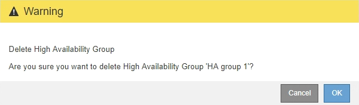

= 고가용성 그룹을 제거하는 중입니다
:allow-uri-read: 
:icons: font
:imagesdir: ../media/

[role="lead"]
더 이상 사용하지 않는 고가용성(HA) 그룹을 제거할 수 있습니다.

.필요한 것
* 지원되는 브라우저를 사용하여 Grid Manager에 로그인해야 합니다.
* 루트 액세스 권한이 있어야 합니다.

.이 작업을 시작합니다
HA 그룹을 제거하면 그룹의 가상 IP 주소 중 하나를 사용하도록 구성된 S3 또는 Swift 클라이언트가 더 이상 StorageGRID에 연결할 수 없습니다. 클라이언트 중단을 방지하려면 HA 그룹을 삭제하기 전에 영향을 받는 모든 S3 또는 Swift 클라이언트 애플리케이션을 업데이트해야 합니다. 다른 IP 주소(예: 다른 HA 그룹의 가상 IP 주소 또는 설치 중 또는 DHCP를 사용하는 동안 인터페이스에 구성된 IP 주소)를 사용하여 연결할 각 클라이언트를 업데이트합니다.

.단계
. 구성 * > * 네트워크 설정 * > * 고가용성 그룹 * 을 선택합니다.
+
High Availability Groups 페이지가 나타납니다.

+
image::../media/ha_groups_page_with_two_groups.png[HA 그룹 기본 화면]

. 제거할 HA 그룹을 선택하고 * 제거 * 를 클릭합니다.
+
High Availability Group 삭제 경고가 나타납니다.

+

. 확인 * 을 클릭합니다.
+
HA 그룹이 제거됩니다.

