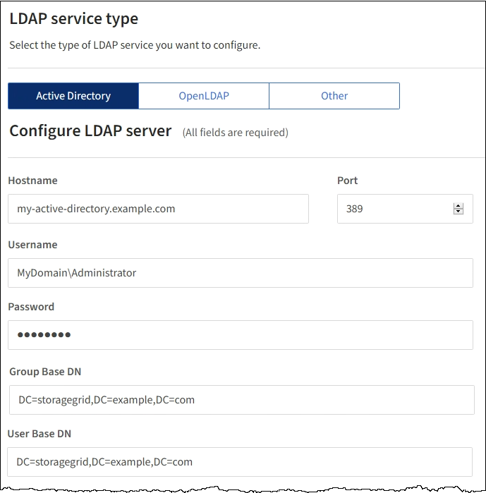

= ID 페더레이션 사용
:allow-uri-read: 
:icons: font
:imagesdir: ../media/

[role="lead"]
ID 페더레이션을 사용하면 그룹 및 사용자를 더 빠르게 설정할 수 있으며, 사용자는 익숙한 자격 증명을 사용하여 StorageGRID에 로그인할 수 있습니다.

== ID 페더레이션을 구성하는 중입니다

관리 그룹 및 사용자를 Active Directory, OpenLDAP 또는 Oracle Directory Server와 같은 다른 시스템에서 관리하도록 하려면 ID 페더레이션을 구성할 수 있습니다.

.필요한 것
* 지원되는 브라우저를 사용하여 Grid Manager에 로그인해야 합니다.
* 특정 액세스 권한이 있어야 합니다.
* SSO(Single Sign-On)를 사용하려는 경우 통합 ID 소스로 Active Directory를 사용하고 ID 공급자로 AD FS를 사용해야 합니다. Single Sign-On 사용 요건 참조
* ID 공급자로 Active Directory, OpenLDAP 또는 Oracle Directory Server를 사용하고 있어야 합니다.
+

NOTE: 목록에 없는 LDAP v3 서비스를 사용하려면 기술 지원 부서에 문의해야 합니다.

* LDAP 서버와의 통신에 TLS(Transport Layer Security)를 사용하려는 경우 ID 공급자는 TLS 1.2 또는 1.3을 사용해야 합니다.

.이 작업에 대해
다음과 같은 유형의 통합 그룹을 가져오려면 그리드 관리자의 ID 소스를 구성해야 합니다.

* 관리 그룹. 관리자 그룹의 사용자는 그룹에 할당된 관리 권한에 따라 Grid Manager에 로그인하여 작업을 수행할 수 있습니다.
* 자신의 ID 소스를 사용하지 않는 테넌트의 테넌트 사용자 그룹 테넌트 그룹의 사용자는 테넌트 관리자의 그룹에 할당된 권한을 기반으로 테넌트 관리자에 로그인하여 작업을 수행할 수 있습니다.

.단계
. Configuration * > * Access Control * > * Identity Federation * 을 선택합니다.
. ID 페더레이션 사용 * 을 선택합니다.
+
LDAP 서버 구성 필드가 나타납니다.

. LDAP 서비스 유형 섹션에서 구성할 LDAP 서비스 유형을 선택합니다.
+
Active Directory *, * OpenLDAP * 또는 * 기타 * 를 선택할 수 있습니다.

+

NOTE: OpenLDAP * 를 선택한 경우 OpenLDAP 서버를 구성해야 합니다. OpenLDAP 서버 구성 지침을 참조하십시오.

+

NOTE: Oracle Directory Server를 사용하는 LDAP 서버의 값을 구성하려면 * 기타 * 를 선택합니다.

. 기타 * 를 선택한 경우 LDAP 속성 섹션의 필드를 작성합니다.
+
** * 사용자 고유 이름 *: LDAP 사용자의 고유 식별자가 포함된 속성의 이름입니다. 이 속성은 과 같습니다 `sAMAccountName` Active Directory 및 의 경우 `uid` OpenLDAP의 경우. Oracle Directory Server를 구성하는 경우 를 입력합니다 `uid`.
** * 사용자 UUID *: LDAP 사용자의 영구 고유 식별자가 포함된 특성의 이름입니다. 이 속성은 과 같습니다 `objectGUID` Active Directory 및 의 경우 `entryUUID` OpenLDAP의 경우. Oracle Directory Server를 구성하는 경우 를 입력합니다 `nsuniqueid`. 지정된 속성에 대한 각 사용자의 값은 16바이트 또는 문자열 형식의 32자리 16진수 숫자여야 하며, 하이픈은 무시됩니다.
** * 그룹 고유 이름 *: LDAP 그룹의 고유 식별자가 포함된 속성의 이름입니다. 이 속성은 과 같습니다 `sAMAccountName` Active Directory 및 의 경우 `cn` OpenLDAP의 경우. Oracle Directory Server를 구성하는 경우 를 입력합니다 `cn`.
** * 그룹 UUID *: LDAP 그룹의 영구 고유 식별자가 포함된 특성의 이름입니다. 이 속성은 과 같습니다 `objectGUID` Active Directory 및 의 경우 `entryUUID` OpenLDAP의 경우. Oracle Directory Server를 구성하는 경우 를 입력합니다 `nsuniqueid`. 지정된 속성에 대한 각 그룹의 값은 16바이트 또는 문자열 형식의 32자리 16진수 숫자여야 하며, 하이픈은 무시됩니다.

. LDAP 서버 구성 섹션에서 필요한 LDAP 서버 및 네트워크 연결 정보를 입력합니다.
+
** * 호스트 이름 *: LDAP 서버의 서버 호스트 이름 또는 IP 주소입니다.
** * 포트 *: LDAP 서버에 연결하는 데 사용되는 포트입니다.
+

NOTE: STARTTLS의 기본 포트는 389이고 LDAPS의 기본 포트는 636입니다. 그러나 방화벽이 올바르게 구성된 경우 모든 포트를 사용할 수 있습니다.

** * 사용자 이름 *: LDAP 서버에 연결할 사용자의 DN(고유 이름)의 전체 경로입니다.
+

NOTE: Active Directory의 경우 아래쪽 로그온 이름 또는 사용자 기본 이름을 지정할 수도 있습니다.

+
지정된 사용자는 그룹 및 사용자를 나열하고 다음 속성에 액세스할 수 있는 권한이 있어야 합니다.

+
*** `sAMAccountName` 또는 `uid`
*** `objectGUID`, `entryUUID`, 또는 `nsuniqueid`
*** `cn`
*** `memberOf` 또는 `isMemberOf`

** * 암호 *: 사용자 이름과 연결된 암호입니다.
** * Group base DN *: 그룹을 검색할 LDAP 하위 트리에 대한 DN(고유 이름)의 전체 경로입니다. Active Directory 예제(아래)에서 고유 이름이 기본 DN(DC=StorageGrid, DC=example, DC=com)과 관련된 모든 그룹을 통합 그룹으로 사용할 수 있습니다.
+

NOTE: 그룹 고유 이름 * 값은 * 그룹 기본 DN * 내에서 고유해야 합니다.

** * 사용자 기본 DN *: 사용자를 검색할 LDAP 하위 트리의 고유 이름(DN)의 전체 경로입니다.
+

NOTE: 사용자 고유 이름 * 값은 * 사용자 기본 DN * 내에서 고유해야 합니다.

. TLS(Transport Layer Security) * 섹션에서 보안 설정을 선택합니다.
+
** * STARTTLS 사용(권장) *: STARTTLS를 사용하여 LDAP 서버와의 통신을 보호합니다. 이 옵션을 선택하는 것이 좋습니다.
** * LDAPS * 사용: LDAPS(LDAP over SSL) 옵션은 TLS를 사용하여 LDAP 서버에 연결합니다. 이 옵션은 호환성을 위해 지원됩니다.
** * TLS * 사용 안 함: StorageGRID 시스템과 LDAP 서버 간의 네트워크 트래픽은 보호되지 않습니다.
+

NOTE: Active Directory 서버가 LDAP 서명을 적용하는 경우 * TLS 사용 안 함 * 옵션을 사용할 수 없습니다. STARTTLS 또는 LDAPS를 사용해야 합니다.

. STARTTLS 또는 LDAPS를 선택한 경우 연결 보안에 사용되는 인증서를 선택합니다.
+
** * 운영 체제 CA 인증서 사용 *: 운영 체제에 설치된 기본 CA 인증서를 사용하여 연결을 보호합니다.
** * 사용자 지정 CA 인증서 사용 *: 사용자 지정 보안 인증서를 사용합니다.
+
이 설정을 선택한 경우 사용자 지정 보안 인증서를 복사하여 CA 인증서 텍스트 상자에 붙여 넣습니다.

. 선택적으로 * 연결 테스트 * 를 선택하여 LDAP 서버에 대한 연결 설정을 확인합니다.
+
연결이 유효한 경우 페이지의 오른쪽 상단에 확인 메시지가 나타납니다.

. 연결이 유효하면 * 저장 * 을 선택합니다.
+
다음 스크린샷은 Active Directory를 사용하는 LDAP 서버의 구성 값 예를 보여 줍니다.

+

.관련 정보
link:supported-ciphers-for-outgoing-tls-connections.html["발신 TLS 연결에 지원되는 암호"]

link:requirements-for-sso.html["Single Sign-On 사용에 대한 요구 사항"]

link:creating-tenant-account.html["테넌트 계정을 생성하는 중입니다"]

link:../tenant/index.html["테넌트 계정을 사용합니다"]

=== OpenLDAP 서버 구성 지침

OpenLDAP 서버를 ID 페더레이션에 사용하려면 OpenLDAP 서버에서 특정 설정을 구성해야 합니다.

==== MemberOf 및 구체화 오버레이

MemberOf 및 구체화 오버레이를 활성화해야 합니다. 자세한 내용은 OpenLDAP용 관리자 안내서 에서 역방향 그룹 구성원 유지 관리 지침을 참조하십시오.

==== 인덱싱

지정된 인덱스 키워드를 사용하여 다음 OpenLDAP 속성을 구성해야 합니다.

* `olcDbIndex: objectClass eq`
* `olcDbIndex: uid eq,pres,sub`
* `olcDbIndex: cn eq,pres,sub`
* `olcDbIndex: entryUUID eq`

또한 최적의 성능을 위해 사용자 이름 도움말에 언급된 필드를 인덱싱해야 합니다.

OpenLDAP용 관리자 안내서 에서 역방향 그룹 구성원 유지 관리에 대한 정보를 참조하십시오.

.관련 정보
http://["OpenLDAP 설명서: 버전 2.4 관리자 가이드"^]

== ID 소스와 동기화 수행

StorageGRID 시스템은 ID 소스에서 페더레이션 그룹과 사용자를 정기적으로 동기화합니다. 사용자 권한을 최대한 빨리 설정하거나 제한하려는 경우 동기화를 강제로 시작할 수 있습니다.

.필요한 것
* 지원되는 브라우저를 사용하여 Grid Manager에 로그인해야 합니다.
* 특정 액세스 권한이 있어야 합니다.
* ID 소스를 활성화해야 합니다.

.단계
. Configuration * > * Access Control * > * Identity Federation * 을 선택합니다.
+
ID 페더레이션 페이지가 나타납니다. 동기화 * 버튼은 페이지 하단에 있습니다.

+
image::../media/identity_federation_synchronize.gif[Configuration > Identity Federation > Synchronize 버튼의 스크린샷]

. 동기화 * 를 클릭합니다.
+
동기화가 성공적으로 시작되었다는 확인 메시지가 표시됩니다. 동기화 프로세스는 환경에 따라 다소 시간이 걸릴 수 있습니다.

+

NOTE: ID 소스에서 페더레이션 그룹과 사용자를 동기화하는 데 문제가 있는 경우 * ID 페더레이션 동기화 실패 * 경고가 트리거됩니다.

== ID 페더레이션을 사용하지 않도록 설정합니다

그룹 및 사용자에 대한 ID 페더레이션을 일시적으로 또는 영구적으로 비활성화할 수 있습니다. ID 페더레이션을 사용하지 않도록 설정하면 StorageGRID와 ID 소스 간에 통신이 이루어지지 않습니다. 그러나 구성한 설정은 그대로 유지되므로 나중에 ID 페더레이션을 쉽게 다시 사용할 수 있습니다.

.필요한 것
* 지원되는 브라우저를 사용하여 Grid Manager에 로그인해야 합니다.
* 특정 액세스 권한이 있어야 합니다.

.이 작업에 대해
ID 페더레이션을 사용하지 않도록 설정하기 전에 다음 사항을 확인해야 합니다.

* 페더레이션 사용자는 로그인할 수 없습니다.
* 현재 로그인한 페더레이션 사용자는 세션이 만료될 때까지 StorageGRID 시스템에 대한 액세스 권한을 유지하지만 세션이 만료된 후에는 로그인할 수 없습니다.
* StorageGRID 시스템과 ID 소스 간의 동기화는 수행되지 않으며 동기화되지 않은 계정에 대해 알림 또는 경보가 발생하지 않습니다.
* SSO(Single Sign-On)가 * Enabled * 또는 * Sandbox Mode * 로 설정된 경우 * Enable Identity Federation *(ID 페더레이션 사용 *) 확인란이 비활성화됩니다. ID 페더레이션을 비활성화하려면 Single Sign-On 페이지의 SSO 상태가 * 사용 안 함 * 이어야 합니다.

.단계
. Configuration * > * Access Control * > * Identity Federation * 을 선택합니다.
. ID 페더레이션 사용 * 확인란의 선택을 취소합니다.
. 저장 * 을 클릭합니다.

.관련 정보
link:disabling-single-sign-on.html["SSO(Single Sign-On) 비활성화"]
