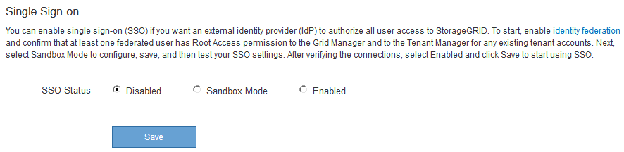

= sandbox 모드 사용
:allow-uri-read: 
:icons: font
:imagesdir: ../media/

[role="lead"]
StorageGRID 사용자에 대해 SSO(Single Sign-On)를 적용하기 전에 샌드박스 모드를 사용하여 AD FS(Active Directory Federation Services) 기반 당사자 트러스트를 구성 및 테스트할 수 있습니다. SSO를 사용하도록 설정한 후 샌드박스 모드를 다시 활성화하여 새로운 신뢰할 수 있는 기존 및 기존의 트러스트를 구성하거나 테스트할 수 있습니다. sandbox 모드를 다시 활성화하면 StorageGRID 사용자에 대해 SSO가 일시적으로 비활성화됩니다.

.필요한 것
* 지원되는 브라우저를 사용하여 Grid Manager에 로그인해야 합니다.
* 특정 액세스 권한이 있어야 합니다.

.이 작업에 대해
SSO가 활성화되어 있고 사용자가 관리자 노드에 로그인을 시도하면 StorageGRID는 AD FS에 인증 요청을 보냅니다. 그런 다음 AD FS는 인증 요청을 성공했는지 여부를 나타내는 인증 응답을 StorageGRID로 다시 보냅니다. 요청에 성공하려면 사용자의 UUID(Universally Unique Identifier)가 응답에 포함됩니다.

StorageGRID(서비스 공급자) 및 AD FS(ID 공급자)가 사용자 인증 요청에 대해 안전하게 통신할 수 있도록 하려면 StorageGRID에서 특정 설정을 구성해야 합니다. 그런 다음 AD FS를 사용하여 모든 관리 노드에 대한 신뢰할 수 있는 상대 트러스트를 만들어야 합니다. 마지막으로 StorageGRID로 돌아가서 SSO를 활성화해야 합니다.

sandbox 모드를 사용하면 SSO를 활성화하기 전에 이 전면과 후면을 간편하게 구성하고 모든 설정을 테스트할 수 있습니다.

NOTE: sandbox 모드를 사용하는 것이 좋지만 반드시 필요한 것은 아닙니다. StorageGRID에서 SSO를 구성한 직후 AD FS 기반 당사자 트러스트를 생성할 준비가 되었으면 또한 각 관리 노드에 대해 SSO 및 단일 로그아웃(SLO) 프로세스를 테스트할 필요가 없습니다. * Enabled * 를 클릭하고 StorageGRID 설정을 입력한 다음 AD FS의 각 관리 노드에 대한 신뢰할 수 있는 파티 트러스트 를 생성한 다음 * Save * 를 클릭하여 SSO를 활성화합니다.

.단계
. Configuration * * * Access Control * * Single Sign-On * 을 선택합니다.
+
단일 사인온 페이지가 나타나고 * 비활성화 * 옵션이 선택됩니다.

+

+

NOTE: SSO 상태 옵션이 나타나지 않으면 Active Directory를 통합 ID 소스로 구성했는지 확인합니다. Single Sign-On 사용 요건 참조

. Sandbox 모드 * 옵션을 선택합니다.
+
ID 공급자 및 공급자 설정이 나타납니다. ID 공급자 섹션에서 * 서비스 유형 * 필드는 읽기 전용입니다. 사용 중인 ID 페더레이션 서비스 유형(예: Active Directory)이 표시됩니다.

. ID 공급자 섹션에서 다음을 수행합니다.
+
.. AD FS에 표시되는 대로 페더레이션 서비스 이름을 입력합니다.
+

NOTE: 페더레이션 서비스 이름을 찾으려면 Windows Server Manager로 이동합니다. Tools * * * AD FS Management * 를 선택합니다. 작업 메뉴에서 * 페더레이션 서비스 속성 편집 * 을 선택합니다. 두 번째 필드에 페더레이션 서비스 이름이 표시됩니다.

.. ID 공급자가 StorageGRID 요청에 대한 응답으로 SSO 구성 정보를 보낼 때 TLS(전송 계층 보안)를 사용하여 연결을 보호할지 여부를 지정합니다.
+
*** * 운영 체제 CA 인증서 사용 *: 운영 체제에 설치된 기본 CA 인증서를 사용하여 연결을 보호합니다.
*** * 사용자 지정 CA 인증서 사용 *: 사용자 지정 CA 인증서를 사용하여 연결을 보호합니다.
+
이 설정을 선택한 경우 인증서를 복사하여 * CA 인증서 * 텍스트 상자에 붙여 넣습니다.

*** * TLS * 사용 안 함: TLS 인증서를 사용하여 연결을 보호하지 마십시오.

. 신뢰할 수 있는 당사자 섹션에서 신뢰할 수 있는 상대 트러스트를 구성할 때 StorageGRID 관리 노드에 사용할 신뢰할 수 있는 당사자 식별자를 지정합니다.
+
** 예를 들어 그리드에 관리 노드가 하나뿐이고 나중에 관리 노드를 더 추가할 예정이 없는 경우 를 입력합니다 `SG` 또는 `StorageGRID`.
** 그리드에 둘 이상의 관리 노드가 포함된 경우 문자열을 포함합니다 `[HOSTNAME]` 를 입력합니다. 예를 들면, 다음과 같습니다. `SG-[HOSTNAME]`. 이렇게 하면 노드의 호스트 이름을 기반으로 각 관리 노드에 대한 기반 당사자 식별자가 포함된 테이블이 생성됩니다. +참고: StorageGRID 시스템의 각 관리 노드에 대한 신뢰할 수 있는 상대 신뢰를 만들어야 합니다. 각 관리 노드에 대한 신뢰할 수 있는 당사자 덕분에 사용자는 모든 관리 노드에 안전하게 로그인할 수 있습니다.

+
image::../media/sso_status_sandbox_mode.gif[SSO(Single Sign-On),Sandbox mode enabled,Relying party identifiers shown for several Admin Nodes]

. 저장 * 을 클릭합니다.
+
** 몇 초 동안 * Save * (저장 *) 버튼에 녹색 확인 표시가 나타납니다.
+
image::../media/save_button_green_checkmark.gif[녹색 확인 표시가 있는 저장 버튼]

** Sandbox 모드 확인 알림이 나타나고 Sandbox 모드가 이제 활성화되었음을 확인합니다. AD FS를 사용하는 동안 이 모드를 사용하여 각 관리 노드에 대한 의존적인 당사자 신뢰를 구성하고 SSO(Single Sign-In) 및 SLO(Single Logout) 프로세스를 테스트할 수 있습니다.
+
image::../media/sso_sandbox_mode_enabled.gif[SSO Sandbox 모드가 활성화되었습니다]

.관련 정보
link:requirements-for-sso.html["Single Sign-On 사용에 대한 요구 사항"]
