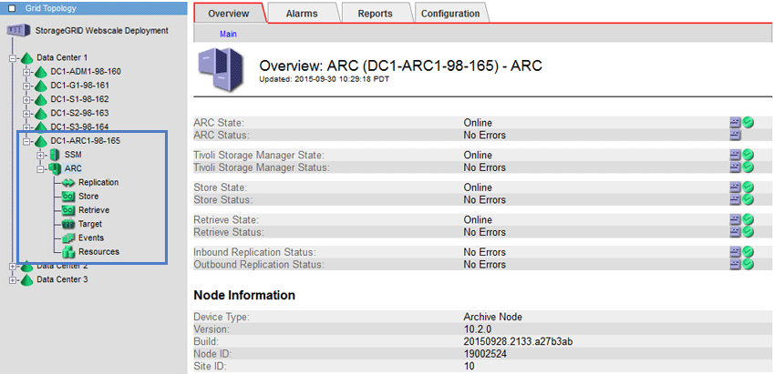

= 아카이브 노드의 정의
:allow-uri-read: 
:icons: font
:imagesdir: ../media/

[role="lead"]
아카이브 노드는 객체 데이터의 장기 저장을 위해 외부 아카이브 스토리지 시스템을 대상으로 지정할 수 있는 인터페이스를 제공합니다. 또한 아카이브 노드는 이 연결과 StorageGRID 시스템과 대상 외부 아카이브 스토리지 시스템 간의 개체 데이터 전송을 모니터링합니다.

삭제할 수 없지만 정기적으로 액세스하지 않는 오브젝트 데이터는 언제든지 스토리지 노드의 회전식 디스크에서 벗어나 클라우드 또는 테이프와 같은 외부 아카이브 스토리지로 이동할 수 있습니다. 이러한 오브젝트 데이터 아카이빙은 데이터 센터 사이트의 아카이브 노드 구성과 이 아카이브 노드가 콘텐츠 배치 지침을 위한 "대상"으로 선택된 ILM 규칙 구성을 통해 수행됩니다. 아카이브 노드는 아카이빙된 객체 데이터 자체를 관리하지 않으며, 이는 외부 아카이브 디바이스가 수행합니다.

NOTE: 오브젝트 메타데이터는 아카이빙되지 않지만 스토리지 노드에 유지됩니다.
