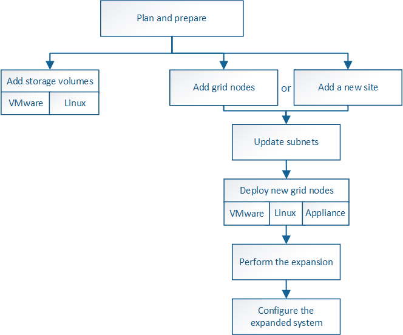

= 확장 절차 개요
:allow-uri-read: 
:icons: font
:imagesdir: ../media/

[role="lead"]
StorageGRID 확장을 수행하는 기본 단계는 스토리지 노드에 스토리지 볼륨 추가, 기존 사이트에 새 노드 추가 또는 새 사이트 추가 등 확장 유형에 따라 다릅니다. 모든 경우에 현재 시스템의 운영을 중단하지 않고 확장을 수행할 수 있습니다.

그리드에 추가하려는 노드의 유형이나 노드를 추가하는 이유는 기본 확장 절차에 영향을 주지 않습니다. 하지만 아래의 워크플로우 다이어그램에 표시된 것처럼 노드를 추가하는 단계는 StorageGRID 어플라이언스를 추가하는지, 아니면 VMware를 실행하는 호스트를 추가하는지에 따라 약간 달라집니다.

NOTE: OpenStack에서 StorageGRID를 새로 설치 또는 확장하기 위해 NetApp에서 제공하는 가상 머신 디스크 파일 및 스크립트는 더 이상 지원되지 않습니다. OpenStack에서 기존 구축을 확장하려면 Linux 배포 단계를 참조하십시오.

NOTE: "'Linux'는 Red Hat ® Enterprise Linux ®, Ubuntu ®, CentOS 또는 Debian ® 배포를 의미합니다. NetApp 상호 운용성 매트릭스 툴을 사용하여 지원되는 버전 목록을 확인하십시오.

* 관련 정보 *

https://mysupport.netapp.com/matrix["NetApp 상호 운용성 매트릭스 툴"^]

link:planning-expansion.html["StorageGRID 확장 계획"]

link:preparing-for-expansion.html["확장 준비 중"]

link:adding-storage-volumes-to-storage-nodes.html["스토리지 노드에 스토리지 볼륨을 추가하는 중입니다"]

link:adding-grid-nodes-to-existing-site-or-adding-new-site.html["기존 사이트에 그리드 노드 추가 또는 새 사이트 추가"]
