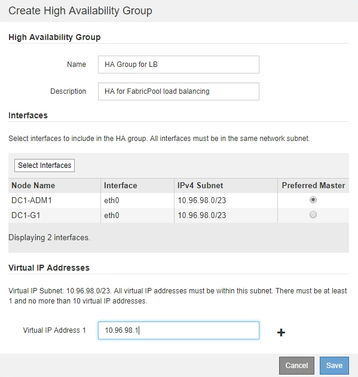

= FabricPool에 대한 고가용성(HA) 그룹 생성
:allow-uri-read: 
:icons: font
:imagesdir: ../media/

[role="lead"]
FabricPool와 함께 사용하도록 StorageGRID를 구성할 때 HA(고가용성) 그룹을 하나 이상 선택적으로 생성할 수 있습니다. HA 그룹은 관리 노드, 게이트웨이 노드 또는 둘 다에서 하나 이상의 네트워크 인터페이스로 구성됩니다.

.필요한 것
* 지원되는 브라우저를 사용하여 Grid Manager에 로그인해야 합니다.
* 루트 액세스 권한이 있어야 합니다.

.이 작업에 대해
각 HA 그룹은 가상 IP 주소(VIP)를 사용하여 연결된 노드의 공유 서비스에 대한 고가용성 액세스를 제공합니다.

이 작업에 대한 자세한 내용은 를 참조하십시오. 을 참조하십시오 link:../admin/managing-high-availability-groups.html["고가용성 그룹 관리"].

.단계
. 구성 * > * 네트워크 설정 * > * 고가용성 그룹 * 을 선택합니다.
. 하나 이상의 네트워크 인터페이스를 선택합니다. 네트워크 인터페이스는 Grid Network(eth0) 또는 Client Network(eth2)의 동일한 서브넷에 속해야 합니다.
. 하나의 노드를 Preferred Master로 지정합니다.
+
장애가 발생하여 VIP 주소가 백업 인터페이스에 재할당되지 않는 한 기본 마스터는 활성 인터페이스입니다.

. HA 그룹에 최대 10개의 IPv4 주소를 입력합니다.
+
주소는 모든 멤버 인터페이스에서 공유하는 IPv4 서브넷 내에 있어야 합니다.

+

