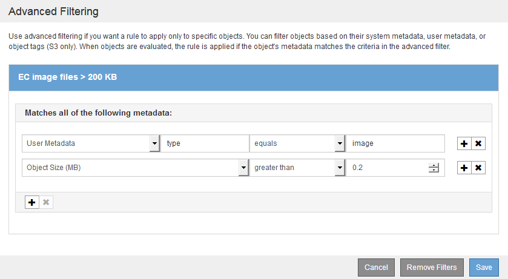
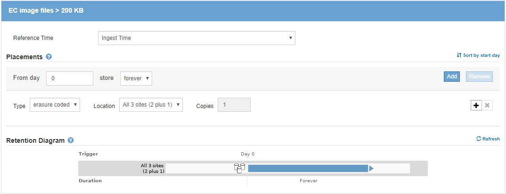

= 예 3: 이미지 파일의 보호 향상을 위한 ILM 규칙 및 정책
:allow-uri-read: 
:icons: font
:imagesdir: ../media/

[role="lead"]
다음 예제 규칙 및 정책을 사용하여 200KB보다 큰 이미지가 삭제 코딩되고 3개의 복사본이 더 작은 이미지로 만들어지는지 확인할 수 있습니다.

CAUTION: 다음 ILM 규칙 및 정책은 예일 뿐입니다. ILM 규칙을 구성하는 방법은 여러 가지가 있습니다. 새 정책을 활성화하기 전에 제안된 정책을 시뮬레이션하여 콘텐츠가 손실로부터 보호되도록 의도한 대로 동작하는지 확인합니다.

== 예를 들어 ILM 규칙 1: 200KB보다 큰 이미지 파일에 EC를 사용합니다

이 ILM 규칙 예에서는 고급 필터링을 사용하여 200KB보다 큰 모든 이미지 파일을 삭제합니다.

[cols="1a,2a"]
|===
| 규칙 정의 | 예제 값 

 a| 
규칙 이름
 a| 
EC 이미지 파일 > 200KB

 a| 
참조 시간
 a| 
수집 시간

 a| 
사용자 메타데이터에 대한 고급 필터링
 a| 
사용자 메타데이터 유형은 이미지 파일과 동일합니다

 a| 
개체 크기에 대한 고급 필터링
 a| 
객체 크기(MB)가 0.2보다 큽니다

 a| 
콘텐츠 배치
 a| 
3개의 사이트를 사용하여 2+1 삭제 코딩 복사본을 생성합니다

|===

이 규칙은 정책의 첫 번째 규칙으로 구성되므로 삭제 코딩 배치 지침은 200KB보다 큰 이미지에만 적용됩니다.

== 예를 들어 ILM 규칙 2: 나머지 모든 이미지 파일에 대해 3개의 복사본을 복제합니다

이 예제 ILM 규칙은 고급 필터링을 사용하여 이미지 파일을 복제하도록 지정합니다.

[cols="1a,2a"]
|===
| 규칙 정의 | 예제 값 

 a| 
규칙 이름
 a| 
이미지 파일용 3부

 a| 
참조 시간
 a| 
수집 시간

 a| 
사용자 메타데이터에 대한 고급 필터링
 a| 
사용자 메타데이터 유형은 이미지 파일과 동일합니다

 a| 
콘텐츠 배치
 a| 
모든 스토리지 노드에서 3개의 복제 복사본을 생성합니다

|===
image:../media/policy_3_rule_2_copies_for_images_adv_filtering.gif["예를 들어 ILM 규칙 2: 나머지 모든 이미지 파일에 대해 3개의 복사본을 복제합니다"]

정책의 첫 번째 규칙이 이미 200KB보다 큰 이미지 파일과 일치했기 때문에 이러한 배치 지침은 200KB 이하의 이미지 파일에만 적용됩니다.

image::../media/policy_3_rule_2_copies_for_images_placements.png[예를 들어 ILM 규칙 2: 나머지 모든 이미지 파일에 대해 3개의 복사본을 복제합니다]

== 예를 들어, ILM 정책 3: 이미지 파일에 대한 보호 개선

이 예에서 ILM 정책은 세 가지 ILM 규칙을 사용하여 삭제 코드가 이미지 파일이 200KB(0.2MB)보다 큰 이미지 파일을 코딩하고 이미지 파일에 대해 복제된 복사본을 200KB 이하의 크기로 만드는 정책을 만들고, 이미지가 아닌 파일에 대해 복제된 복사본을 두 개 만듭니다.

이 ILM 정책 예제에는 다음 작업을 수행하는 규칙이 포함되어 있습니다.

* 삭제 200KB보다 큰 모든 이미지 파일을 코딩합니다.
* 나머지 이미지 파일(즉, 200KB 이하의 이미지)의 복사본을 3개 만듭니다.
* 나머지 개체(즉, 이미지가 아닌 모든 파일)에 기본 규칙을 적용합니다.

image::../media/policy_3_configured_policy.gif[예를 들어, ILM 정책 3: 이미지 파일에 대한 보호 개선]
