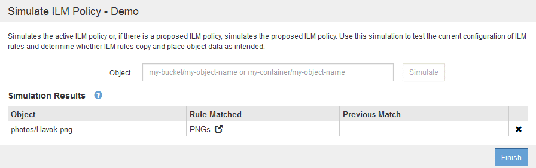
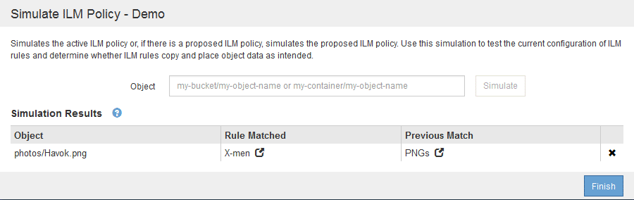

= ILM 정책 시뮬레이션에 대한 예
:allow-uri-read: 
:icons: font
:imagesdir: ../media/

[role="lead"]
다음 예에서는 ILM 정책을 활성화하기 전에 시뮬레이션하여 ILM 규칙을 확인하는 방법을 보여 줍니다.

== 예 1: 제안된 ILM 정책을 시뮬레이션할 때 규칙 확인

이 예제에서는 제안된 정책을 시뮬레이션할 때 규칙을 확인하는 방법을 보여 줍니다.

이 예제에서 * 예제 ILM 정책 * 은 두 개의 버킷에 있는 인제스트된 오브젝트에 대해 시뮬레이션되고 있습니다. 이 정책은 다음과 같은 세 가지 규칙을 포함합니다.

* 첫 번째 규칙 * 2개 복사본, 버킷 - A * 의 경우 2년, 버킷 - a의 오브젝트에만 적용됩니다
* 두 번째 규칙인 menu: EC objects [1 MB] 는 1MB를 초과하는 개체에 필터를 제외한 모든 버킷에 적용됩니다.
* 세 번째 규칙은 기본 규칙이며 필터를 포함하지 않습니다.

image::../media/saved_policy_for_simulation.png[Simulation에 대한 저장된 정책]

.단계
. 규칙을 추가하고 정책을 저장한 후 * 시뮬레이션 * 을 클릭합니다.
+
ILM 정책 시뮬레이션 대화 상자가 나타납니다.

. Object * 필드에 테스트 개체의 S3 버킷/오브젝트 키 또는 Swift 컨테이너/오브젝트 이름을 입력하고 * Simulate * 를 클릭합니다.
+
Simulation 결과가 나타나고 정책의 어떤 규칙이 테스트한 각 개체와 일치하는지를 보여줍니다.

+
image::../media/simulate_policy_screen.png[정책 시뮬레이션 화면]

. 각 객체가 올바른 규칙에 일치하는지 확인합니다.
+
이 예에서

+
.. `bucket-a/bucket-a object.pdf` 의 오브젝트를 필터링하는 첫 번째 규칙과 올바르게 일치했습니다 `bucket-a`.
.. `bucket-b/test object greater than 1 MB.pdf` 에 있습니다 `bucket-b`첫 번째 규칙과 일치하지 않습니다. 대신 1MB보다 큰 객체를 필터링하는 두 번째 규칙에 의해 올바르게 일치되었습니다.
.. `bucket-b/test object less than 1 MB.pdf` 처음 두 개의 규칙에 있는 필터와 일치하지 않아 필터가 없는 기본 규칙에 따라 배치됩니다.

== 예 2: 제안된 ILM 정책을 시뮬레이션할 때 규칙 재정렬

이 예제에서는 정책을 시뮬레이션할 때 결과를 변경하기 위해 규칙의 순서를 변경하는 방법을 보여 줍니다.

이 예에서는 * Demo * 정책을 시뮬레이션하고 있습니다. 이 정책은 시리즈 = x-men 사용자 메타데이터가 있는 개체를 찾기 위해 다음과 같은 세 가지 규칙을 포함합니다.

* 첫 번째 규칙인 * PNG * 는 에서 끝나는 키 이름을 필터링합니다 `.png`.
* 두 번째 규칙 * X-MEN * 은 테넌트 A 및 의 필터에 대한 객체에만 적용됩니다 `series=x-men` 사용자 메타데이터.
* 마지막 규칙인 * Two 는 두 데이터 센터 * 를 복사합니다. 이 규칙은 처음 두 규칙과 일치하지 않는 모든 개체와 일치합니다.

image::../media/simulate_reorder_rules_pngs_rule.png[예 2: 제안된 ILM 정책을 시뮬레이션할 때 규칙 재정렬]

.단계
. 규칙을 추가하고 정책을 저장한 후 * 시뮬레이션 * 을 클릭합니다.
. Object * 필드에 테스트 개체의 S3 버킷/오브젝트 키 또는 Swift 컨테이너/오브젝트 이름을 입력하고 * Simulate * 를 클릭합니다.
+
Simulation 결과가 나타나고 이 표시됩니다 `Havok.png` 객체가 * PNG * 규칙에 일치했습니다.

+

+
그러나 의 규칙은 입니다 `Havok.png` 테스트 대상이 * X-MEN * 규칙이었습니다.

. 문제를 해결하려면 규칙을 다시 정렬하십시오.
+
.. ILM 정책 시뮬레이션 페이지를 닫으려면 * 마침 * 을 클릭합니다.
.. 정책을 편집하려면 * 편집 * 을 클릭합니다.
.. X-MEN * 규칙을 목록의 맨 위로 끕니다.
+
image::../media/simulate_reorder_rules_correct_rule.png[시뮬레이션 - 규칙 순서 재지정 - 규칙 수정]

.. 저장 * 을 클릭합니다.

. 시뮬레이션 * 을 클릭합니다.
+
이전에 테스트한 객체는 업데이트된 정책에 대해 재평가되고 새 시뮬레이션 결과가 표시됩니다. 이 예에서 일치하는 규칙 열은 을 표시합니다 `Havok.png` 이제 객체는 예상대로 X-MEN 메타데이터 규칙과 일치합니다. 이전 일치 열은 PNG 규칙이 이전 시뮬레이션에서 개체와 일치했음을 나타냅니다.

+

+

NOTE: 정책 구성 페이지에 있는 경우 테스트 개체의 이름을 다시 입력할 필요 없이 변경 후 정책을 다시 시뮬레이션할 수 있습니다.

== 예 3: 제안된 ILM 정책을 시뮬레이션할 때 규칙 수정

이 예제에서는 정책을 시뮬레이션하고 정책의 규칙을 정정하고 시뮬레이션을 계속하는 방법을 보여 줍니다.

이 예에서는 * Demo * 정책을 시뮬레이션하고 있습니다. 이 정책은 가 있는 개체를 찾기 위한 것입니다 `series=x-men` 사용자 메타데이터. 그러나 에 대해 이 정책을 시뮬레이션하는 동안 예기치 않은 결과가 발생했습니다 `Beast.jpg` 오브젝트. 이 개체는 X-Men 메타데이터 규칙을 일치시키는 대신 기본 규칙과 일치하며 두 개의 데이터 센터를 복제합니다.

image::../media/simulate_results_for_object_wrong_metadata.png[예 3: 제안된 ILM 정책을 시뮬레이션할 때 규칙 수정]

테스트 객체가 정책의 예상 규칙과 일치하지 않으면 정책의 각 규칙을 검사하고 오류를 수정해야 합니다.

.단계
. 정책의 각 규칙에 대해 규칙 이름 또는 자세한 정보 아이콘을 클릭하여 규칙 설정을 확인합니다 image:../media/icon_nms_more_details.gif["자세한 정보 아이콘"] 규칙이 표시되는 대화 상자
. 규칙의 테넌트 계정, 참조 시간 및 필터링 기준을 검토합니다.
+
이 예제에서 X-MEN 규칙의 메타데이터에는 오류가 포함되어 있습니다. 메타데이터의 값은 "x-men" 대신 "x-men1"로 입력되었습니다.

+
image::../media/simulate_rules_select_rule_popup_with_wrong_metadata.png[예 3: 제안된 ILM 정책을 시뮬레이션할 때 규칙 수정]

. 오류를 해결하려면 다음과 같이 규칙을 수정하십시오.
+
** 규칙이 제안된 정책의 일부인 경우 규칙을 복제하거나 정책에서 규칙을 제거한 다음 편집할 수 있습니다.
** 규칙이 활성 정책의 일부인 경우 규칙을 복제해야 합니다. 활성 정책에서 규칙을 편집하거나 제거할 수 없습니다.
+
[cols="1a,3a"]
|===
| 옵션을 선택합니다 | 설명 

 a| 
규칙 클론 생성
 a| 
... ILM * > * 규칙 * 을 선택합니다.
... 잘못된 규칙을 선택하고 * Clone * 을 클릭합니다.
... 잘못된 정보를 변경하고 * 저장 * 을 클릭합니다.
... ILM * > * 정책 * 을 선택합니다.
... 제안된 정책을 선택하고 * 편집 * 을 클릭합니다.
... 규칙 선택 * 을 클릭합니다.
... 새 규칙의 확인란을 선택하고 원래 규칙의 확인란을 선택 취소한 다음 * 적용 * 을 클릭합니다.
... 저장 * 을 클릭합니다.

 a| 
규칙 편집
 a| 
... 제안된 정책을 선택하고 * 편집 * 을 클릭합니다.
... 삭제 아이콘을 클릭합니다 image:../media/icon_nms_delete_new.gif["삭제 아이콘"] 잘못된 규칙을 제거하려면 * 저장 * 을 클릭합니다.
... ILM * > * 규칙 * 을 선택합니다.
... 잘못된 규칙을 선택하고 * 편집 * 을 클릭합니다.
... 잘못된 정보를 변경하고 * 저장 * 을 클릭합니다.
... ILM * > * 정책 * 을 선택합니다.
... 제안된 정책을 선택하고 * 편집 * 을 클릭합니다.
... 수정된 규칙을 선택하고 * 적용 * 을 클릭한 다음 * 저장 * 을 클릭합니다.

|===

. 시뮬레이션을 다시 수행합니다.
+

NOTE: 규칙을 편집하기 위해 ILM 정책 페이지에서 탐색했기 때문에 이전에 시뮬레이션에 입력한 개체가 더 이상 표시되지 않습니다. 오브젝트의 이름을 다시 입력해야 합니다.

+
이 예에서는 수정된 X-MEN 규칙이 이제 와 일치합니다 `Beast.jpg` 에 기초한 개체 `series=x-men` 사용자 메타데이터(예상됨)

+
image::../media/simulate_results_for_object_corrected_metadata.gif[예 3: 제안된 ILM 정책을 시뮬레이션할 때 규칙 수정]

