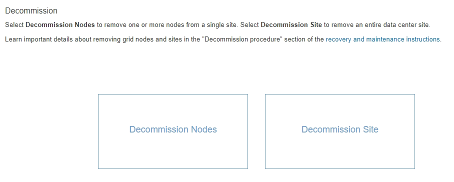
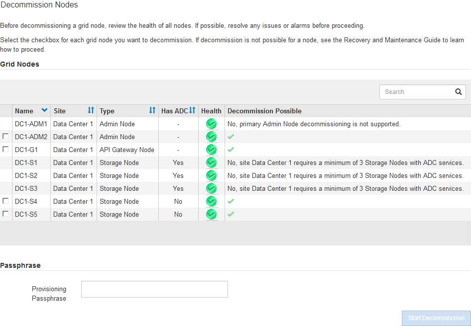

= 서비스 해제 노드 페이지 액세스
:allow-uri-read: 
:icons: font
:imagesdir: ../media/

[role="lead"]
Grid Manager에서 Decommission Nodes 페이지에 액세스하면 사용 중단될 수 있는 노드를 한 눈에 볼 수 있습니다.

.필요한 것
* 지원되는 브라우저를 사용하여 Grid Manager에 로그인해야 합니다.
* 유지 관리 또는 루트 액세스 권한이 있어야 합니다.

.단계
. 유지보수 * > * 유지보수 작업 * > * 서비스 해제 * 를 선택합니다.
+
서비스 해제 페이지가 나타납니다.

+

. [서비스 해제 노드] * 버튼을 클릭합니다.
+
서비스 해제 노드 페이지가 나타납니다. 이 페이지에서 다음을 수행할 수 있습니다.

+
** 현재 사용 중단될 수 있는 그리드 노드를 결정합니다.
** 모든 그리드 노드의 상태를 확인합니다
** 목록을 오름차순 또는 내림차순으로 * 이름 *, * 사이트 *, * 유형 * 또는 * ADC * 를 기준으로 정렬합니다.
** 검색어를 입력하여 특정 노드를 빠르게 찾을 수 있습니다. 예를 들어 이 페이지에는 단일 데이터 센터의 모든 그리드 노드가 표시됩니다. Decommission Possible 열은 비기본 관리 노드, 게이트웨이 노드 및 5개의 스토리지 노드 중 2개의 서비스를 해제할 수 있음을 나타냅니다.

+

. 서비스 해제하려는 각 노드에 대해 * 서비스 해제 가능 * 열을 검토합니다.
+
그리드 노드를 해체할 수 있는 경우 이 열에는 녹색 확인 표시가 있고 맨 왼쪽 열에는 확인란이 포함됩니다. 노드를 해체할 수 없는 경우 이 열에 이 문제가 설명되어 있습니다. 노드가 해체될 수 없는 두 가지 이상의 이유가 있는 경우 가장 중요한 이유가 표시됩니다.

+
[cols="1a,2a,3a"]
|===
| 사용 중지 가능한 이유 | 설명 | 해결 단계 

 a| 
아니요. 노드 유형 서비스 해제는 지원되지 않습니다.
 a| 
운영 관리자 노드 또는 아카이브 노드는 해제할 수 없습니다.
 a| 
없음.

 a| 
아니요. 그리드 노드가 하나 이상 연결되어 있지 않습니다.

* 참고: * 이 메시지는 연결된 그리드 노드에만 표시됩니다.
 a| 
그리드 노드의 연결이 끊어진 경우에는 연결된 그리드 노드를 해제할 수 없습니다.

상태 * 열에는 연결이 끊긴 그리드 노드에 대한 다음 아이콘 중 하나가 포함됩니다.

** image:../media/icon_alarm_gray_administratively_down.png["회색 물음표 아이콘"] (회색): 관리상 중단
** image:../media/icon_alarm_blue_unknown.png["파란색 물음표 아이콘"] (파란색): 알 수 없음

 a| 
로 이동합니다 <<decommission_procedure_choices,서비스 해제 절차 선택 항목이 나열된 단계입니다>>.

 a| 
아니요. 하나 이상의 필수 노드가 현재 연결 해제되어 있으며 복구해야 합니다.

* 참고: * 이 메시지는 연결이 끊긴 그리드 노드에만 표시됩니다.
 a| 
하나 이상의 필수 노드도 연결 해제된 경우(예: ADC 쿼럼에 필요한 스토리지 노드) 연결이 해제된 그리드 노드를 해제할 수 없습니다.
 a| 
.. 연결이 끊긴 모든 노드에 대해 서비스 해제 가능 메시지를 검토합니다.
.. 필요한 경우 사용 해제할 수 없는 노드를 결정합니다.
+
*** 필요한 노드의 상태가 관리상 중단된 경우 노드를 다시 온라인 상태로 전환합니다.
*** 필요한 노드의 상태가 Unknown 인 경우 노드 복구 절차를 수행하여 필요한 노드를 복구합니다.

 a| 
아니요, HA 그룹의 구성원:_x_. 이 노드를 사용 해제하려면 먼저 모든 HA 그룹에서 제거해야 합니다.
 a| 
노드 인터페이스가 고가용성(HA) 그룹에 속한 경우에는 관리 노드 또는 게이트웨이 노드를 해제할 수 없습니다.
 a| 
HA 그룹을 편집하여 노드의 인터페이스를 제거하거나 전체 HA 그룹을 제거합니다. StorageGRID 관리 지침을 참조하십시오.

 a| 
아니요. site_x_에는 ADC 서비스를 포함하는 최소 _n_개의 스토리지 노드가 필요합니다.
 a| 
* 스토리지 노드만 해당. * ADC 쿼럼 요구 사항을 지원하기 위해 사이트에 충분한 노드가 남아 있으면 스토리지 노드를 해제할 수 없습니다.
 a| 
확장을 수행합니다. 사이트에 새 스토리지 노드를 추가하고 ADC 서비스를 사용하도록 지정합니다. ADC 정수에 대한 정보를 참조하십시오.

 a| 
아니요. 하나 이상의 삭제 코딩 프로파일에 적어도 _n_개의 스토리지 노드가 필요합니다. ILM 규칙에서 프로파일을 사용하지 않는 경우 비활성화할 수 있습니다.
 a| 
* 스토리지 노드 전용. * 기존 삭제 코딩 프로파일에 대해 충분한 노드가 남아 있지 않으면 스토리지 노드를 해제할 수 없습니다.

예를 들어, 4+2 삭제 코딩에 대해 삭제 코딩 프로필이 있는 경우 최소 6개의 스토리지 노드를 유지해야 합니다.
 a| 
영향을 받는 각 삭제 코딩 프로필에 대해 프로필을 사용하는 방법에 따라 다음 단계 중 하나를 수행합니다.

** * 활성 ILM 정책에 사용됨 *: 확장을 수행합니다. 삭제 코딩을 계속할 수 있도록 새 스토리지 노드를 추가합니다. StorageGRID 확장 지침을 참조하십시오.
** * ILM 규칙에 사용되지만 활성 ILM 정책에는 사용되지 않음 *: 규칙을 편집 또는 삭제한 다음 삭제 코딩 프로필을 비활성화합니다.
** * ILM 규칙에서 사용되지 않음 *: 삭제 코딩 프로필을 비활성화합니다.

* 참고: * 삭제 코딩 프로파일을 비활성화하려고 하면 오류 메시지가 나타나고 오브젝트 데이터는 여전히 프로파일과 연결됩니다. 비활성화 프로세스를 다시 시도하기 전에 몇 주를 기다려야 할 수 있습니다.

정보 수명 주기 관리를 사용하여 개체를 관리하기 위한 지침에서 삭제 코딩 프로필 비활성화에 대해 알아보십시오.

|===
. [[서비스 해제_절차_선택]] 노드에 대해 서비스 해제가 가능한 경우 수행해야 할 절차를 결정합니다.
+
[cols="1a,1a"]
|===
| 그리드에 다음 사항이 포함되어 있는 경우: | 이동... 

 a| 
연결이 끊긴 모든 그리드 노드
 a| 
link:decommissioning-disconnected-grid-nodes.html["분리된 그리드 노드를 해체합니다"]

 a| 
연결된 그리드 노드만
 a| 
link:decommissioning-connected-grid-nodes.html["연결된 그리드 노드 해제"]

|===

.관련 정보
link:checking-data-repair-jobs.html["데이터 복구 작업을 확인하는 중입니다"]

link:understanding-adc-service-quorum.html["ADC 정수에 대한 이해"]

link:../ilm/index.html["ILM을 사용하여 개체를 관리합니다"]

link:../expand/index.html["그리드를 확장합니다"]

link:../admin/index.html["StorageGRID 관리"]
