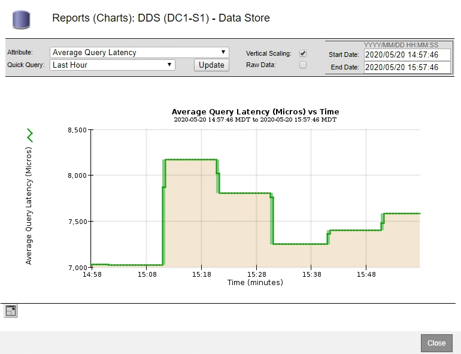

= 차트 및 그래프 표시
:allow-uri-read: 
:icons: font
:imagesdir: ../media/

[role="lead"]
노드 페이지에는 스토리지 용량 및 처리량과 같은 속성을 모니터링하기 위해 정기적으로 액세스해야 하는 그래프와 차트가 들어 있습니다. 경우에 따라, 특히 기술 지원 작업을 할 때 * 지원 * > * 도구 * > * 그리드 토폴로지 * 페이지를 사용하여 추가 차트에 액세스할 수 있습니다.

.필요한 것
지원되는 브라우저를 사용하여 Grid Manager에 로그인해야 합니다.

.단계
. 노드 * 를 선택합니다. 그런 다음 노드, 사이트 또는 전체 그리드를 선택합니다.
. 정보를 보려는 탭을 선택합니다.
+
일부 탭에는 한 개 이상의 Grafana 차트가 포함되어 있으며, 이 차트는 시간의 경과에 따른 Prometheus 메트릭의 값을 플롯하는 데 사용됩니다. 예를 들어, 노드의 * 노드 * > * 하드웨어 * 탭에는 두 개의 Grafana 차트가 들어 있습니다.

+
image::../media/nodes_page_hardware_tab_graphs.png[노드 페이지 하드웨어 탭 그래프]

. 원하는 경우 차트 위에 커서를 올려 놓으면 특정 시점에 대한 보다 자세한 값을 볼 수 있습니다.
+
image::../media/nodes_page_memory_usage_details.png[노드 페이지 메모리 사용 세부 정보]

. 필요에 따라 특정 특성 또는 메트릭에 대한 차트를 표시할 수 있습니다. 노드 페이지의 표에서 차트 아이콘을 클릭합니다 image:../media/icon_chart_new.gif["차트 아이콘"] 또는 image:../media/icon_chart_new_for_11_5.png["차트 아이콘 - 11.5의 경우 새로 만들기"] 속성 이름의 오른쪽에 있습니다.
+

NOTE: 일부 메트릭 및 특성에는 차트를 사용할 수 없습니다.

+
* 예 1 *: 스토리지 노드의 객체 탭에서 차트 아이콘을 클릭할 수 있습니다 image:../media/icon_chart_new.gif["차트 아이콘"] 메타데이터 쿼리의 평균 지연 시간을 확인합니다.

+
image::../media/icon_nodes_average_latency_chart.png[노드 평균 지연 시간 차트 아이콘]

+

+
* 예 2 *: 스토리지 노드의 객체 탭에서 차트 아이콘을 클릭할 수 있습니다 image:../media/icon_chart_new_for_11_5.png["차트 아이콘 - 11.5의 경우 새로 만들기"] Grafana 로 시간 경과에 따라 감지된 오브젝트의 수에 대한 그래프 를 봅니다.

+
image::../media/object_count_table.png[개체 수 표]

+
image::../media/charts_lost_object_detected.png[차트 손실된 개체가 감지되었습니다]

. 노드 페이지에 표시되지 않은 속성에 대한 차트를 표시하려면 * 지원 * > * 도구 * > * 그리드 토폴로지 * 를 선택합니다.
. grid node_ * > * _component 또는 service_ * > * Overview * > * Main * 을 선택합니다.
+
image::../media/nms_chart.gif[주변 텍스트로 설명된 스크린샷]

. 차트 아이콘을 클릭합니다 image:../media/icon_chart_new.gif["차트 아이콘"] 속성 옆에 있습니다.
+
그러면 * Reports * > * Charts * 페이지가 자동으로 변경됩니다. 차트는 지난 하루 동안의 특성 데이터를 표시합니다.

