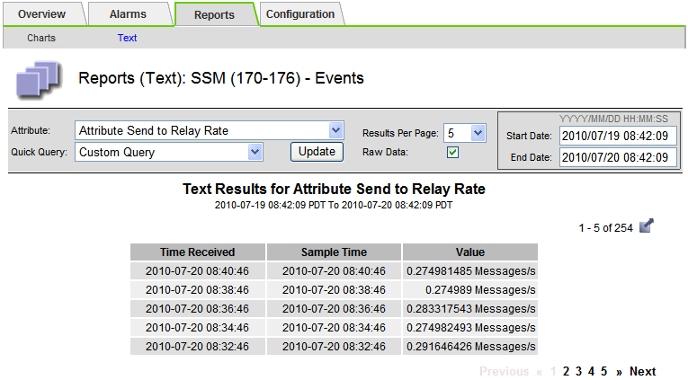

= 텍스트 보고서를 내보내는 중입니다
:allow-uri-read: 
:icons: font
:imagesdir: ../media/

[role="lead"]
내보낸 텍스트 보고서는 데이터를 선택하고 복사할 수 있는 새 브라우저 탭을 엽니다.

.이 작업에 대해
그런 다음 복사한 데이터를 새 문서(예: 스프레드시트)에 저장하고 StorageGRID 시스템의 성능을 분석하는 데 사용할 수 있습니다.

.단계
. 지원 * > * 도구 * > * 그리드 토폴로지 * 를 선택합니다.
. 텍스트 보고서를 만듭니다.
. 내보내기 * 를 클릭합니다image:../media/icon_export.gif["내보내기 아이콘"].
+

+
보고서를 표시하는 Export Text Report(텍스트 보고서 내보내기) 창이 열립니다.

+
image::../media/export_text_report_data.gif[샘플 텍스트 보고서를 보여 주는 스크린샷]

. 텍스트 보고서 내보내기 창의 내용을 선택하고 복사합니다.
+
이제 이 데이터를 스프레드시트와 같은 타사 문서에 붙여넣을 수 있습니다.

