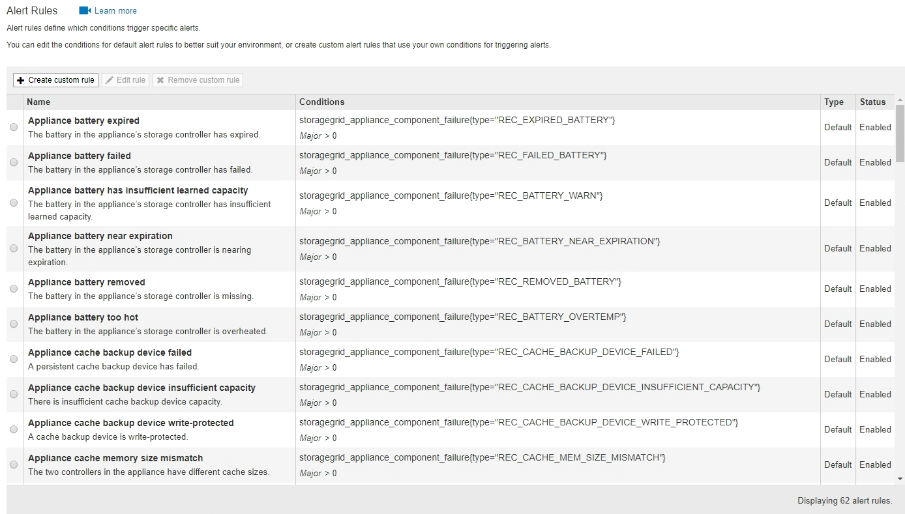
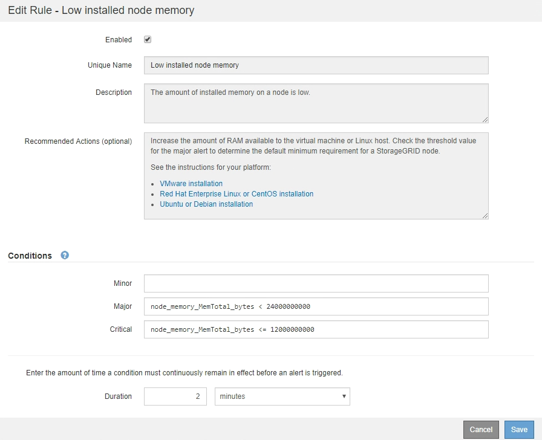
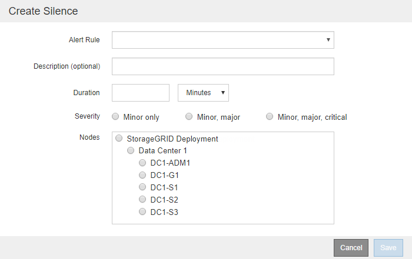

= 알림 관리
:allow-uri-read: 
:icons: font
:imagesdir: ../media/

[role="lead"]
경고를 통해 StorageGRID 시스템 내의 다양한 이벤트 및 조건을 모니터링할 수 있습니다. 사용자 지정 알림을 생성하고, 기본 경고를 편집 또는 비활성화하고, 경고에 대한 이메일 알림을 설정하고, 알림 해제를 통해 알림을 관리할 수 있습니다.

.관련 정보
link:viewing-current-alerts.html["현재 경고 보기"]

link:viewing-resolved-alerts.html["해결된 경고 보기"]

link:viewing-specific-alert.html["특정 경고 보기"]

link:alerts-reference.html["경고 참조"]

== 경고란 무엇입니까

이 경고 시스템은 StorageGRID 작동 중에 발생할 수 있는 문제를 감지, 평가 및 해결하기 위한 사용이 간편한 인터페이스를 제공합니다.

* 알림 시스템은 시스템에서 실행 가능한 문제에 초점을 맞춥니다. 기존 시스템의 일부 알람과 달리, 경고는 무시해도 안전한 이벤트가 아니라 즉각적인 주의가 필요한 이벤트에 대해 트리거됩니다.
* 현재 경고 페이지에서는 현재 문제를 볼 수 있는 사용자 친화적인 인터페이스를 제공합니다. 개별 알림 및 알림 그룹을 기준으로 목록을 정렬할 수 있습니다. 예를 들어 모든 알림을 노드/사이트별로 정렬하여 특정 노드에 영향을 미치는 알림을 확인할 수 있습니다. 또는 특정 알림의 가장 최근 인스턴스를 찾기 위해 트리거된 시간을 기준으로 그룹의 알림을 정렬할 수 있습니다.
* 해결된 경고 페이지는 현재 경고 페이지와 유사한 정보를 제공하지만, 경고가 트리거된 시기 및 해결된 시점을 포함하여 해결된 경고의 기록을 검색하고 볼 수 있습니다.
* 동일한 유형의 여러 알림이 하나의 이메일로 그룹화되어 알림 수가 줄어듭니다. 또한 동일한 유형의 여러 알림이 경고 페이지에 그룹으로 표시됩니다. 알림 그룹을 확장하고 축소하여 개별 알림을 표시하거나 숨길 수 있습니다. 예를 들어, 여러 노드에서 * 노드 * 경고와 거의 동시에 통신할 수 없다고 보고하면 하나의 이메일만 전송되고 알림은 경고 페이지에 그룹으로 표시됩니다.
* 알림은 직관적인 이름과 설명을 사용하여 문제를 빠르게 파악할 수 있도록 도와줍니다. 알림 알림에는 영향을 받는 노드 및 사이트에 대한 세부 정보, 알림 심각도, 알림 규칙이 트리거된 시간, 경고와 관련된 메트릭의 현재 값이 포함됩니다.
* 경고 이메일 알림 및 현재 경고 및 해결된 경고 페이지의 경고 목록은 경고 해결을 위한 권장 조치를 제공합니다. 이러한 권장 조치에는 보다 자세한 문제 해결 절차를 쉽게 찾아 액세스할 수 있도록 StorageGRID 문서 센터로 직접 연결되는 링크가 포함되어 있습니다.
* 하나 이상의 심각도 수준에서 알림에 대한 알림을 일시적으로 억제해야 하는 경우 지정된 기간 및 전체 그리드, 단일 사이트 또는 단일 노드에 대해 특정 알림 규칙을 쉽게 해제할 수 있습니다. 또한 소프트웨어 업그레이드와 같은 계획된 유지 관리 절차 중에 모든 경고 규칙을 해제할 수 있습니다.
* 필요에 따라 기본 경고 규칙을 편집할 수 있습니다. 경고 규칙을 완전히 비활성화하거나 트리거 조건 및 기간을 변경할 수 있습니다.
* 사용자 정의 경고 규칙을 생성하여 자신의 상황과 관련된 특정 조건을 타겟팅하고 자신만의 권장 조치를 제공할 수 있습니다. 사용자 지정 알림의 조건을 정의하려면 Grid Management API의 Metrics 섹션에서 사용할 수 있는 Prometheus 메트릭을 사용하여 표현식을 생성합니다.

== 경고 규칙 관리

경고 규칙은 특정 경고를 트리거하는 조건을 정의합니다. StorageGRID에는 기본 경고 규칙 집합이 포함되어 있으며, 이 규칙 집합을 그대로 사용하거나 수정하거나 사용자 지정 경고 규칙을 만들 수 있습니다.

=== 경고 규칙 보기

모든 기본 및 사용자 지정 알림 규칙 목록을 보고 각 알림을 트리거할 조건을 확인하고 경고가 비활성화되었는지 여부를 확인할 수 있습니다.

.필요한 것
* 지원되는 브라우저를 사용하여 Grid Manager에 로그인해야 합니다.
* 알림 관리 또는 루트 액세스 권한이 있어야 합니다.

.단계
. 경고 * > * 경고 규칙 * 을 선택합니다.
+
경고 규칙 페이지가 나타납니다.

+

. 경고 규칙 표의 정보를 검토합니다.
+
|===
| 열 머리글 | 설명 

 a| 
이름
 a| 
알림 규칙의 고유한 이름 및 설명입니다. 사용자 지정 경고 규칙이 먼저 나열되고 그 뒤에 기본 경고 규칙이 나열됩니다. 알림 규칙 이름은 이메일 알림의 제목입니다.

 a| 
조건
 a| 
이 알림이 트리거되는 시기를 결정하는 Prometheus 식입니다. 알림은 다음 심각도 수준 중 하나 이상으로 트리거될 수 있지만 각 심각도에 대한 조건은 필요하지 않습니다.

** * 심각 * image:../media/icon_alert_red_critical.png["아이콘 경고 빨간색 위험"]: StorageGRID 노드나 서비스의 정상적인 작동을 중지해 온 비정상적인 조건이 존재합니다. 기본 문제를 즉시 해결해야 합니다. 문제가 해결되지 않으면 서비스가 중단되거나 데이터가 손실될 수 있습니다.
** * 주 * image:../media/icon_alert_orange_major.png["아이콘 경고 주황색 주"]: 현재 작업에 영향을 미치거나 위험 경고에 대한 임계값에 근접한 비정상적인 상태가 존재합니다. StorageGRID 노드나 서비스의 정상 작동을 비정상적인 상태로 중지하지 않도록 주요 경고를 조사하고 모든 기본 문제를 해결해야 합니다.
** * 보조 * image:../media/icon_alert_yellow_miinor.png["아이콘 경고 노란색이 경미합니다"]: 시스템이 정상적으로 작동하지만 시스템이 계속 작동할 경우 시스템 기능에 영향을 줄 수 있는 비정상적인 상태가 존재합니다. 보다 심각한 문제를 초래하지 않도록 자체적으로 명확하지 않은 사소한 경고를 모니터링하고 해결해야 합니다.

 a| 
유형
 a| 
알림 규칙의 유형:

** * 기본값 *: 시스템과 함께 제공되는 경고 규칙입니다. 기본 알림 규칙을 비활성화하거나 기본 알림 규칙의 조건 및 기간을 편집할 수 있습니다. 기본 알림 규칙은 제거할 수 없습니다.
** * 기본값**: 편집된 조건 또는 기간이 포함된 기본 경고 규칙입니다. 필요에 따라 수정된 조건을 원래 기본값으로 쉽게 되돌릴 수 있습니다.
** * 사용자 정의 *: 사용자가 만든 알림 규칙입니다. 사용자 지정 경고 규칙을 비활성화, 편집 및 제거할 수 있습니다.

 a| 
상태
 a| 
이 경고 규칙의 현재 활성화 또는 비활성화 여부를 나타냅니다. 비활성화된 경고 규칙의 조건은 평가되지 않으므로 경고가 트리거되지 않습니다.

|===

.관련 정보
link:alerts-reference.html["경고 참조"]

=== 사용자 지정 경고 규칙을 만드는 중입니다

사용자 지정 알림 규칙을 만들어 알림을 트리거할 자체 조건을 정의할 수 있습니다.

.필요한 것
* 지원되는 브라우저를 사용하여 Grid Manager에 로그인해야 합니다.
* 알림 관리 또는 루트 액세스 권한이 있어야 합니다.

.이 작업에 대해
StorageGRID에서는 사용자 지정 경고의 유효성을 검사하지 않습니다. 사용자 지정 알림 규칙을 만들려면 다음 일반 지침을 따릅니다.

* 기본 알림 규칙의 조건을 확인하고 사용자 지정 알림 규칙의 예로 사용합니다.
* 경고 규칙에 대해 둘 이상의 조건을 정의하는 경우 모든 조건에 동일한 식을 사용합니다. 그런 다음 각 조건에 대한 임계값을 변경합니다.
* 각 조건에서 오타 및 논리 오류가 있는지 주의 깊게 확인합니다.
* Grid Management API에 나열된 메트릭만 사용하십시오.
* Grid Management API를 사용하여 표현식을 테스트할 때 "성공" 응답은 단순히 빈 응답 본체일 수 있습니다(경고가 트리거되지 않음). 알림이 실제로 트리거되었는지 확인하려면 임계값을 현재 참인 것으로 예상되는 값으로 일시적으로 설정할 수 있습니다.
+
예를 들어, 식을 테스트합니다 `node_memory_MemTotal_bytes < 24000000000`, 먼저 실행합니다 `node_memory_MemTotal_bytes >= 0` 그리고 예상 결과를 얻을 수 있는지 확인합니다(모든 노드가 값을 반환함). 그런 다음 연산자 및 임계값을 다시 원하는 값으로 변경하고 다시 실행합니다. 이 식에 대한 현재 경고가 없음을 나타내는 결과가 없습니다.

* 알림이 예상대로 트리거되었음을 확인한 경우를 제외하고 사용자 지정 알림이 작동 중인 것으로 가정하지 마십시오.

.단계
. 경고 * > * 경고 규칙 * 을 선택합니다.
+
경고 규칙 페이지가 나타납니다.

. 사용자 지정 규칙 만들기 * 를 선택합니다.
+
사용자 지정 규칙 만들기 대화 상자가 나타납니다.

+
image::../media/alerts_create_custom_rule.png[알림 > 사용자 지정 규칙 생성 을 클릭합니다]

. 이 경고 규칙이 현재 활성화되어 있는지 여부를 확인하려면 * Enabled * (활성화 *) 확인란을 선택하거나 선택을 취소합니다.
+
경고 규칙을 비활성화하면 해당 식이 계산되지 않고 경고가 트리거되지 않습니다.

. 다음 정보를 입력합니다.
+
|===
| 필드에 입력합니다 | 설명 

 a| 
고유 이름
 a| 
이 규칙의 고유 이름입니다. 알림 규칙 이름은 알림 페이지에 표시되며 이메일 알림의 제목이기도 합니다. 알림 규칙의 이름은 1자에서 64자 사이여야 합니다.

 a| 
설명
 a| 
발생한 문제에 대한 설명입니다. 설명은 경고 페이지와 이메일 알림에 표시되는 경고 메시지입니다. 알림 규칙에 대한 설명은 1자에서 128자 사이여야 합니다.

 a| 
권장 조치
 a| 
이 경고가 트리거될 때 수행할 권장 조치를 선택할 수도 있습니다. 권장 작업을 일반 텍스트로 입력합니다(서식 코드 없음). 경고 규칙에 권장되는 작업은 0자에서 1,024자 사이여야 합니다.

|===
. 조건 섹션에 하나 이상의 알림 심각도 수준에 대한 Prometheus 식을 입력합니다.
+
기본 표현식은 대개 다음과 같습니다.

+
[listing]
----
[metric] [operator] [value]
----
+
식은 임의의 길이일 수 있지만 사용자 인터페이스의 한 줄에 표시됩니다. 적어도 하나의 식이 필요합니다.

+
사용 가능한 메트릭을 확인하고 Prometheus 식을 테스트하려면 도움말 아이콘을 클릭합니다 image:../media/icon_nms_question.gif["물음표 아이콘"] 그리드 관리 API의 메트릭 섹션 링크를 따라 이동합니다.

+
그리드 관리 API 사용에 대한 자세한 내용은 StorageGRID 관리 지침을 참조하십시오. Prometheus 쿼리 구문에 대한 자세한 내용은 Prometheus 설명서를 참조하십시오.

+
이 식을 사용하면 노드에 설치된 RAM의 양이 24,000,000,000바이트(24GB) 미만인 경우 경고가 트리거됩니다.

+
[listing]
----
node_memory_MemTotal_bytes < 24000000000
----
. [기간*] 필드에 경고가 트리거되기 전에 조건이 계속 유효해야 하는 시간을 입력하고 시간 단위를 선택합니다.
+
조건이 참일 때 경고를 즉시 트리거하려면 * 0 * 을 입력합니다. 이 값을 늘려 일시적 조건이 경고를 트리거하지 않도록 합니다.

+
기본값은 5분입니다.

. 저장 * 을 클릭합니다.
+
대화 상자가 닫히고 새 사용자 지정 경고 규칙이 경고 규칙 테이블에 나타납니다.

.관련 정보
link:../admin/index.html["StorageGRID 관리"]

link:commonly-used-prometheus-metrics.html["일반적으로 사용되는 Prometheus 메트릭입니다"]

https://prometheus.io/docs/querying/basics/["Prometheus: 쿼리 기본 사항"]

=== 알림 규칙 편집

알림 규칙을 편집하여 트리거 조건을 변경할 수 있습니다. 사용자 지정 알림 규칙의 경우 규칙 이름, 설명 및 권장 작업을 업데이트할 수도 있습니다.

.필요한 것
* 지원되는 브라우저를 사용하여 Grid Manager에 로그인해야 합니다.
* 알림 관리 또는 루트 액세스 권한이 있어야 합니다.

.이 작업에 대해
기본 경고 규칙을 편집할 때 Minor, Major 및 Critical 경고의 조건 및 기간을 변경할 수 있습니다. 사용자 지정 알림 규칙을 편집할 때 규칙의 이름, 설명 및 권장 작업을 편집할 수도 있습니다.

IMPORTANT: 알림 규칙을 편집하기로 결정할 때는 주의해야 합니다. 트리거 값을 변경하는 경우 중요한 작업이 완료되지 못할 때까지 기본 문제를 감지하지 못할 수 있습니다.

.단계
. 경고 * > * 경고 규칙 * 을 선택합니다.
+
경고 규칙 페이지가 나타납니다.

. 편집하려는 경고 규칙에 대한 라디오 버튼을 선택합니다.
. 규칙 편집 * 을 선택합니다.
+
규칙 편집 대화 상자가 나타납니다. 이 예제에서는 기본 경고 규칙을 보여 줍니다. 고유 이름, 설명 및 권장 조치 필드는 사용할 수 없으며 편집할 수 없습니다.

+

. 이 경고 규칙이 현재 활성화되어 있는지 여부를 확인하려면 * Enabled * (활성화 *) 확인란을 선택하거나 선택을 취소합니다.
+
경고 규칙을 비활성화하면 해당 식이 계산되지 않고 경고가 트리거되지 않습니다.

+

NOTE: 현재 알림에 대한 알림 규칙을 사용하지 않도록 설정한 경우 알림이 더 이상 활성 알림으로 나타나지 않을 때까지 몇 분 정도 기다려야 합니다.

+

IMPORTANT: 일반적으로 기본 알림 규칙을 사용하지 않는 것이 좋습니다. 경고 규칙을 비활성화하면 중요한 작업이 완료되지 못할 때까지 기본 문제를 감지하지 못할 수 있습니다.

. 사용자 지정 알림 규칙의 경우 필요에 따라 다음 정보를 업데이트합니다.
+

NOTE: 기본 경고 규칙에 대해서는 이 정보를 편집할 수 없습니다.

+
|===
| 필드에 입력합니다 | 설명 

 a| 
고유 이름
 a| 
이 규칙의 고유 이름입니다. 알림 규칙 이름은 알림 페이지에 표시되며 이메일 알림의 제목이기도 합니다. 알림 규칙의 이름은 1자에서 64자 사이여야 합니다.

 a| 
설명
 a| 
발생한 문제에 대한 설명입니다. 설명은 경고 페이지와 이메일 알림에 표시되는 경고 메시지입니다. 알림 규칙에 대한 설명은 1자에서 128자 사이여야 합니다.

 a| 
권장 조치
 a| 
이 경고가 트리거될 때 수행할 권장 조치를 선택할 수도 있습니다. 권장 작업을 일반 텍스트로 입력합니다(서식 코드 없음). 경고 규칙에 권장되는 작업은 0자에서 1,024자 사이여야 합니다.

|===
. 조건 섹션에서 하나 이상의 알림 심각도 수준에 대한 Prometheus 식을 입력하거나 업데이트합니다.
+

NOTE: 편집된 기본 경고 규칙의 조건을 원래 값으로 복원하려면 수정된 조건 오른쪽에 있는 세 개의 점을 클릭합니다.

+
image::../media/alert_rules_edit_revert_to_default.png[경고 규칙: 편집된 조건을 기본값으로 되돌립니다]

+

NOTE: 현재 알림에 대한 조건을 업데이트하면 이전 조건이 해결될 때까지 변경 내용이 적용되지 않을 수 있습니다. 다음에 규칙의 조건 중 하나가 충족되면 해당 알림에 업데이트된 값이 반영됩니다.

+
기본 표현식은 대개 다음과 같습니다.

+
[listing]
----
[metric] [operator] [value]
----
+
식은 임의의 길이일 수 있지만 사용자 인터페이스의 한 줄에 표시됩니다. 적어도 하나의 식이 필요합니다.

+
사용 가능한 메트릭을 확인하고 Prometheus 식을 테스트하려면 도움말 아이콘을 클릭합니다 image:../media/icon_nms_question.gif["물음표 아이콘"] 그리드 관리 API의 메트릭 섹션 링크를 따라 이동합니다.

+
그리드 관리 API 사용에 대한 자세한 내용은 StorageGRID 관리 지침을 참조하십시오. Prometheus 쿼리 구문에 대한 자세한 내용은 Prometheus 설명서를 참조하십시오.

+
이 식을 사용하면 노드에 설치된 RAM의 양이 24,000,000,000바이트(24GB) 미만인 경우 경고가 트리거됩니다.

+
[listing]
----
node_memory_MemTotal_bytes < 24000000000
----
. [기간*] 필드에 경고가 트리거되기 전에 조건이 계속 유효해야 하는 시간을 입력하고 시간 단위를 선택합니다.
+
조건이 참일 때 경고를 즉시 트리거하려면 * 0 * 을 입력합니다. 이 값을 늘려 일시적 조건이 경고를 트리거하지 않도록 합니다.

+
기본값은 5분입니다.

. 저장 * 을 클릭합니다.
+
기본 경고 규칙을 편집한 경우 유형 열에 * 기본값** 이 나타납니다. 기본 또는 사용자 지정 경고 규칙을 비활성화하면 * 상태 * 열에 * 사용 안 함 * 이 나타납니다.

.관련 정보
link:../admin/index.html["StorageGRID 관리"]

link:commonly-used-prometheus-metrics.html["일반적으로 사용되는 Prometheus 메트릭입니다"]

https://prometheus.io/docs/querying/basics/["Prometheus: 쿼리 기본 사항"]

=== 경고 규칙 비활성화

기본 또는 사용자 지정 알림 규칙에 대해 활성화/비활성화 상태를 변경할 수 있습니다.

.필요한 것
* 지원되는 브라우저를 사용하여 Grid Manager에 로그인해야 합니다.
* 알림 관리 또는 루트 액세스 권한이 있어야 합니다.

.이 작업에 대해
경고 규칙을 비활성화하면 해당 식이 계산되지 않고 경고가 트리거되지 않습니다.

IMPORTANT: 일반적으로 기본 알림 규칙을 사용하지 않는 것이 좋습니다. 경고 규칙을 비활성화하면 중요한 작업이 완료되지 못할 때까지 기본 문제를 감지하지 못할 수 있습니다.

.단계
. 경고 * > * 경고 규칙 * 을 선택합니다.
+
경고 규칙 페이지가 나타납니다.

. 비활성화 또는 활성화할 경고 규칙의 라디오 버튼을 선택합니다.
. 규칙 편집 * 을 선택합니다.
+
규칙 편집 대화 상자가 나타납니다.

. 이 경고 규칙이 현재 활성화되어 있는지 여부를 확인하려면 * Enabled * (활성화 *) 확인란을 선택하거나 선택을 취소합니다.
+
경고 규칙을 비활성화하면 해당 식이 계산되지 않고 경고가 트리거되지 않습니다.

+

NOTE: 현재 알림에 대한 알림 규칙을 사용하지 않도록 설정한 경우 알림이 더 이상 활성 알림으로 표시되지 않을 때까지 몇 분 정도 기다려야 합니다.

. 저장 * 을 클릭합니다.
+
* 상태 * 열에 * 사용 안 함 * 이 나타납니다.

=== 사용자 지정 알림 규칙을 제거하는 중입니다

사용자 지정 알림 규칙을 더 이상 사용하지 않으려는 경우 제거할 수 있습니다.

.필요한 것
* 지원되는 브라우저를 사용하여 Grid Manager에 로그인해야 합니다.
* 알림 관리 또는 루트 액세스 권한이 있어야 합니다.

.단계
. 경고 * > * 경고 규칙 * 을 선택합니다.
+
경고 규칙 페이지가 나타납니다.

. 제거할 사용자 지정 알림 규칙의 라디오 버튼을 선택합니다.
+
기본 알림 규칙은 제거할 수 없습니다.

. 사용자 지정 규칙 제거 * 를 클릭합니다.
+
확인 대화 상자가 나타납니다.

. 경고 규칙을 제거하려면 * 확인 * 을 클릭합니다.
+
알림의 활성 인스턴스는 10분 이내에 해결됩니다.

== 알림 관리

경고가 트리거되면 StorageGRID는 e-메일 알림과 SNMP(Simple Network Management Protocol) 알림(트랩)을 보낼 수 있습니다.

=== 알림에 대한 SNMP 알림을 설정합니다

경고가 발생할 때 StorageGRID에서 SNMP 알림을 보내도록 하려면 StorageGRID SNMP 에이전트를 활성화하고 하나 이상의 트랩 대상을 구성해야 합니다.

.이 작업에 대해
그리드 관리자의 * 구성 * > * 모니터링 * > * SNMP 에이전트 * 옵션을 사용하거나 그리드 관리 API의 SNMP 끝점을 사용하여 StorageGRID SNMP 에이전트를 활성화 및 구성할 수 있습니다. SNMP 에이전트는 SNMP 프로토콜의 세 가지 버전을 모두 지원합니다.

SNMP 에이전트를 구성하는 방법에 대한 자세한 내용은 SNMP 모니터링 사용 섹션을 참조하십시오.

StorageGRID SNMP 에이전트를 구성한 후 두 가지 유형의 이벤트 기반 알림을 보낼 수 있습니다.

* 트랩은 관리 시스템에서 확인이 필요하지 않은 SNMP 에이전트가 보낸 알림입니다. 트랩은 알림이 트리거되는 등 StorageGRID 내에 발생한 사항을 관리 시스템에 알리는 역할을 합니다. 트랩은 SNMP의 세 가지 버전에서 모두 지원됩니다
* 는 트랩과 유사하지만 관리 시스템에서 확인을 필요로 합니다. SNMP 에이전트가 일정 시간 내에 승인을 받지 못하면 승인을 받거나 최대 재시도 값에 도달할 때까지 알림을 다시 보냅니다. SNMPv2c 및 SNMPv3에서 알림이 지원됩니다.

기본 또는 사용자 지정 경고가 심각도 수준에서 트리거되면 트랩 및 알림 알림이 전송됩니다. 경고에 대한 SNMP 알림을 표시하지 않으려면 경고에 대한 무음을 구성해야 합니다. 경고 알림은 선호하는 송신자가 되도록 구성된 관리 노드에서 보냅니다. 기본적으로 기본 관리 노드가 선택됩니다. 자세한 내용은 StorageGRID 관리 지침을 참조하십시오.

NOTE: 특정 알람(기존 시스템)이 지정된 심각도 수준 이상으로 트리거될 때도 트랩 및 알림 알림이 전송되지만, 모든 알람 또는 모든 알람 심각도에 대해 SNMP 알림이 전송되지 않습니다.

.관련 정보
link:using-snmp-monitoring.html["SNMP 모니터링을 사용합니다"]

link:managing-alerts.html["알림 해제"]

link:../admin/index.html["StorageGRID 관리"]

link:alarms-that-generate-snmp-notifications.html["SNMP 알림을 생성하는 알람(레거시 시스템)"]

=== 알림에 대한 이메일 알림을 설정합니다

경고가 발생할 때 이메일 알림을 보내려면 SMTP 서버에 대한 정보를 제공해야 합니다. 알림 메시지를 받는 사람의 전자 메일 주소도 입력해야 합니다.

.필요한 것
* 지원되는 브라우저를 사용하여 Grid Manager에 로그인해야 합니다.
* 알림 관리 또는 루트 액세스 권한이 있어야 합니다.

.필요한 것
알람과 경고는 독립적인 시스템이므로 경고 알림에 사용되는 이메일 설정은 알람 알림 및 AutoSupport 메시지에 사용되지 않습니다. 그러나 모든 알림에 동일한 이메일 서버를 사용할 수 있습니다.

StorageGRID 배포에 여러 관리 노드가 포함된 경우 알림 알림을 보내는 기본 설정 관리자 노드를 선택할 수 있습니다. 알람 알림 및 AutoSupport 메시지에도 동일한 "선호 발신자"가 사용됩니다. 기본적으로 기본 관리 노드가 선택됩니다. 자세한 내용은 StorageGRID 관리 지침을 참조하십시오.

.단계
. 경고 * > * 이메일 설정 * 을 선택합니다.
+
이메일 설정 페이지가 나타납니다.

+
image::../media/alerts_email_setup_disabled.png[경고 이메일 설정이 비활성화되었습니다]

. 알림이 구성된 임계값에 도달할 때 알림 이메일을 보내도록 하려면 * 이메일 알림 활성화 * 확인란을 선택합니다.
+
이메일(SMTP) 서버, 전송 계층 보안(TLS), 이메일 주소 및 필터 섹션이 나타납니다.

. 이메일(SMTP) 서버 섹션에서 StorageGRID가 SMTP 서버에 액세스하는 데 필요한 정보를 입력합니다.
+
SMTP 서버에 인증이 필요한 경우 사용자 이름과 암호를 모두 제공해야 합니다. 또한 TLS가 필요하며 CA 인증서를 제공해야 합니다.

+
|===
| 필드에 입력합니다 | 를 입력합니다 

 a| 
메일 서버
 a| 
SMTP 서버의 FQDN(정규화된 도메인 이름) 또는 IP 주소입니다.

 a| 
포트
 a| 
SMTP 서버에 액세스하는 데 사용되는 포트입니다. 1에서 65535 사이여야 합니다.

 a| 
사용자 이름(선택 사항)
 a| 
SMTP 서버에 인증이 필요한 경우 인증할 사용자 이름을 입력합니다.

 a| 
암호(선택 사항)
 a| 
SMTP 서버에 인증이 필요한 경우 인증할 암호를 입력합니다.

|===
+
image:../media/alerts_email_smtp_server.png["경고 이메일 SMTP 서버"]

. 전자 메일 주소 섹션에서 보낸 사람 및 각 받는 사람에 대한 전자 메일 주소를 입력합니다.
+
.. 보낸 사람 e-메일 주소 * 에 대해 알림 알림의 보낸 사람 주소로 사용할 유효한 e-메일 주소를 지정합니다.
+
예를 들면 다음과 같습니다. `storagegrid-alerts@example.com`

.. 받는 사람 섹션에서 경고가 발생할 때 전자 메일을 받아야 하는 각 전자 메일 목록의 전자 메일 주소를 입력합니다.
+
더하기 아이콘을 클릭합니다 image:../media/icon_plus_sign_black_on_white.gif["더하기 아이콘"] 받는 사람을 추가합니다.

+
image::../media/alerts_email_recipients.png[경고 전자 메일 받는 사람]

. SMTP 서버와의 통신에 TLS(전송 계층 보안)가 필요한 경우 TLS(전송 계층 보안) 섹션에서 TLS * 필요 확인란을 선택합니다.
+
.. CA 인증서* 필드에 SMTP 서버 ID를 확인하는 데 사용할 CA 인증서를 제공합니다.
+
내용을 복사하여 이 필드에 붙여넣거나 * 찾아보기 * 를 클릭하여 파일을 선택할 수 있습니다.

+
각 중간 발급 CA(인증 기관)의 인증서가 포함된 단일 파일을 제공해야 합니다. 파일에는 인증서 체인 순서에 연결된 PEM 인코딩된 CA 인증서 파일이 각각 포함되어야 합니다.

.. SMTP 전자 메일 서버에서 인증을 위해 클라이언트 인증서를 제공하도록 전자 메일 보낸 사람이 필요한 경우 * 클라이언트 인증서 보내기 * 확인란을 선택합니다.
.. 클라이언트 인증서 * 필드에 SMTP 서버로 보낼 PEM 인코딩된 클라이언트 인증서를 입력합니다.
+
내용을 복사하여 이 필드에 붙여넣거나 * 찾아보기 * 를 클릭하여 파일을 선택할 수 있습니다.

.. 개인 키 * 필드에 암호화되지 않은 PEM 인코딩으로 클라이언트 인증서에 대한 개인 키를 입력합니다.
+
내용을 복사하여 이 필드에 붙여넣거나 * 찾아보기 * 를 클릭하여 파일을 선택할 수 있습니다.

+

NOTE: 전자 메일 설정을 편집해야 하는 경우 연필 아이콘을 클릭하여 이 필드를 업데이트합니다.

+
image::../media/alerts_email_tls.png[경고 이메일 TLS]

. 특정 경고에 대한 규칙이 해제된 경우를 제외하고 필터 섹션에서 이메일 알림을 발생시킬 알림 심각도 수준을 선택합니다.
+
|===
| 심각도입니다 | 설명 

 a| 
경미, 중대, 중대
 a| 
경고 규칙에 대한 하위, 주 또는 위험 조건이 충족되면 이메일 알림이 전송됩니다.

 a| 
주요, 중요
 a| 
경고 규칙에 대한 중요 또는 위험 조건이 충족되면 이메일 알림이 전송됩니다. 알림 메시지는 사소한 알림에 대해서는 전송되지 않습니다.

 a| 
중요 전용
 a| 
경고 규칙에 대한 위험 조건이 충족된 경우에만 이메일 알림이 전송됩니다. Minor 또는 Major 알림에 대한 알림은 전송되지 않습니다.

|===
+
image:../media/alerts_email_filters.png["경고 전자 메일 필터"]

. 이메일 설정을 테스트할 준비가 되면 다음 단계를 수행하십시오.
+
.. 테스트 이메일 보내기 * 를 클릭합니다.
+
테스트 이메일이 전송되었음을 나타내는 확인 메시지가 나타납니다.

.. 모든 이메일 수신인의 확인란을 선택하고 테스트 이메일이 수신되었는지 확인합니다.
+

NOTE: 몇 분 이내에 이메일을 받지 못했거나 * 이메일 알림 실패 * 경고가 트리거된 경우 설정을 확인하고 다시 시도하십시오.

.. 다른 관리 노드에 로그인하고 테스트 이메일을 보내 모든 사이트의 연결을 확인합니다.
+

NOTE: 알림 알림을 테스트할 때는 모든 관리 노드에 로그인하여 연결을 확인해야 합니다. 이는 모든 관리 노드가 테스트 이메일을 보내는 알람 알림 및 AutoSupport 메시지를 테스트하는 것과는 다릅니다.

. 저장 * 을 클릭합니다.
+
테스트 이메일을 전송해도 설정이 저장되지 않습니다. 저장 * 을 클릭해야 합니다.

+
이메일 설정이 저장됩니다.

.관련 정보
link:managing-alerts.html["경고 이메일 알림 문제 해결"]

link:../maintain/index.html["유지 및 복구"]

=== 알림 e-메일 알림에 포함된 정보입니다

SMTP 이메일 서버를 구성한 후에는 경고 규칙이 무음으로 표시되지 않는 한 경고가 트리거될 때 지정된 수신자에게 이메일 알림이 전송됩니다.

이메일 알림에는 다음 정보가 포함됩니다.

image::../media/alerts_email_notification.png[알림 이메일 알림]

[cols="1a,5a"]
|===
|  | 설명 

 a| 
1
 a| 
알림의 이름, 이 알림의 활성 인스턴스 수 순으로 표시됩니다.

 a| 
2
 a| 
알림에 대한 설명입니다.

 a| 
3
 a| 
경고에 대해 권장되는 모든 작업

 a| 
4
 a| 
영향을 받는 노드 및 사이트, 알림 심각도, 경고 규칙이 트리거된 UTC 시간, 영향을 받는 작업 및 서비스 이름 등 알림의 각 활성 인스턴스에 대한 세부 정보입니다.

 a| 
5
 a| 
알림을 보낸 관리 노드의 호스트 이름입니다.

|===
.관련 정보
link:managing-alerts.html["알림 해제"]

=== StorageGRID가 이메일 알림에서 경고를 그룹화하는 방법

알림이 트리거될 때 과도한 수의 이메일 알림이 전송되지 않도록 하기 위해 StorageGRID는 동일한 알림에 여러 개의 알림을 그룹화하려고 시도합니다.

StorageGRID가 이메일 알림에서 여러 경고를 그룹화하는 방법의 예는 다음 표를 참조하십시오.

|===
| 동작 | 예 

 a| 
각 알림 알림은 이름이 같은 알림에만 적용됩니다. 이름이 다른 두 개의 알림이 동시에 트리거되면 두 개의 이메일 알림이 전송됩니다.
 a| 
* 경고 A는 두 노드에서 동시에 트리거됩니다. 하나의 알림만 전송됩니다.
* 노드 1에서 경고 A가 트리거되고, 노드 2에서 경고 B가 동시에 트리거됩니다. 각 알림에 대해 하나씩 두 개의 알림이 전송됩니다.

 a| 
특정 노드의 특정 경고에 대해 둘 이상의 심각도에 대한 임계값에 도달하면 가장 심각한 경고에 대해서만 알림이 전송됩니다.
 a| 
* 경고 A가 트리거되고 Minor, Major 및 Critical 경고 임계값에 도달합니다. 긴급 경고에 대해 하나의 알림이 전송됩니다.

 a| 
알림이 처음 트리거되면 StorageGRID는 2분 후에 알림을 보냅니다. 같은 이름의 다른 알림이 이 시간 동안 트리거되면 StorageGRID는 초기 알림에서 모든 경고를 그룹화합니다
 a| 
. 알림 A는 노드 1의 오전 8시에 트리거됩니다. 알림이 전송되지 않습니다.
. 알림 A는 노드 2의 08:01에 트리거됩니다. 알림이 전송되지 않습니다.
. 08:02에 알림의 두 인스턴스를 모두 보고하라는 알림이 전송됩니다.

 a| 
같은 이름의 다른 알림이 트리거되면 StorageGRID는 10분 후에 새 알림을 보냅니다. 새 알림은 이전에 보고되었더라도 모든 활성 경고(해제되지 않은 현재 경고)를 보고합니다.
 a| 
. 알림 A는 노드 1의 오전 8시에 트리거됩니다. 통지는 08:02에 전송됩니다.
. 알림 A는 노드 2의 오전 8시 5분에 트리거됩니다. 두 번째 통지는 08:15(10분 후)에 전송됩니다. 두 노드가 모두 보고됩니다.

 a| 
동일한 이름의 현재 알림이 여러 개 있고 이 경고 중 하나가 해결된 경우, 경고가 해결된 노드에서 다시 발생하면 새 알림이 전송되지 않습니다.
 a| 
. 노드 1에 대해 경고 A가 트리거됩니다. 알림이 전송됩니다.
. 노드 2에 대해 경고 A가 트리거됩니다. 두 번째 알림이 전송됩니다.
. 노드 2에 대해 경고 A가 해결되었지만 노드 1에 대해 활성 상태로 유지됩니다.
. 노드 2에 대해 경고 A가 다시 트리거됩니다. 노드 1에 대한 알림이 아직 활성 상태이므로 새 알림이 전송되지 않습니다.

 a| 
StorageGRID는 모든 경고 인스턴스가 해결되거나 경고 규칙이 해제될 때까지 7일마다 이메일 알림을 계속 전송합니다.
 a| 
. 3월 8일에 노드 1에 대해 경고 A가 트리거됩니다. 알림이 전송됩니다.
. 경고 A가 해결되지 않거나 소거되지 않았습니다. 추가 통지는 3월 15일, 3월 22일, 3월 29일 등으로 발송됩니다.

|===

=== 경고 이메일 알림 문제 해결

이메일 알림 실패 * 알림이 트리거되거나 테스트 알림 이메일 알림을 받을 수 없는 경우 다음 단계를 따라 문제를 해결하십시오.

.필요한 것
* 지원되는 브라우저를 사용하여 Grid Manager에 로그인해야 합니다.
* 알림 관리 또는 루트 액세스 권한이 있어야 합니다.

.단계
. 설정을 확인합니다.
+
.. 경고 * > * 이메일 설정 * 을 선택합니다.
.. 이메일(SMTP) 서버 설정이 올바른지 확인합니다.
.. 받는 사람에 대해 유효한 전자 메일 주소를 지정했는지 확인합니다.

. 스팸 필터를 확인하고 이메일이 정크 폴더로 전송되지 않았는지 확인합니다.
. 이메일 관리자에게 문의하여 보낸 사람 주소의 이메일이 차단되지 않았는지 확인하십시오.
. 관리 노드에 대한 로그 파일을 수집한 다음 기술 지원 부서에 문의하십시오.
+
기술 지원 부서에서는 로그의 정보를 사용하여 무엇이 잘못되었는지 확인할 수 있습니다. 예를 들어, 지정한 서버에 연결할 때 prometheus.log 파일에 오류가 표시될 수 있습니다.

.관련 정보
link:collecting-log-files-and-system-data.html["로그 파일 및 시스템 데이터를 수집하는 중입니다"]

== 알림 해제

선택적으로, 알림 알림을 일시적으로 표시하지 않도록 Silence를 구성할 수 있습니다.

.필요한 것
* 지원되는 브라우저를 사용하여 Grid Manager에 로그인해야 합니다.
* 알림 관리 또는 루트 액세스 권한이 있어야 합니다.

.이 작업에 대해
전체 그리드, 단일 사이트 또는 단일 노드 및 하나 이상의 심각도에 대한 경고 규칙을 해제할 수 있습니다. 각 무정지는 단일 경고 규칙 또는 모든 경고 규칙에 대한 모든 알림을 표시하지 않습니다.

SNMP 에이전트를 사용하도록 설정한 경우, 이 옵션을 해제해도 SNMP 트랩이 억제되고 에 알립니다.

IMPORTANT: 경고 규칙을 해제할 때는 주의하십시오. 경고를 음소거하면 중요한 작업이 완료되지 못하게 될 때까지 기본 문제를 감지하지 못할 수 있습니다.

NOTE: 알람과 알림은 독립 시스템이므로 이 기능을 사용하여 알람 알림을 억제할 수 없습니다.

.단계
. 알림 * > * Silence * 를 선택합니다.
+
Silence 페이지가 나타납니다.

+
image::../media/alerts_silences_page.png[알림 > 페이지 사용 을 선택합니다]

. Create * 를 선택합니다.
+
Create Silence 대화상자가 나타납니다.

+

. 다음 정보를 선택하거나 입력합니다.
+
[cols="1a,3a"]
|===
| 필드에 입력합니다 | 설명 

 a| 
경고 규칙
 a| 
무음 설정할 알림 규칙의 이름입니다. 알림 규칙이 비활성화된 경우에도 기본 또는 사용자 지정 알림 규칙을 선택할 수 있습니다.

* 참고: * 이 대화 상자에 지정된 기준을 사용하여 모든 경고 규칙을 해제하려면 * 모든 규칙 * 을 선택합니다.

 a| 
설명
 a| 
선택적으로 무음 에 대한 설명입니다. 예를 들어, 이 침묵의 목적을 설명하십시오.

 a| 
기간
 a| 
몇 분, 몇 시간 또는 며칠 내에 이 침묵이 얼마나 오랫동안 지속되기를 바라는지. 5분에서 1,825일(5년)까지 침묵이 적용됩니다.

* 참고: * 알림 규칙을 장시간 사용하지 않아야 합니다. 경고 규칙이 해제된 경우 중요한 작업이 완료되지 못하도록 하기 전까지는 기본 문제를 감지하지 못할 수 있습니다. 그러나, * 서비스 어플라이언스 링크 다운 * 알림 및 * 스토리지 어플라이언스 링크 다운 * 경고와 같이 특정 의도적 구성에 의해 경고가 트리거되는 경우, 확장된 무음을 사용해야 할 수도 있습니다.

 a| 
심각도입니다
 a| 
어떤 경고 심각도 또는 심각도를 소거해야 하는지 확인합니다. 선택한 심각도 중 하나에서 경고가 트리거되면 알림이 전송되지 않습니다.

 a| 
노드
 a| 
이 무정적을 적용할 노드나 노드입니다. 전체 그리드, 단일 사이트 또는 단일 노드에 대한 알림 규칙이나 모든 규칙을 억제할 수 있습니다. 전체 그리드를 선택하면 모든 사이트와 모든 노드에 무음(Silence)이 적용됩니다. 사이트를 선택하면 해당 사이트의 노드에만 무음 이 적용됩니다.

* 참고: * 각 무음 시 둘 이상의 노드 또는 둘 이상의 사이트를 선택할 수 없습니다. 둘 이상의 노드 또는 둘 이상의 사이트에서 한 번에 동일한 알림 규칙을 억제하려면 추가 비누를 만들어야 합니다.

|===
. 저장 * 을 클릭합니다.
. 만료되기 전에 무음을 수정하거나 종료하려면 무음을 편집하거나 제거할 수 있습니다.
+
[cols="1a,3a"]
|===
| 옵션을 선택합니다 | 설명 

 a| 
무음을 편집합니다
 a| 
.. 알림 * > * Silence * 를 선택합니다.
.. 테이블에서 편집하려는 무음(Silence)에 대한 라디오 버튼을 선택합니다.
.. 편집 * 을 클릭합니다.
.. 설명, 남은 시간, 선택한 심각도 또는 영향을 받는 노드를 변경합니다.
.. 저장 * 을 클릭합니다.

 a| 
정적을 제거합니다
 a| 
.. 알림 * > * Silence * 를 선택합니다.
.. 테이블에서 제거할 무음(Silence)에 대한 라디오 버튼을 선택합니다.
.. 제거 * 를 클릭합니다.
.. 이 무음을 제거할 것인지 확인하려면 * 확인 * 을 클릭합니다.
+
* 참고 *: 이제 이 경고가 트리거될 때 알림이 전송됩니다(다른 무음으로 인해 억제되지 않는 경우). 이 경고가 현재 트리거된 경우 이메일 또는 SNMP 알림을 보내고 경고 페이지를 업데이트하는 데 몇 분 정도 걸릴 수 있습니다.

|===

.관련 정보
link:configuring-snmp-agent.html["SNMP 에이전트 구성"]
