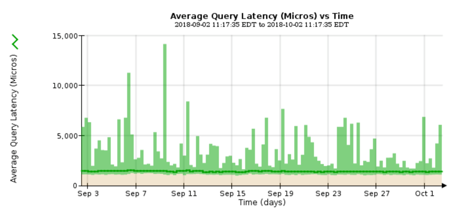

= 쿼리 지연 시간 모니터링
:allow-uri-read: 
:icons: font
:imagesdir: ../media/

[role="lead"]
개체 저장, 검색 또는 삭제와 같은 클라이언트 작업은 그리드의 개체 메타데이터 분산 데이터베이스에 대한 쿼리를 만듭니다. 쿼리 대기 시간의 추세를 모니터링하여 그리드 리소스가 현재 로드에 적합한지 확인해야 합니다.

.필요한 것
지원되는 브라우저를 사용하여 Grid Manager에 로그인해야 합니다.

.이 작업에 대해
쿼리 지연 시간의 일시적인 증가는 정상이며 수집 요청의 갑작스러운 증가로 인해 발생할 수 있습니다. 실패한 쿼리는 정상이며 일시적으로 사용할 수 없는 일시적인 네트워크 문제 또는 노드로 인해 발생할 수 있습니다. 그러나 쿼리를 수행하는 데 걸리는 평균 시간이 증가하면 전반적인 그리드 성능이 저하됩니다.

시간이 지남에 따라 쿼리 지연 시간이 증가하는 경우 향후 워크로드를 충족하기 위해 확장 절차에서 추가 스토리지 노드를 추가하는 것을 고려해야 합니다.

쿼리 평균 시간이 너무 긴 경우 * 메타데이터 쿼리 * 알림에 대해 높은 지연 시간이 트리거됩니다.

.단계
. 노드 * > *_스토리지 노드_ * > * 오브젝트 * 를 선택합니다.
. 쿼리 테이블까지 아래로 스크롤하여 평균 지연 시간 값을 확인합니다.
+
image::../media/queries_table.png[질의 테이블]

. 차트 아이콘을 클릭합니다 image:../media/icon_chart_new.gif["차트 아이콘"] 시간 경과에 따른 값을 차트로 작성합니다.
+

+
예제 차트에는 일반 그리드 작업 중 쿼리 대기 시간이 급격하게 증가하는 것을 보여 줍니다.

.관련 정보
link:../expand/index.html["그리드를 확장합니다"]
