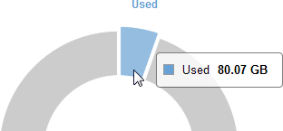

= 전체 그리드에 대한 스토리지 용량 모니터링
:allow-uri-read: 
:icons: font
:imagesdir: ../media/

[role="lead"]
그리드의 전체 스토리지 용량을 모니터링하여 오브젝트 데이터 및 오브젝트 메타데이터에 대한 충분한 여유 공간이 유지되도록 해야 합니다. 시간이 지남에 따라 스토리지 용량이 변경되는 방식을 이해하면 그리드의 가용 스토리지 용량이 소비되기 전에 스토리지 노드 또는 스토리지 볼륨을 추가할 계획을 세울 수 있습니다.

.필요한 것
지원되는 브라우저를 사용하여 Grid Manager에 로그인해야 합니다.

.이 작업에 대해
Grid Manager의 대시보드를 사용하면 전체 그리드와 각 데이터 센터에 대해 사용 가능한 스토리지 양을 신속하게 평가할 수 있습니다. 노드 페이지에서는 오브젝트 데이터 및 오브젝트 메타데이터에 대한 자세한 값을 제공합니다.

.단계
. 전체 그리드 및 각 데이터 센터에 사용할 수 있는 스토리지 양을 평가합니다.
+
.. 대시보드 * 를 선택합니다.
.. Available Storage(사용 가능한 스토리지) 패널에서 사용 가능한 스토리지 용량과 사용된 스토리지 용량의 전체 요약을 확인합니다.
+

NOTE: 요약에는 아카이브 미디어가 포함되지 않습니다.

+
image::../media/grid_manager_dashboard_cropped.png[Grid Manager 대시보드]

.. 차트의 Free(여유) 또는 Used Capacity(사용된 용량) 섹션 위에 커서를 놓으면 사용 가능한 공간 또는 사용된 공간을 정확하게 확인할 수 있습니다.
+

.. 다중 사이트 그리드의 경우 각 데이터 센터에 대한 차트를 검토하십시오.
.. 차트 아이콘을 클릭합니다 image:../media/icon_chart_new.gif["차트 아이콘"] 전체 차트 또는 개별 데이터 센터에 대해 시간별 용량 사용을 보여주는 그래프를 표시합니다.
+
사용된 스토리지 용량(%)과 을 비교한 그래프입니다 시간이 나타납니다.

. 사용된 스토리지 양과 오브젝트 데이터 및 오브젝트 메타데이터에 사용 가능한 스토리지 양을 확인합니다.
+
.. 노드 * 를 선택합니다.
.. *_GRID_ * > * 스토리지 * 를 선택합니다.
+

.. 커서를 Storage Used - Object Data 및 Storage Used - Object Metadata 차트 위에 놓으면 전체 그리드에 사용 가능한 객체 스토리지 및 객체 메타데이터 스토리지가 얼마나 되는지, 그리고 시간이 지남에 따라 얼마나 사용되었는지 확인할 수 있습니다.
+

NOTE: 사이트 또는 그리드의 총 값에는 오프라인 노드와 같이 최소 5분 동안 보고된 메트릭이 없는 노드가 포함되지 않습니다.

. 기술 지원 부서의 지시에 따라 그리드의 스토리지 용량에 대한 추가 세부 정보를 봅니다.
+
.. 지원 * > * 도구 * > * 그리드 토폴로지 * 를 선택합니다.
.. grid_ * > * Overview * > * Main * 을 선택합니다.
+
image::../media/system_wide_storage_capacity.gif[시스템 전체 스토리지 용량 -- 그리드 토폴로지 트리]

. 그리드의 가용 스토리지 용량이 소비되기 전에 스토리지 노드 또는 스토리지 볼륨을 추가하기 위해 확장을 수행할 계획을 수립합니다.
+
확장 시기를 계획할 때 추가 스토리지를 조달 및 설치하는 데 걸리는 시간을 고려하십시오.

+

NOTE: ILM 정책에서 삭제 코딩을 사용하는 경우 기존 스토리지 노드의 비율이 약 70%일 때 확장을 수행하여 추가해야 할 노드 수를 줄일 수 있습니다.

+
스토리지 확장 계획에 대한 자세한 내용은 StorageGRID 확장 지침을 참조하십시오.

.관련 정보
link:../expand/index.html["그리드를 확장합니다"]
