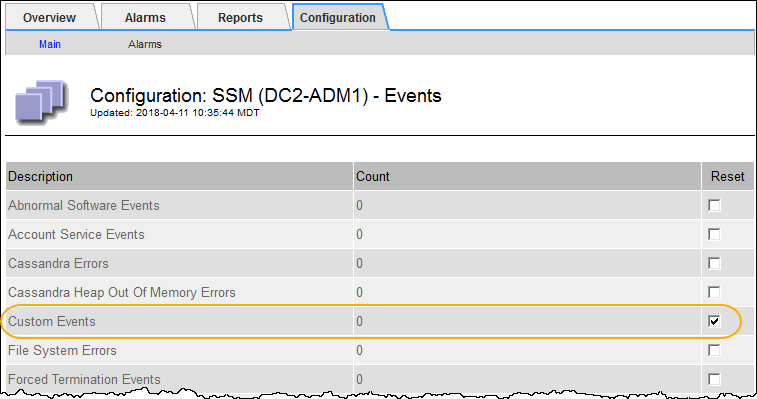

= 사용자 지정 이벤트 수를 0으로 재설정합니다
:allow-uri-read: 
:icons: font
:imagesdir: ../media/

[role="lead"]
사용자 지정 이벤트에 대해서만 카운터를 재설정하려면 지원 메뉴의 그리드 토폴로지 페이지를 사용해야 합니다.

.이 작업에 대해
카운터를 재설정하면 다음 이벤트에 의해 알람이 트리거됩니다. 반면, 알람을 확인할 때 해당 알람은 다음 임계값 수준에 도달한 경우에만 다시 트리거됩니다.

. 지원 * > * 도구 * > * 그리드 토폴로지 * 를 선택합니다.
. grid node_ * > * ssm * > * Events * > * Configuration * > * Main * 을 선택합니다.
. 사용자 지정 이벤트의 * 재설정 * 확인란을 선택합니다.
+

. 변경 내용 적용 * 을 클릭합니다.

