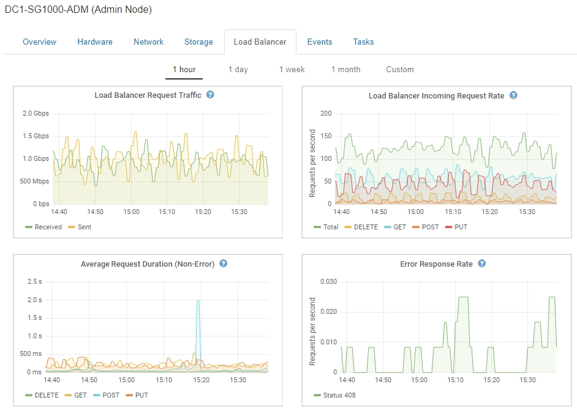

= 차트 및 그래프 유형
:allow-uri-read: 
:icons: font
:imagesdir: ../media/

[role="lead"]
차트와 그래프에는 특정 StorageGRID 메트릭 및 특성의 값이 요약되어 있습니다.

그리드 관리자 대시보드에는 그리드 및 각 사이트에 사용할 수 있는 스토리지를 요약하는 원형(도넛) 차트가 포함되어 있습니다.

image::../media/dashboard_available_storage_panel.png[대시보드 사용 가능한 스토리지 패널]

테넌트 관리자 대시보드의 스토리지 사용 패널에 다음이 표시됩니다.

* 테넌트를 위해 가장 큰 버킷(S3) 또는 컨테이너(Swift)의 목록입니다
* 가장 큰 버킷 또는 컨테이너의 상대적 크기를 나타내는 막대 차트
* 사용된 총 공간 및 할당량이 설정된 경우 남은 공간의 양과 백분율이 표시됩니다

image::../media/tenant_dashboard_with_buckets.png[테넌트 대시보드]

또한 노드 페이지 및 * 지원 * > * 도구 * > * 그리드 토폴로지 * 페이지에서 StorageGRID 메트릭 및 속성 변경 사항을 확인할 수 있는 그래프를 제공합니다.

그래프에는 네 가지 유형이 있습니다.

* * Grafana 차트 *: 노드 페이지에 표시된 Grafana 차트는 시간의 경과에 따라 Prometheus 메트릭의 값을 플롯하는 데 사용됩니다. 예를 들어 관리 노드의 * 노드 * > * 로드 밸런서 * 탭에는 4개의 Grafana 차트가 포함되어 있습니다.
+

+

NOTE: Grafana 차트는 * 지원 * > * 도구 * > * 메트릭 * 페이지에서 사용할 수 있는 사전 구성된 대시보드에도 포함되어 있습니다.

* * 선 그래프 *: 노드 페이지와 * 지원 * > * 도구 * > * 그리드 토폴로지 * 페이지에서 사용할 수 있습니다(차트 아이콘을 클릭합니다 image:../media/icon_chart_new.gif["아이콘 차트(신규)"] 데이터 값 다음에), 선 그래프는 단위 값이 있는 StorageGRID 속성 값(예: NTP 주파수 오프셋, ppm)을 플롯하는 데 사용됩니다. 값의 변경 내용은 시간 경과에 따른 정규 데이터 간격(빈)으로 표시됩니다.
+
image::../media/line_graph.gif[선 그래프]

* * 영역 그래프 *: 노드 페이지와 * 지원 * > * 도구 * > * 그리드 토폴로지 * 페이지에서 사용할 수 있습니다(차트 아이콘을 클릭합니다 image:../media/icon_chart_new.gif["아이콘 차트(신규)"] 데이터 값 다음에) 영역 그래프는 개체 수 또는 서비스 하중 값과 같은 용적 특성 수량을 플롯하는 데 사용됩니다. 영역 그래프는 선 그래프와 비슷하지만 선 아래에 밝은 갈색 음영을 포함합니다. 값의 변경 내용은 시간 경과에 따른 정규 데이터 간격(빈)으로 표시됩니다.
+
image::../media/area_graph.gif[영역 그래프]

* 일부 그래프는 다른 유형의 차트 아이콘으로 표시됩니다 image:../media/icon_chart_new_for_11_5.png["차트 아이콘 - 11.5의 경우 새로 만들기"] 다른 형식을 사용합니다.
+
image::../media/charts_lost_object_detected.png[차트 손실된 개체가 감지되었습니다]

* * 상태 그래프 *: * 지원 * > * 도구 * > * 그리드 토폴로지 * 페이지에서 사용할 수 있습니다(차트 아이콘을 클릭합니다 image:../media/icon_chart_new.gif["아이콘 차트(신규)"] 데이터 값 다음에) 상태 그래프는 온라인, 대기 또는 오프라인일 수 있는 서비스 상태와 같은 고유한 상태를 나타내는 속성 값을 플롯하는 데 사용됩니다. 상태 그래프는 선 그래프와 유사하지만 전이는 불연속입니다. 즉, 값이 한 상태 값에서 다른 상태 값으로 이동합니다.
+
image::../media/state_graph.gif[상태 그래프]

.관련 정보
link:viewing-nodes-page.html["노드 페이지 보기"]

link:viewing-grid-topology-tree.html["그리드 토폴로지 트리 보기"]

link:reviewing-support-metrics.html["지원 메트릭 검토"]
