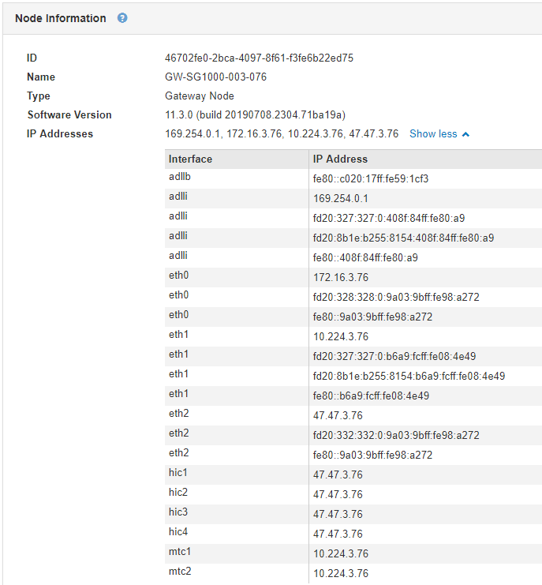

= 어플라이언스 관리 노드 및 게이트웨이 노드에 대한 정보 보기
:allow-uri-read: 
:icons: font
:imagesdir: ../media/

[role="lead"]
노드 페이지에는 서비스 상태에 대한 정보와 관리 노드 또는 게이트웨이 노드에 사용되는 각 서비스 어플라이언스에 대한 모든 컴퓨팅, 디스크 디바이스 및 네트워크 리소스에 대한 정보가 나열됩니다. 또한 메모리, 스토리지 하드웨어, 네트워크 리소스, 네트워크 인터페이스, 네트워크 주소, 데이터를 수신하고 전송합니다.

.단계
. 노드 페이지에서 어플라이언스 관리 노드 또는 어플라이언스 게이트웨이 노드를 선택합니다.
. 개요 * 를 선택합니다.
+
개요 탭의 노드 정보 테이블에는 노드의 ID 및 이름, 노드 유형, 설치된 소프트웨어 버전 및 노드에 연결된 IP 주소가 표시됩니다. Interface 열에는 다음과 같은 인터페이스 이름이 포함되어 있습니다.

+
** * adllb * 및 * adlli *: 관리 네트워크 인터페이스에 활성/백업 본딩을 사용하는 경우에 표시됩니다
** * eth *: 그리드 네트워크, 관리자 네트워크 또는 클라이언트 네트워크.
** * hic *: 어플라이언스에 있는 물리적 10GbE, 25 또는 100GbE 포트 중 하나입니다. 이러한 포트는 함께 연결되어 StorageGRID 그리드 네트워크(eth0) 및 클라이언트 네트워크(eth2)에 연결할 수 있습니다.
** * MTC *: 어플라이언스에 있는 물리적 1GbE 포트 중 하나로, 본딩하거나 앨리어싱하여 StorageGRID 관리 네트워크(eth1)에 연결할 수 있습니다.

. 어플라이언스에 대한 자세한 내용을 보려면 * 하드웨어 * 를 선택하십시오.
+
.. CPU Utilization(CPU 사용률) 및 Memory(메모리) 그래프를 보고 시간에 따른 CPU 및 메모리 사용량 비율을 확인합니다. 다른 시간 간격을 표시하려면 차트 또는 그래프 위에 있는 컨트롤 중 하나를 선택합니다. 1시간, 1일, 1주 또는 1개월 간격으로 사용 가능한 정보를 표시할 수 있습니다. 날짜 및 시간 범위를 지정할 수 있는 사용자 지정 간격을 설정할 수도 있습니다.
+
image::../media/nodes_page_hardware_tab_graphs_services_appliance.png[노드 페이지 서비스 어플라이언스에 대한 하드웨어 탭 그래프]

.. 아래로 스크롤하여 제품의 구성 요소 표를 봅니다. 이 표에는 모델 이름, 일련 번호, 컨트롤러 펌웨어 버전 및 각 구성 요소의 상태와 같은 정보가 포함되어 있습니다.
+
image::../media/nodes_page_hardware_tab_services_appliance_do_not_use.png[노드 페이지 서비스 어플라이언스에는 하드웨어 탭이 있습니다]

+
|===
| Appliance 테이블의 필드 | 설명 

 a| 
어플라이언스 모델
 a| 
이 StorageGRID 어플라이언스의 모델 번호입니다.

 a| 
스토리지 컨트롤러 오류 드라이브 수
 a| 
최적화되지 않은 드라이브 수입니다.

 a| 
스토리지 데이터 드라이브 유형입니다
 a| 
HDD(하드 디스크 드라이브) 또는 SSD(Solid State Drive)와 같은 어플라이언스의 드라이브 유형입니다.

 a| 
스토리지 데이터 드라이브 크기입니다
 a| 
어플라이언스의 모든 데이터 드라이브를 포함한 총 용량입니다.

 a| 
스토리지 RAID 모드
 a| 
어플라이언스의 RAID 모드입니다.

 a| 
전체 전원 공급 장치
 a| 
어플라이언스에 있는 모든 전원 공급 장치의 상태입니다.

 a| 
컴퓨팅 컨트롤러 BMC IP
 a| 
컴퓨팅 컨트롤러에 있는 BMC(베이스보드 관리 컨트롤러) 포트의 IP 주소입니다. 이 IP를 사용하여 BMC 인터페이스에 연결하여 어플라이언스 하드웨어를 모니터링하고 진단할 수 있습니다.

BMC가 포함되지 않은 어플라이언스 모델에는 이 필드가 표시되지 않습니다.

 a| 
컴퓨팅 컨트롤러 일련 번호입니다
 a| 
컴퓨팅 컨트롤러의 일련 번호입니다.

 a| 
컴퓨팅 하드웨어
 a| 
컴퓨팅 컨트롤러 하드웨어의 상태입니다.

 a| 
컴퓨팅 컨트롤러 CPU 온도
 a| 
컴퓨팅 컨트롤러의 CPU의 온도 상태입니다.

 a| 
컴퓨팅 컨트롤러 섀시 온도
 a| 
컴퓨팅 컨트롤러의 온도 상태입니다.

|===
.. 모든 스테이터스가 ""명목""인지 확인합니다.
+
상태가 "공칭"가 아닌 경우 현재 경고를 검토하십시오.

. 각 네트워크에 대한 정보를 보려면 * Network * 를 선택하십시오.
+
네트워크 트래픽 그래프는 전체 네트워크 트래픽에 대한 요약을 제공합니다.

+
image::../media/nodes_page_network_traffic_graph.gif[노드 페이지 네트워크 트래픽 그래프]

+
.. 네트워크 인터페이스 섹션을 검토합니다.
+
image::../media/nodes_page_hardware_tab_network_services_appliance.png[노드 페이지 하드웨어 탭 네트워크 서비스 어플라이언스]

+
네트워크 인터페이스 테이블의 * Speed * 열에 있는 값을 사용하여 어플라이언스의 40개/100GbE 네트워크 포트 4개가 액티브/백업 모드 또는 LACP 모드를 사용하도록 구성되었는지 확인하십시오.

+

NOTE: 표에 표시된 값은 4개의 링크가 모두 사용된다고 가정합니다.

+
|===
| 링크 모드 | 본드 모드 | 개별 HIC 링크 속도(hic1, hic2, hic3, hic4) | 예상 그리드/클라이언트 네트워크 속도(eth0, eth2) 

 a| 
집계
 a| 
LACP
 a| 
100
 a| 
400

 a| 
고정
 a| 
LACP
 a| 
100
 a| 
200

 a| 
고정
 a| 
Active/Backup(활성/백업)
 a| 
100
 a| 
100

 a| 
집계
 a| 
LACP
 a| 
40
 a| 
160

 a| 
고정
 a| 
LACP
 a| 
40
 a| 
80

 a| 
고정
 a| 
Active/Backup(활성/백업)
 a| 
40
 a| 
40

|===
.. 네트워크 통신 섹션을 검토합니다.
+
Receive 및 Transmit 테이블은 각 네트워크에서 수신 및 전송된 바이트 및 패킷의 수와 기타 수신 및 전송 메트릭을 보여줍니다.

+

. 서비스 어플라이언스의 디스크 장치 및 볼륨에 대한 정보를 보려면 * Storage * 를 선택합니다.
+
image::../media/nodes_page_storage_tab_services_appliance.png[노드 페이지 스토리지 탭 서비스 어플라이언스]

.관련 정보
link:../sg100-1000/index.html["SG100 및 AMP, SG1000 서비스 어플라이언스"]
