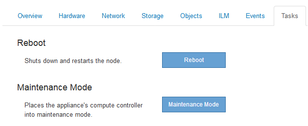
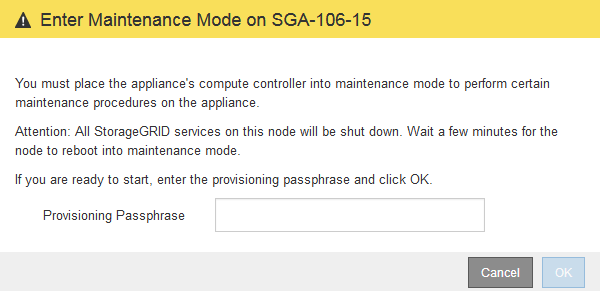
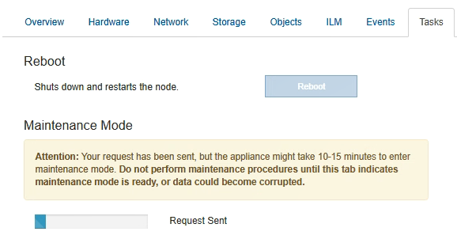
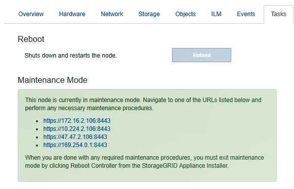

= 유지보수 모드로 제품을 두십시오
:allow-uri-read: 
:icons: font
:imagesdir: ../media/

[role="lead"]
특정 유지보수 절차를 수행하기 전에 제품을 유지보수 모드로 전환해야 합니다.

.필요한 것
* 지원되는 브라우저를 사용하여 Grid Manager에 로그인해야 합니다.
* 유지 관리 또는 루트 액세스 권한이 있어야 합니다. 자세한 내용은 StorageGRID 관리 지침을 참조하십시오.

.이 작업에 대해
StorageGRID 어플라이언스를 유지 관리 모드로 전환하면 원격 액세스가 불가능한 제품이 될 수 있습니다.

NOTE: 유지보수 모드의 StorageGRID 어플라이언스에 대한 암호 및 호스트 키는 어플라이언스가 서비스 중일 때와 동일하게 유지됩니다.

.단계
. 그리드 관리자에서 * 노드 * 를 선택합니다.
. 노드 페이지의 트리 뷰에서 어플라이언스 스토리지 노드를 선택합니다.
. 작업 * 을 선택합니다.
+

. 유지보수 모드 * 를 선택합니다.
+
확인 대화 상자가 나타납니다.

+

. 프로비저닝 암호를 입력하고 * OK * 를 선택합니다.
+
진행 표시줄과 "전송 요청", "StorageGRID 중지", "재부팅 중"과 같은 일련의 메시지는 어플라이언스가 유지보수 모드로 들어가기 위한 단계를 완료하고 있음을 나타냅니다.

+

+
어플라이언스가 유지보수 모드일 때 확인 메시지에 StorageGRID 어플라이언스 설치 프로그램에 액세스하는 데 사용할 수 있는 URL이 나열됩니다.

+

. StorageGRID 어플라이언스 설치 프로그램에 액세스하려면 표시된 URL 중 하나를 찾습니다.
+
가능한 경우 어플라이언스의 관리 네트워크 포트의 IP 주소가 포함된 URL을 사용하십시오.

+

NOTE: 액세스 `+https://169.254.0.1:8443+` 로컬 관리 포트에 직접 연결해야 합니다.

. StorageGRID 어플라이언스 설치 프로그램에서 어플라이언스가 유지보수 모드인지 확인합니다.
+
image::../media/maintenance_mode_notification_bar.png[유지보수 모드 메시지]

. 필요한 유지보수 작업을 수행합니다.
. 유지보수 작업을 완료한 후 유지보수 모드를 종료하고 정상 노드 운영을 재개합니다. StorageGRID 어플라이언스 설치 프로그램에서 * 고급 * > * 컨트롤러 재부팅 * 을 선택한 다음 * StorageGRID * 으로 재부팅 * 을 선택합니다.
+
image::../media/reboot_controller_from_maintenance_mode.png[유지보수 모드에서 컨트롤러를 재부팅합니다]

+
어플라이언스가 재부팅되고 그리드에 다시 가입하는 데 최대 20분이 걸릴 수 있습니다. 재부팅이 완료되고 노드가 그리드에 다시 결합되었는지 확인하려면 Grid Manager로 돌아갑니다. 노드 * 탭은 정상 상태를 표시해야 합니다 image:../media/icon_alert_green_checkmark.png["아이콘 경고 녹색 확인 표시"] 어플라이언스 노드의 경우 활성 알림이 없고 노드가 그리드에 연결되어 있음을 나타냅니다.

+
image::../media/node_rejoin_grid_confirmation.png[어플라이언스 노드가 그리드에 다시 합류했습니다]

