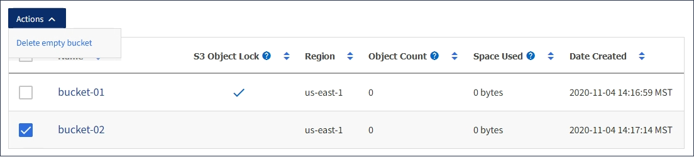

= S3 버킷을 삭제하는 중입니다
:allow-uri-read: 
:icons: font
:imagesdir: ../media/

[role="lead"]
테넌트 관리자를 사용하여 비어 있는 S3 버킷을 삭제할 수 있습니다.

.필요한 것
* 지원되는 브라우저를 사용하여 테넌트 관리자에 로그인해야 합니다.
* 모든 버킷 관리 또는 루트 액세스 권한이 있는 사용자 그룹에 속해야 합니다. 이러한 권한은 그룹 또는 버킷 정책의 사용 권한 설정을 재정의합니다.

.이 작업에 대해
다음 지침은 Tenant Manager를 사용하여 S3 버킷을 삭제하는 방법을 설명합니다. 테넌트 관리 API 또는 S3 REST API를 사용하여 S3 버킷을 삭제할 수도 있습니다.

오브젝트 또는 비최신 오브젝트 버전이 포함된 S3 버킷을 삭제할 수 없습니다. S3 버전 오브젝트를 삭제하는 방법에 대한 자세한 내용은 정보 수명 주기 관리를 사용하여 오브젝트를 관리하는 지침을 참조하십시오.

.단계
. 스토리지(S3) * > * 버킷 * 을 선택합니다.
+
Bucket 페이지가 나타나고 기존의 모든 S3 버킷을 표시합니다.

+
image::../media/buckets_table.png[버킷 테이블]

. 삭제할 빈 버킷의 확인란을 선택합니다.
+
작업 메뉴가 활성화됩니다.

. 작업 메뉴에서 * 빈 버킷 삭제 * 를 선택합니다.
+

+
확인 메시지가 나타납니다.

+
image::../media/delete_bucket_confirmation_dialog.png[버킷 삭제 확인 대화 상자]

. 버킷을 삭제하려면 * 버킷 삭제 * 를 선택합니다.
+
StorageGRID가 버킷이 비어 있음을 확인한 다음 버킷을 삭제합니다. 이 작업은 몇 분 정도 걸릴 수 있습니다.

+
버킷이 비어 있지 않으면 오류 메시지가 나타납니다. 버킷을 삭제하려면 먼저 모든 오브젝트를 삭제해야 합니다.

+
image::../media/delete_bucket_not_empty_message.png[버킷 삭제 비어 있지 않음 메시지]

.관련 정보
link:../ilm/index.html["ILM을 사용하여 개체를 관리합니다"]
