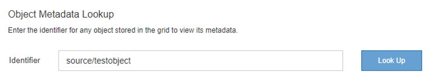

= 오브젝트 및 스토리지 문제 해결
:allow-uri-read: 
:icons: font
:imagesdir: ../media/

[role="lead"]
오브젝트 및 스토리지 문제의 근원을 확인하는 데 도움이 되는 여러 가지 작업을 수행할 수 있습니다.

== 객체 데이터 위치를 확인하는 중입니다

문제에 따라 오브젝트 데이터가 저장되는 위치를 확인할 수 있습니다. 예를 들어, ILM 정책이 예상대로 수행되고 있고 대상 데이터가 원하는 위치에 저장되어 있는지 확인해야 할 수 있습니다.

.필요한 것
* 다음 중 하나의 개체 식별자가 있어야 합니다.
+
** * UUID *: 객체의 범용 고유 식별자입니다. UUID를 모두 대문자로 입력합니다.
** * CBID *: StorageGRID 내에서 개체의 고유 식별자입니다. 감사 로그에서 개체의 CBID를 가져올 수 있습니다. CBID를 모두 대문자로 입력합니다.
** * S3 버킷 및 오브젝트 키 *: S3 인터페이스를 통해 오브젝트를 수집하면 클라이언트 애플리케이션이 버킷과 오브젝트 키 조합을 사용하여 오브젝트를 저장하고 식별합니다.
** * Swift 컨테이너 및 오브젝트 이름 *: Swift 인터페이스를 통해 오브젝트가 수집되면 클라이언트 애플리케이션이 컨테이너 및 오브젝트 이름 조합을 사용하여 오브젝트를 저장하고 식별합니다.

.단계
. ILM * > * 개체 메타데이터 조회 * 를 선택합니다.
. 식별자 * 필드에 개체의 식별자를 입력합니다.
+
UUID, CBID, S3 버킷/오브젝트 키 또는 Swift 컨테이너/오브젝트 이름을 입력할 수 있습니다.

+

. 조회 * 를 클릭합니다.
+
개체 메타데이터 조회 결과가 나타납니다. 이 페이지에는 다음 유형의 정보가 나열됩니다.

+
** 객체 ID(UUID), 객체 이름, 컨테이너 이름, 테넌트 계정 이름 또는 ID, 객체의 논리적 크기, 객체를 처음 생성한 날짜 및 시간, 객체를 마지막으로 수정한 날짜 및 시간을 비롯한 시스템 메타데이터
** 객체와 연결된 모든 사용자 메타데이터 키 값 쌍입니다.
** S3 오브젝트의 경우 오브젝트와 연결된 오브젝트 태그 키 값 쌍이 됩니다.
** 복제된 오브젝트 복사본의 경우 각 복제본의 현재 스토리지 위치입니다.
** 삭제 코딩 오브젝트 복사본의 경우 각 분절의 현재 스토리지 위치입니다.
** 클라우드 스토리지 풀의 오브젝트 복사본의 경우 외부 버킷의 이름 및 오브젝트의 고유 식별자를 비롯한 오브젝트의 위치가 포함됩니다.
** 분할된 오브젝트 및 다중 파트 오브젝트의 경우 세그먼트 식별자 및 데이터 크기를 포함한 오브젝트 세그먼트 목록입니다. 세그먼트가 100개를 초과하는 오브젝트의 경우 처음 100개의 세그먼트만 표시됩니다.
** 처리되지 않은 내부 스토리지 형식의 모든 오브젝트 메타데이터 이 원시 메타데이터에는 릴리즈부터 릴리즈까지 유지되지 않는 내부 시스템 메타데이터가 포함됩니다.
+
다음 예는 2개의 복제된 복사본으로 저장된 S3 테스트 개체에 대한 오브젝트 메타데이터 조회 결과를 보여 줍니다.

+
image::../media/object_lookup_results.png[객체 조회 결과]

.관련 정보
link:../ilm/index.html["ILM을 사용하여 개체를 관리합니다"]

link:../s3/index.html["S3을 사용합니다"]

link:../swift/index.html["Swift를 사용합니다"]

== 오브젝트 저장소(스토리지 볼륨) 장애가 발생했습니다

스토리지 노드의 기본 스토리지는 오브젝트 저장소로 나뉩니다. 이러한 오브젝트 저장소는 StorageGRID 시스템 스토리지의 마운트 지점 역할을 하는 물리적 파티션입니다. 오브젝트 저장소는 스토리지 볼륨이라고도 합니다.

각 스토리지 노드에 대한 오브젝트 저장소 정보를 볼 수 있습니다. 오브젝트 저장소는 * 노드 * > *_스토리지 노드_ * > * 스토리지 * 페이지 하단에 표시됩니다.

image::../media/nodes_page_storage_nodes_storage_tables.png[노드 페이지 스토리지 노드 스토리지 테이블]

각 스토리지 노드에 대한 자세한 내용을 보려면 다음 단계를 수행하십시오.

. 지원 * > * 도구 * > * 그리드 토폴로지 * 를 선택합니다.
. site_ * > *_Storage Node_ * > * LDR * > * Storage * > * Overview * > * Main * 을 선택합니다.

image::../media/storage_node_object_stores.png[스토리지 노드 오브젝트 저장소]

장애의 특성에 따라 스토리지 볼륨의 장애가 스토리지 상태 또는 오브젝트 저장소 상태에 대한 알람에 반영될 수 있습니다. 스토리지 볼륨에 장애가 발생하면 장애가 발생한 스토리지 볼륨을 복구하여 스토리지 노드를 최대한 빨리 전체 기능으로 복원해야 합니다. 필요한 경우 * 구성 * 탭으로 이동하여 스토리지 노드를 읽기 전용 상태로 배치하여 StorageGRID 시스템이 서버의 전체 복구를 준비하는 동안 데이터 검색에 사용할 수 있도록 합니다.

.관련 정보
link:../maintain/index.html["유지 및 복구"]
