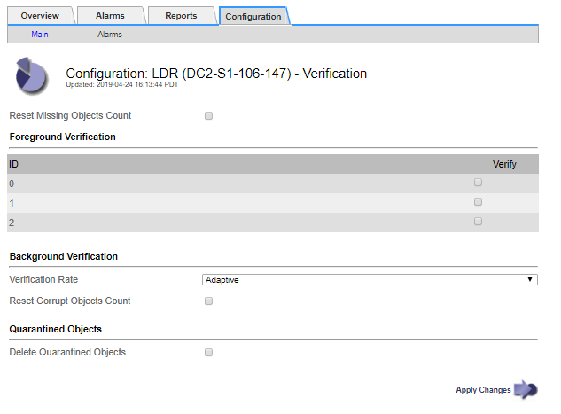

= 개체 무결성을 확인하는 중입니다
:allow-uri-read: 
:icons: font
:imagesdir: ../media/

[role="lead"]
StorageGRID 시스템은 스토리지 노드에서 오브젝트 데이터의 무결성을 확인하여 손상되거나 누락된 오브젝트가 없는지 확인합니다.

검증 프로세스에는 백그라운드 검증과 전면 검증의 두 가지가 있습니다. 이 두 구성 모두 함께 작동하여 데이터 무결성을 보장합니다. 백그라운드 검증이 자동으로 실행되고 개체 데이터의 정확성을 지속적으로 확인합니다. 전경 확인은 사용자가 트리거할 수 있으며, 개체의 정확성은 아니지만 더욱 빠르게 확인할 수 있습니다.

== 백그라운드 검사란 무엇입니까

백그라운드 검증 프로세스는 스토리지 노드에서 손상된 오브젝트 데이터 복사본을 자동으로 지속적으로 검사하고 발견한 문제를 자동으로 복구합니다.

백그라운드 검증 에서는 다음과 같이 복제된 오브젝트와 삭제 코딩 오브젝트의 무결성을 검사합니다.

* * 복제된 객체 *: 백그라운드 검증 프로세스에서 손상된 복제된 객체가 발견되면 손상된 복제본이 해당 위치에서 제거되고 스토리지 노드의 다른 곳에서 격리됩니다. 그런 다음 손상되지 않은 새 복사본이 생성되어 활성 ILM 정책을 충족하도록 배치됩니다. 새 복제본이 원래 복제본에 사용된 스토리지 노드에 배치되지 않을 수 있습니다.

NOTE: 손상된 개체 데이터가 시스템에서 삭제되지 않고 격리되므로 계속 액세스할 수 있습니다. 격리된 객체 데이터에 액세스하는 방법에 대한 자세한 내용은 기술 지원 팀에 문의하십시오.

* * 삭제 코딩 오브젝트 *: 백그라운드 검증 프로세스에서 삭제 코딩 오브젝트의 조각이 손상된 것을 감지하면 StorageGRID는 나머지 데이터 및 패리티 조각을 사용하여 동일한 스토리지 노드에 누락된 조각을 자동으로 재구축하려고 시도합니다. 손상된 조각을 다시 만들 수 없는 경우 손상된 복사본 감지(ECOR) 속성이 1씩 증가하고 객체의 다른 복사본을 검색하려고 시도합니다. 가져오기가 성공하면 삭제 코딩 개체의 대체 복사본을 만들기 위해 ILM 평가가 수행됩니다.
+
백그라운드 검증 프로세스는 스토리지 노드의 객체만 확인합니다. 아카이브 노드 또는 클라우드 스토리지 풀에서 객체를 확인하지 않습니다. 백그라운드 검증을 받으려면 객체가 4일 이상이어야 합니다.

백그라운드 검증은 일반적인 시스템 활동을 방해하지 않도록 설계된 연속 속도로 실행됩니다. 백그라운드 검증을 중지할 수 없습니다. 그러나 문제가 의심될 경우 백그라운드 검증 속도를 높여 스토리지 노드의 내용을 더 빠르게 확인할 수 있습니다.

=== 백그라운드 검증과 관련된 경고 및 알람(레거시

손상된 개체가 시스템에서 자동으로 수정할 수 없는 것을 감지하면(손상으로 인해 개체가 식별되지 않음) * 식별되지 않은 손상된 개체가 감지됨 * 경고가 트리거됩니다.

백그라운드 검증이 손상된 개체를 다른 복사본을 찾을 수 없어 교체할 수 없는 경우 * Objects Lost * 알림과 Lost (Lost Objects) 레거시 경보가 트리거됩니다.

== 백그라운드 검증 비율 변경

데이터 무결성에 대한 우려가 있는 경우 백그라운드 검증이 스토리지 노드에서 복제된 오브젝트 데이터를 검사하는 속도를 변경할 수 있습니다.

.필요한 것
* 지원되는 브라우저를 사용하여 Grid Manager에 로그인해야 합니다.
* 특정 액세스 권한이 있어야 합니다.

.이 작업에 대해
스토리지 노드에서 백그라운드 검증을 위한 검증 비율을 변경할 수 있습니다.

* 적응: 기본 설정. 이 작업은 최대 4MB/s 또는 10개의 오브젝트/s(둘 중 먼저 초과되는 값)에서 확인하도록 설계되었습니다.
* 높음: 일반적인 시스템 작업을 느리게 할 수 있는 속도로 스토리지 검증이 빠르게 진행됩니다.

하드웨어 또는 소프트웨어 오류로 인해 오브젝트 데이터가 손상되었을 수 있다고 의심되는 경우에만 높은 확인 속도를 사용하십시오. 우선 순위가 높은 백그라운드 검증이 완료되면 검증 속도가 자동으로 적응(Adaptive)으로 재설정됩니다.

.단계
. 지원 * > * 도구 * > * 그리드 토폴로지 * 를 선택합니다.
. 스토리지 노드 _>LDR > 검증 * 을 선택합니다.
. Configuration * > * Main * 을 선택합니다.
. LDR * > * 검증 * > * 구성 * > * 주 * 로 이동합니다.
. Background Verification(배경 검증) 아래에서 * Verification Rate(검증 비율) * > * High(높음) * 또는 * Verification Rate(검증 비율) * > * Adaptive * 를 선택합니다.
+

NOTE: Verification Rate(확인 속도)를 High(높음)로 설정하면 통지 수준에서 VPRI(검증 비율) 레거시 경보가 트리거됩니다.

. 변경 내용 적용 * 을 클릭합니다.
. 복제된 객체에 대한 백그라운드 검증 결과를 모니터링합니다.
+
.. 노드 * > *_스토리지 노드_ * > * 개체 * 로 이동합니다.
.. 확인 섹션에서 * 손상된 개체 * 및 * 식별되지 않은 개체 * 에 대한 값을 모니터링합니다.
+
백그라운드 확인이 손상된 복제된 개체 데이터를 찾으면 * 손상된 개체 * 메트릭이 증가하고 StorageGRID는 다음과 같이 데이터에서 개체 식별자를 추출하려고 시도합니다.

+
*** 개체 식별자를 추출할 수 있는 경우 StorageGRID는 개체 데이터의 새 복사본을 자동으로 만듭니다. 활성 ILM 정책을 충족하는 StorageGRID 시스템의 모든 위치에서 새 복사본을 만들 수 있습니다.
*** 개체 식별자가 손상되어 추출할 수 없는 경우 * 손상된 개체 식별되지 않음 * 메트릭이 증가하고 * 식별되지 않은 손상된 개체 감지됨 * 경고가 트리거됩니다.

.. 손상된 복제된 개체 데이터가 발견되면 기술 지원 부서에 문의하여 손상의 근본 원인을 확인하십시오.

. 삭제 코딩 개체에 대한 백그라운드 검증 결과를 모니터링합니다.
+
백그라운드 검증이 삭제 코딩 오브젝트 데이터의 손상된 조각을 찾으면 손상된 조각 감지됨 속성이 증가합니다. StorageGRID는 동일한 스토리지 노드에 손상된 부분을 재생성하여 복구합니다.

+
.. 지원 * > * 도구 * > * 그리드 토폴로지 * 를 선택합니다.
.. 스토리지 노드 _ > LDR > 삭제 코딩 * 을 선택합니다.
.. Verification Results 테이블에서 손상된 조각 감지(ECCD) 속성을 모니터링합니다.

. 손상된 개체가 StorageGRID 시스템에 의해 자동으로 복구된 후 손상된 개체의 수를 재설정합니다.
+
.. 지원 * > * 도구 * > * 그리드 토폴로지 * 를 선택합니다.
.. LDR > Verification > Configuration * 을 선택합니다.
.. 손상된 개체 수 재설정 * 을 선택합니다.
.. 변경 내용 적용 * 을 클릭합니다.

. 격리된 객체가 필요하지 않은 것으로 확신하면 삭제할 수 있습니다.

NOTE: 개체 손실 * 경고 또는 손실된(개체 손실) 레거시 경보가 트리거된 경우 기술 지원 부서에서 격리된 개체에 액세스하여 기본 문제를 디버깅하거나 데이터 복구를 시도할 수 있습니다.

. 지원 * > * 도구 * > * 그리드 토폴로지 * 를 선택합니다.
. 스토리지 노드 * > * LDR * > * 검증 * > * 구성 * 을 선택합니다.
. 격리된 개체 삭제 * 를 선택합니다.
. 변경 내용 적용 * 을 클릭합니다.

== 전경 검증이란

포그라운드 검증은 스토리지 노드에 예상되는 모든 오브젝트 데이터가 있는지 확인하는 사용자 시작 프로세스입니다. 포그라운드 확인은 스토리지 디바이스의 무결성을 확인하는 데 사용됩니다.

포그라운드 검증은 스토리지 노드에 있는 오브젝트 데이터의 무결성을 검사하는 백그라운드 검증 대신 더 빠른 방법입니다. 포그라운드 확인에서 누락된 항목이 많은 경우 스토리지 노드와 연결된 스토리지 디바이스의 전체 또는 일부에 문제가 있을 수 있습니다.

전경 검증에서는 다음과 같이 복제된 오브젝트 데이터와 삭제 코딩 오브젝트 데이터를 모두 검사합니다.

* * 복제된 객체 *: 복제된 객체 데이터의 복제본이 누락된 것으로 확인되면 StorageGRID은 자동으로 시스템의 다른 위치에 저장된 복제본에서 복제본을 교체하려고 시도합니다. 스토리지 노드는 ILM 평가를 통해 기존 복사본을 실행합니다. 그러면 누락된 복사본이 예상 위치에 더 이상 존재하지 않기 때문에 현재 ILM 정책이 이 개체에 대해 더 이상 충족되지 않는 것으로 결정됩니다. 시스템의 활성 ILM 정책을 충족하기 위해 새 복사본이 생성되고 배치됩니다. 이 새 복사본은 누락된 복사본이 저장된 위치와 같은 위치에 있지 않을 수 있습니다.
* * 삭제 코딩 오브젝트 *: 삭제 코딩 오브젝트의 조각이 누락된 것으로 확인되면 StorageGRID은 나머지 조각을 사용하여 동일한 스토리지 노드에 누락된 조각을 자동으로 재구축합니다. 누락된 조각을 재생성할 수 없는 경우(너무 많은 조각이 손실되었기 때문에) 손상된 사본 감지(ECOR) 속성이 1씩 증가합니다. 그런 다음 ILM은 오브젝트의 다른 복사본을 찾으려고 시도합니다. 이 복사본은 새 삭제 코딩 복사본을 생성하는 데 사용할 수 있습니다.
+
포그라운드 검증에서 스토리지 볼륨의 삭제 코딩 문제를 식별하는 경우 포그라운드 검증 작업은 영향을 받는 볼륨을 식별하는 오류 메시지와 함께 일시 중지됩니다. 영향을 받는 스토리지 볼륨에 대해 복구 절차를 수행해야 합니다.

누락된 복제 오브젝트 또는 손상된 삭제 코딩 오브젝트의 다른 복사본을 그리드에서 찾을 수 없는 경우 * Objects Lost * 알림과 Lost (Lost Objects) 레거시 경보가 트리거됩니다.

== 전경 확인 실행 중

포그라운드 검증을 사용하면 스토리지 노드에 데이터가 있는지 확인할 수 있습니다. 객체 데이터가 누락되면 기본 스토리지 디바이스에 문제가 있는 것으로 나타날 수 있습니다.

.필요한 것
* 다음 그리드 작업이 실행되고 있지 않은지 확인했습니다.
+
** 그리드 확장: 스토리지 노드를 추가할 때 서버 추가(GEXP
** 동일한 스토리지 노드에서 LDCM(Storage Node Decommissioning) 이러한 그리드 작업이 실행 중인 경우 해당 그리드 작업이 완료될 때까지 기다리거나 잠금을 해제합니다.

* 스토리지가 온라인 상태인지 확인했습니다. (* 지원 * > * 도구 * > * 그리드 토폴로지 * 를 선택합니다. 그런 다음 *_Storage Node_ * > * LDR * > * Storage * > * Overview * > * Main * 을 선택합니다. 스토리지 상태 - 현재 * 가 온라인 상태인지 확인합니다.)
* 다음 복구 절차가 동일한 스토리지 노드에서 실행되지 않도록 했습니다.
+
** 장애가 발생한 스토리지 볼륨 복구
** 시스템 드라이브 Foreground 확인에 실패한 스토리지 노드를 복구해도 복구 절차가 진행 중인 동안에는 유용한 정보를 제공하지 않습니다.

.이 작업에 대해
포그라운드 검증 에서는 누락된 복제 오브젝트 데이터와 누락된 삭제 코딩 오브젝트 데이터에 대해 모두 검사합니다.

* 포그라운드 검증에서 누락된 객체 데이터가 많은 경우 스토리지 노드의 스토리지에 대해 조사하고 해결해야 하는 문제가 있을 수 있습니다.
* 포그라운드 검증에서 삭제 코딩 데이터와 관련된 심각한 스토리지 오류를 발견하면 이를 사용자에게 알립니다. 오류를 복구하려면 스토리지 볼륨 복구를 수행해야 합니다.

스토리지 노드의 모든 오브젝트 저장소 또는 특정 오브젝트 저장소만 검사하도록 포그라운드 검증을 구성할 수 있습니다.

전경 검증에서 누락된 개체 데이터가 발견되면 StorageGRID 시스템은 이를 대체하려고 시도합니다. 대체 사본을 만들 수 없는 경우 손실된 개체(손실된 개체) 경보가 트리거될 수 있습니다.

전경 확인은 스토리지 노드에 저장된 개체의 수에 따라 완료하는 데 며칠 또는 몇 주가 걸릴 수 있는 LDR 전경 확인 그리드 작업을 생성합니다. 동시에 여러 스토리지 노드를 선택할 수 있지만 이러한 그리드 작업은 동시에 실행되지 않습니다. 그 대신, 대기하다가 완료될 때까지 차례로 실행됩니다. 스토리지 노드에서 포그라운드 검증이 진행 중인 경우 스토리지 노드에 대해 추가 볼륨을 확인하는 옵션이 사용 가능한 것처럼 보이지만 동일한 스토리지 노드에서 다른 포그라운드 검증 작업을 시작할 수 없습니다.

전면 검증이 실행 중인 스토리지 노드 이외의 스토리지 노드가 오프라인이 되면 *% 완료 * 속성이 99.99%가 될 때까지 그리드 작업이 계속 실행됩니다. 그런 다음 * %COMPLETE * 속성이 50%로 돌아가 스토리지 노드가 온라인 상태로 돌아갈 때까지 기다립니다. 스토리지 노드의 상태가 다시 온라인 상태가 되면 LDR Foreground Verification 그리드 작업이 완료될 때까지 계속됩니다.

.단계
. 스토리지 노드 * > * LDR * > * 검증 * 을 선택합니다.
. Configuration * > * Main * 을 선택합니다.
. 전경 확인 * 에서 확인할 각 저장소 볼륨 ID의 확인란을 선택합니다.
+
image::../media/foreground_verification_volume_id_selection.gif[전경 확인 구성 페이지]

. 변경 내용 적용 * 을 클릭합니다.
+
페이지를 나가기 전에 페이지가 자동으로 새로 고쳐지고 다시 로드될 때까지 기다립니다. 새로 고치면 해당 스토리지 노드에서 오브젝트 저장소를 선택할 수 없습니다.

+
LDR 전경 확인 그리드 작업은 완료, 일시 중지 또는 중단할 때까지 생성되고 실행됩니다.

. 누락된 개체 또는 누락된 조각을 모니터링합니다.
+
.. 스토리지 노드 * > * LDR * > * 검증 * 을 선택합니다.
.. 개요 탭의 * 확인 결과 * 아래에서 * 발견된 누락된 개체 * 값을 확인합니다.
+
* 참고 *: 동일한 값이 노드 페이지에서 * 손실된 개체 * 로 보고됩니다. 노드 * > *_스토리지 노드_ * 로 이동하고 * 오브젝트 * 탭을 선택합니다.

+
감지된 * 누락된 객체 수 * 가 큰 경우(누락된 객체가 수백 개 있는 경우) 스토리지 노드의 스토리지에 문제가 있을 수 있습니다. 기술 지원 부서에 문의하십시오.

.. 스토리지 노드 * > * LDR * > * 삭제 코딩 * 을 선택합니다.
.. 개요 탭의 * 확인 결과 * 아래에서 * 발견된 조각 없음 * 값을 확인합니다.
+
발견된 누락된 조각 수가 * 큰 경우(누락된 조각 수가 수백 개 있는 경우) 스토리지 노드의 저장소에 문제가 있을 수 있습니다. 기술 지원 부서에 문의하십시오.

+
포그라운드 검증에서 누락된 복제 오브젝트 복사본이나 누락된 조각의 수가 많이 감지되지 않으면 스토리지가 정상적으로 작동하고 있는 것입니다.

. 포그라운드 검증 그리드 작업의 완료를 모니터링합니다.
+
.. 지원 * > * 도구 * > * 그리드 토폴로지 * 를 선택합니다. 그런 다음 * site * > *_Admin Node_ * > * CMN * > * Grid Task * > * Overview * > * Main * 을 선택합니다.
.. 포그라운드 확인 그리드 작업이 오류 없이 진행되고 있는지 확인합니다.
+
* 참고 *: 포그라운드 검증 그리드 작업이 일시 중지되면 그리드 작업 상태(SCAS)에서 알림 수준 경보가 트리거됩니다.

.. 그리드 작업이 와 함께 일시 중지된 경우 `critical storage error`, 영향을 받는 볼륨을 복구한 다음 나머지 볼륨에 대해 전경 검증을 실행하여 추가 오류를 확인합니다.
+
*주의*: 포그라운드 확인 그리드 작업이 메시지와 함께 일시 중지된 경우 `Encountered a critical storage error in volume _volID_`에서 장애가 발생한 스토리지 볼륨을 복구하는 절차를 수행해야 합니다. 복구 및 유지 관리 지침을 참조하십시오.

.작업을 마친 후
데이터 무결성에 대한 우려가 있는 경우 * LDR * > * Verification * > * Configuration * > * Main * 으로 이동하여 배경 확인률을 높이십시오. 백그라운드 검사는 저장된 모든 개체 데이터의 정확성을 확인하고 발견된 문제를 모두 복구합니다. 가능한 한 빨리 잠재적 문제를 찾아 수리하면 데이터 손실의 위험이 감소합니다.

.관련 정보
link:../maintain/index.html["유지 및 복구"]
