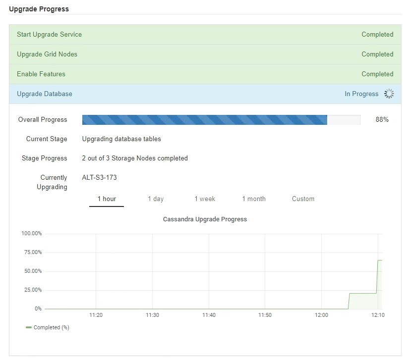

= 그리드 노드 업그레이드 및 업그레이드 완료
:allow-uri-read: 
:icons: font
:imagesdir: ../media/

[role="lead"]
기본 관리 노드를 업그레이드한 후에는 StorageGRID 시스템의 다른 모든 그리드 노드를 업그레이드해야 합니다. 개별 그리드 노드, 그리드 노드 그룹 또는 모든 그리드 노드를 업그레이드하도록 선택하여 업그레이드 순서를 사용자 지정할 수 있습니다.

.단계
. 각 주요 업그레이드 작업에 대한 정보를 제공하는 소프트웨어 업그레이드 페이지의 업그레이드 진행률 섹션을 검토합니다.
+
.. * 업그레이드 서비스 시작 * 은 첫 번째 업그레이드 작업입니다. 이 작업 중에 소프트웨어 파일이 그리드 노드로 배포되고 업그레이드 서비스가 시작됩니다.
.. 업그레이드 서비스 * 작업 시작이 완료되면 * 그리드 노드 업그레이드 * 작업이 시작됩니다.
.. 업그레이드 그리드 노드 * 작업이 진행 중인 동안 그리드 노드 상태 테이블이 나타나고 시스템의 각 그리드 노드에 대한 업그레이드 단계가 표시됩니다.

. 그리드 노드가 그리드 노드 상태 테이블에 표시된 후 그리드 노드를 승인하기 전에 복구 패키지의 새 복사본을 다운로드합니다.
+

IMPORTANT: 기본 관리 노드에서 소프트웨어 버전을 업그레이드한 후 복구 패키지 파일의 새 복사본을 다운로드해야 합니다. 복구 패키지 파일을 사용하면 오류가 발생할 경우 시스템을 복원할 수 있습니다.

. Grid Node Status 테이블의 정보를 검토합니다. 그리드 노드는 관리 노드, API 게이트웨이 노드, 스토리지 노드 및 아카이브 노드 유형별로 섹션에 정렬됩니다.
+
image::../media/software_upgrade_start_grid_node_status.gif[관리자 노드 완료 후 그리드 노드 업그레이드 스크린샷]

+
그리드 노드는 이 페이지가 처음 나타날 때 다음 단계 중 하나일 수 있습니다.

+
** 완료(기본 관리 노드만 해당)
** 업그레이드를 준비하는 중입니다
** 소프트웨어 다운로드가 대기 중입니다
** 다운로드 중입니다
** 승인을 기다리는 중입니다

. 업그레이드 대기열에 추가할 준비가 된 그리드 노드를 승인합니다. 동일한 유형의 승인된 노드는 한 번에 하나씩 업그레이드됩니다.
+
노드 업그레이드 순서가 중요한 경우, 노드 또는 노드 그룹을 한 번에 하나씩 승인하고 다음 노드 또는 노드 그룹을 승인하기 전에 각 노드에서 업그레이드가 완료될 때까지 기다리십시오.

+

IMPORTANT: 그리드 노드에서 업그레이드가 시작되면 해당 노드의 서비스가 중지됩니다. 나중에 그리드 노드가 재부팅됩니다. 이러한 작업은 노드와 통신하는 클라이언트에 대해 서비스 중단을 일으킬 수 있습니다. 노드를 중지하고 재부팅할 준비가 되어 있는지 확인한 경우에만 노드에 대한 업그레이드를 승인하지 마십시오.

+
** 하나 이상의 개별 노드를 업그레이드 대기열에 추가하려면 * Approve * 버튼을 하나 이상 선택합니다.
** 각 섹션에서 * Approve All * 버튼을 선택하여 동일한 유형의 모든 노드를 업그레이드 대기열에 추가합니다.
** 최상위 * 모두 승인 * 버튼을 선택하여 그리드의 모든 노드를 업그레이드 대기열에 추가합니다.

. 업그레이드 대기열에서 노드 또는 모든 노드를 제거해야 하는 경우 * 제거 * 또는 * 모두 제거 * 를 선택합니다.
+
예제에 표시된 것처럼 스테이지가 * 중지 서비스 * 에 도달하면 * 제거 * 버튼이 숨겨지고 더 이상 노드를 제거할 수 없습니다.

+
image::../media/software_upgrade_two_nodes_queued.gif[스테이지가 서비스를 중지함을 보여주는 스크린 샷]

. 각 노드가 대기 중, 서비스 중지, 컨테이너 중지, Docker 이미지 정리, 기본 OS 패키지 업그레이드, 재부팅 및 서비스 시작 등의 업그레이드 단계를 진행할 때까지 기다립니다.
+

NOTE: 어플라이언스 노드가 기본 OS 패키지 업그레이드 단계에 도달하면 어플라이언스의 StorageGRID 어플라이언스 설치 프로그램 소프트웨어가 업데이트됩니다. 이러한 자동 프로세스를 통해 StorageGRID 어플라이언스 설치 프로그램 버전이 StorageGRID 소프트웨어 버전과 동기화된 상태로 유지됩니다.

+
모든 그리드 노드가 업그레이드되면 * 그리드 노드 업그레이드 * 작업이 완료된 것으로 표시됩니다. 나머지 업그레이드 작업은 백그라운드에서 자동으로 수행됩니다.

. 기능 사용 * 작업이 완료되는 즉시(빠르게 발생) 업그레이드된 StorageGRID 버전의 새 기능을 사용할 수 있습니다.
+
예를 들어 StorageGRID 11.5로 업그레이드하는 경우 이제 S3 오브젝트 잠금을 설정하거나 키 관리 서버를 구성하거나 메타데이터 예약 공간 설정을 늘릴 수 있습니다.

+
link:increasing-metadata-reserved-space-setting.html["메타데이터 예약 공간 설정을 높입니다"]

. 주기적으로 * 데이터베이스 업그레이드 * 작업의 진행 상황을 모니터링합니다.
+
이 작업 중에 Cassandra 데이터베이스가 각 스토리지 노드에서 업그레이드됩니다.

+

NOTE: 데이터베이스 업그레이드 * 작업을 완료하는 데 며칠이 걸릴 수 있습니다. 이 백그라운드 작업이 실행될 때 핫픽스 또는 복구 노드를 적용할 수 있습니다. 그러나 * 최종 업그레이드 단계 * 작업이 완료될 때까지 기다린 후 확장 또는 서비스 해제 절차를 수행해야 합니다.

+
그래프를 검토하여 각 스토리지 노드의 진행률을 모니터링할 수 있습니다.

+

. 데이터베이스 업그레이드 * 작업이 완료되면 * 최종 업그레이드 단계 * 작업이 완료될 때까지 몇 분 정도 기다립니다.
+
image::../media/software_upgrade_final_upgrade_steps.png[최종 업그레이드 단계]

+
최종 업그레이드 단계 작업이 완료되면 업그레이드가 완료됩니다.

. 업그레이드가 성공적으로 완료되었는지 확인합니다.
+
.. 지원되는 브라우저를 사용하여 Grid Manager에 로그인합니다.
.. 도움말 * > * 정보 * 를 선택합니다.
.. 표시된 버전이 예상한 버전인지 확인합니다.
.. 유지보수 * > * 시스템 * > * 소프트웨어 업데이트 * 를 선택합니다. 그런 다음 * StorageGRID 업그레이드 * 를 선택합니다.
.. 녹색 배너에 소프트웨어 업그레이드가 예상했던 날짜 및 시간에 완료되었다는 메시지가 표시되는지 확인합니다.
+
image::../media/software_upgrade_done.png[소프트웨어 업그레이드가 완료되었습니다]

. 그리드 작업이 정상으로 돌아갔는지 확인합니다.
+
.. 서비스가 정상적으로 작동하고 있으며 예기치 않은 경고가 없는지 확인합니다.
.. StorageGRID 시스템에 대한 클라이언트 연결이 예상대로 작동하고 있는지 확인합니다.

. StorageGRID용 NetApp 다운로드 페이지에서 방금 설치한 StorageGRID 버전에 사용 가능한 핫픽스가 있는지 확인합니다.
+
https://mysupport.netapp.com/site/products/all/details/storagegrid/downloads-tab["NetApp 다운로드: StorageGRID"^]

+
StorageGRID 11.5._x. y_version 번호:

+
** 주 릴리스는 0(11.5.0)의 _x_값을 가집니다.
** 사용 가능한 경우 부 릴리스에는 0 이외의 _x_값이 있습니다(예: 11.5.1).
** 핫픽스에 _y_값이 있는 경우(예: 11.5.0.1).

. 사용 가능한 경우 StorageGRID 버전에 대한 최신 핫픽스를 다운로드하여 적용하십시오.
+
핫픽스 적용에 대한 자세한 내용은 복구 및 유지 관리 지침을 참조하십시오.

.관련 정보
link:downloading-recovery-package.html["복구 패키지 다운로드 중"]

link:../maintain/index.html["유지 및 복구"]
